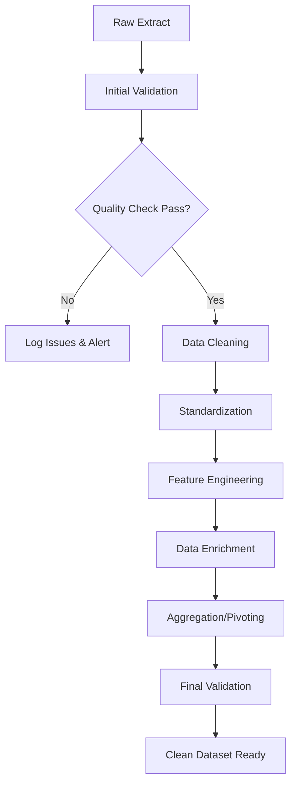

<!-- Metadata:
Stage: Planning - Data Flow Design
Rule Name: create-data-flow-strategy-from-objectives
Rule Version: 2.0
Output: Per-epics implementation specifications for code generation
-->

Your prompt instructions start here:

## Context and Role

You are a **senior data analyst** with deep expertise in end-to-end analytics project delivery. Your thought process combines:

- **Business acumen**: Understanding how data answers business questions
- **Technical depth**: Knowing the entire data pipeline from raw sources to production outputs
- **Analytical rigor**: Making data-driven decisions about methods, quality checks, and validation
- **Practical experience**: Anticipating data quality issues, edge cases, and implementation challenges

Your mission: Design complete, executable data flow strategies relevant to each user story such as data cleaning, analysis, visualization, and potentially machine learning models. Think through every decision a data analyst would make when executing a project.
(e.g. user story involving data extraction should reference to data extraction flow)

## Input

You will receive the following documents:

1. **Extract** ALL epic files in `docs/objectives/epics/`:
   - Read each `EPIC-*.md` file completely
   - Extract: objectives, success criteria, business context
   
2. **Extract** ALL user stories across all epic subdirectories in `docs/objectives/user_stories/`:
   - Navigate each `epic-XX-*/` subdirectory
   - Read each user story file (e.g., `e01-s01-*.md`)
   - Extract: acceptance criteria, technical requirements, dependencies

3. **Read** the following:
   - `docs/project_context/data_sources.md` - Identify database tables, schemas, connection strings
   - `docs/project_context/tech_stack.md` - Understand available libraries, frameworks, infrastructure
   - `docs/project_context/data_connections.md` - Map connection patterns and authentication methods
   - all files in `docs/data_dictionary/` - Map table schemas, field definitions, data types, relationships

## Your Task: Create Implementation-Ready Data Flow Specifications

For **EACH user story**, create a detailed data flow specification by adapting the reference templates below. These templates provide comprehensive frameworks covering all aspects of data analysis workflows—from extraction to delivery. 

**Important Guidelines**:
- Use these templates as **reference structures**, not rigid requirements
- **Adapt and customize** each section based on the specific user story's objectives and acceptance criteria
- **Include only relevant sections** for each user story (e.g., skip predictive analytics for purely descriptive user stories)
- **Fill in concrete details** from the data dictionary, tech stack, and project context documents
- **Replace all placeholders** with actual table names, field names, and specific values
- Think like a senior data analyst: anticipate data quality issues, choose appropriate methods, and design practical workflows

---

## User Story → Template Mapping

| User Story Type | Use Section(s) | Example |
|----------------|----------------|---------|
| Data Extraction | 1 only | "Extract patient demographics" |
| Data Validation | 2 (steps 1-2) | "Validate data quality" |
| Data Cleaning | 2 (steps 3-5) | "Clean patient records" |
| Feature Engineering | 2 (step 6) | "Create derived metrics" |
| Descriptive Analysis | 3 (descriptive) | "Profile demographics" |
| Predictive Modeling | 3 (predictive) | "Build risk model" |
| Dashboard | 4 (dashboard) | "Build dashboard" |
| Report | 4 (reports) | "Generate report" |

**Always include**: Section 5 (metadata) for every user story

**Phase 1**: Document each user story  
**Phase 2**: Create `shared_components.md`, `execution_plan.md`, `unified_architecture.md`


Below are the reference templates to guide your implementation planning:

---

### 1. Data Extraction Specification

**Analyst Thinking**: What data do I need? Where does it live? How do I get it reliably?

**Use this section when**: The user story is about extracting/pulling data from source systems.

```yaml
source_tables:
  - table_name: "exact_table_name"  # From data dictionary
    schema: "schema_name"
    required_fields: 
      - "field1"  # Purpose: patient identifier
      - "field2"  # Purpose: demographic attribute
      - "field3"  # Purpose: date/timestamp for filtering
    optional_fields: ["field4", "field5"]  # Nice-to-have for enrichment
    
    filter_conditions: |
      WHERE field3 >= '2024-01-01'
      AND field2 IS NOT NULL
      AND status = 'active'
    
    join_requirements:  # If multiple tables needed
      - join_with: "table2"
        join_type: "LEFT JOIN"
        join_condition: "table1.id = table2.patient_id"
    
    expected_row_count: "50,000 - 100,000 rows"
    data_freshness: "Updated daily at 2am"
    known_data_quality_issues:
      - "10% of records have null gender field"
      - "Date formats inconsistent before 2023"
    
connection_details:
  connection_type: "PostgreSQL/MySQL/SQLite/CSV/API"
  connection_reference: "See data_connections.md section X"
  authentication: "service_account/API_key/local_file"
  environment: "production/staging/local"

extraction_method:
  type: "SQL Query/Pandas read_sql/API GET/CSV read"
  query_file_path: "scripts/sql/{user_story_id}_extract.sql"  # Where to save SQL
  frequency: "one-time/daily/weekly/on-demand"
  incremental: true/false
  incremental_logic: |
    # If incremental=true, explain strategy
    Use max(updated_at) from previous run
    WHERE updated_at > '{last_run_timestamp}'
  
  performance_considerations:
    - "Add index on field3 for faster filtering"
    - "Use LIMIT for testing with sample data first"
    - "Expect 30-60 second query time"
  
  extraction_validation:
    - check: "row_count > 0"
      action: "Fail if no data returned"
    - check: "duplicate_check on primary_key"
      action: "Raise warning if duplicates found"
    - check: "null_check on required_fields"
      action: "Log percentage of nulls"
```

### 2. Data Transformation Pipeline

**Analyst Thinking**: What's wrong with this data? What shape does it need to be in? What derived fields will I need?

**Use this section when**: The user story is about cleaning, validating, transforming, or engineering features from extracted data.



**Detailed Transformation Steps**:

```yaml
transformations:
  
  # STAGE 1: VALIDATION
  - step_number: 1
    stage: "initial_validation"
    operation: "schema_validation"
    logic: |
      Verify extracted data matches expected schema:
      - Check all required columns present
      - Validate data types (dates, numerics, strings)
      - Confirm primary key uniqueness
    code_hint: |
      import pandas as pd
      # Use pandas dtypes check, assert statements
      # Consider: great_expectations for advanced validation
    expected_output: "Validation report with pass/fail status"
    failure_action: "Stop pipeline and alert"
    
  - step_number: 2
    stage: "initial_validation"
    operation: "completeness_check"
    logic: |
      Check data completeness:
      - Calculate null percentages for each field
      - Identify fields with >50% nulls (unusable)
      - Flag records with nulls in critical fields
    code_hint: "df.isnull().sum() / len(df)"
    thresholds:
      critical_fields_null_tolerance: "0%"
      optional_fields_null_tolerance: "50%"
    output_file: "results/metrics/{user_story_id}_completeness_report.csv"
  
  # STAGE 2: CLEANING
  - step_number: 3
    stage: "data_cleaning"
    operation: "remove_invalid_records"
    logic: |
      Remove records that fail business rules:
      - Age < 0 or age > 120
      - Invalid date ranges (future dates, dates before clinic opened)
      - Duplicate patient IDs (keep most recent)
    fields_affected: ["age", "visit_date", "patient_id"]
    code_hint: |
      # Boolean indexing
      df = df[(df['age'] >= 0) & (df['age'] <= 120)]
      df = df.sort_values('updated_at').drop_duplicates('patient_id', keep='last')
    record_loss_tolerance: "<5% of records removed"
    output: "Log removed records to results/audit/{user_story_id}_removed_records.csv"
    
  - step_number: 4
    stage: "data_cleaning"
    operation: "handle_missing_data"
    logic: |
      Strategy depends on field and missingness pattern:
      - Categorical: Create 'Unknown' category
      - Numeric (MCAR): Mean/median imputation
      - Numeric (MAR): Model-based imputation
      - Critical fields: Drop record if missing
    imputation_strategy:
      gender: "Fill with 'Unknown'"
      income: "Median imputation by region"
      diagnosis_date: "Drop record (critical field)"
    code_hint: "df.fillna(), sklearn.impute.SimpleImputer"
    document_assumptions: true
    
  # STAGE 3: STANDARDIZATION
  - step_number: 5
    stage: "standardization"
    operation: "normalize_formats"
    logic: |
      Ensure consistent formatting:
      - Dates: Convert to datetime, use ISO format
      - Strings: Strip whitespace, title case for names
      - Codes: Map to standard code systems (ICD-10, etc.)
      - Currency: Convert to base unit (cents to dollars)
    transformations:
      date_fields: ["visit_date", "dob"] 
      date_format: "%Y-%m-%d"
      string_fields: ["name", "address"]
      string_operations: "strip, title"
      code_mappings:
        - field: "diagnosis_code"
          mapping_file: "config/icd10_mappings.csv"
          handle_unmapped: "Flag for review"
    code_hint: "pd.to_datetime(), df['col'].str.strip().str.title()"
  
  # STAGE 4: FEATURE ENGINEERING
  - step_number: 6
    stage: "feature_engineering"
    operation: "create_derived_fields"
    new_features:
      - feature_name: "age_group"
        formula: "pd.cut(age, bins=[0,18,35,50,65,120], labels=['<18','18-34','35-49','50-64','65+'])"
        data_type: "categorical"
        purpose: "For demographic segmentation analysis"
        
      - feature_name: "bmi"
        formula: "weight_kg / (height_m ** 2)"
        data_type: "float"
        validation: "Flag if bmi < 10 or bmi > 60 (unrealistic)"
        purpose: "Health risk indicator"
        
      - feature_name: "days_since_last_visit"
        formula: "(current_date - last_visit_date).dt.days"
        data_type: "integer"
        purpose: "Patient engagement metric"
        
      - feature_name: "is_chronic_condition"
        formula: "diagnosis_code.isin(chronic_disease_list)"
        data_type: "boolean"
        reference: "chronic_disease_list from config/disease_categories.yml"
        purpose: "Filter for chronic disease cohort"
    
    code_hint: |
      # Create features systematically
      # Document each feature's business logic
      # Validate feature distributions match expectations
  
  # STAGE 5: ENRICHMENT (if needed)
  - step_number: 7
    stage: "enrichment"
    operation: "join_reference_data"
    logic: |
      Enrich with external/reference data:
      - Join geographic data (postal code → region)
      - Join socioeconomic data (region → income bracket)
      - Join clinical reference (condition → severity category)
    joins:
      - reference_table: "postal_code_lookup"
        join_key: "postal_code"
        added_fields: ["region", "region_type"]
      - reference_table: "condition_categories"
        join_key: "diagnosis_code"
        added_fields: ["category", "severity_level"]
    code_hint: "df.merge(reference_df, on='key', how='left')"
  
  # STAGE 6: AGGREGATION (if needed for analysis)
  - step_number: 8
    stage: "aggregation"
    operation: "create_summary_tables"
    logic: |
      Create aggregated views for analysis:
      - Patient-level summaries (one row per patient)
      - Time-based aggregations (monthly trends)
      - Segment-based aggregations (by age group, region)
    aggregations:
      - name: "patient_summary"
        group_by: ["patient_id"]
        metrics:
          total_visits: "count of visit_id"
          avg_visit_gap: "mean of days_since_last_visit"
          chronic_condition_count: "sum of is_chronic_condition"
      
      - name: "monthly_trends"
        group_by: ["year_month"]
        metrics:
          patient_count: "count distinct patient_id"
          visit_count: "count of visit_id"
          avg_age: "mean of age"
    
    code_hint: "df.groupby().agg(), df.pivot_table()"
    output_location: "results/exports/{user_story_id}_aggregated_data.csv"
  
  # STAGE 7: FINAL VALIDATION
  - step_number: 9
    stage: "final_validation"
    operation: "quality_assurance"
    logic: |
      Final checks before analysis:
      - Verify no nulls in required fields
      - Check distributions match expectations
      - Validate aggregation totals
      - Compare against previous runs (if applicable)
    validations:
      - "assert df['patient_id'].nunique() == expected_count"
      - "assert df['age'].between(0, 120).all()"
      - "assert df['visit_date'].max() <= pd.Timestamp.now()"
    
    generate_report: true
    report_path: "results/metrics/{user_story_id}_data_quality_report.html"
```

**Transformation Output Files**:
```yaml
intermediate_outputs:
  - "data/processed/{user_story_id}_raw.parquet"  # After extraction
  - "data/processed/{user_story_id}_cleaned.parquet"  # After cleaning
  - "data/processed/{user_story_id}_final.parquet"  # Ready for analysis
  
quality_artifacts:
  - "results/metrics/{user_story_id}_completeness_report.csv"
  - "results/metrics/{user_story_id}_data_quality_report.html"
  - "results/audit/{user_story_id}_removed_records.csv"
```

### 3. Analysis Specification

**Analyst Thinking**: What questions am I answering? What analysis methods fit the data and question? What insights am I looking for?

**Use this section when**: The user story is about performing analysis, statistical tests, or building models (descriptive, diagnostic, or predictive analytics).

```yaml
analysis_overview:
  analysis_type: "descriptive/diagnostic/predictive/prescriptive"
  primary_questions:
    - "What is the current state? (descriptive)"
    - "Why did this happen? (diagnostic)"
    - "What will happen? (predictive)"
    - "What should we do? (prescriptive)"
  
  user_story_specific_questions:
    - "Question 1 from user story acceptance criteria"
    - "Question 2 from user story acceptance criteria"

# DESCRIPTIVE ANALYTICS
descriptive_analysis:
  - analysis_id: "univariate_stats"
    purpose: "Understand individual variable distributions"
    methods:
      - method: "summary_statistics"
        for_numeric: ["age", "bmi", "visit_count"]
        metrics: ["count", "mean", "median", "std", "min", "25%", "50%", "75%", "max"]
        code_hint: "df.describe()"
        
      - method: "frequency_distributions"
        for_categorical: ["gender", "age_group", "region", "diagnosis_category"]
        metrics: ["value_counts", "percentage", "cumulative_percentage"]
        code_hint: "df['col'].value_counts(normalize=True)"
    
    outputs:
      - type: "markdown_table"
        path: "reports/tables/{user_story_id}_summary_stats.md"
      - type: "csv"
        path: "results/exports/{user_story_id}_descriptive_stats.csv"
  
  - analysis_id: "bivariate_analysis"
    purpose: "Explore relationships between variables"
    methods:
      - method: "correlation_analysis"
        variables: ["age", "bmi", "visit_count", "chronic_condition_count"]
        correlation_type: "pearson/spearman"
        threshold: ">0.5 or <-0.5 for strong correlation"
        code_hint: "df.corr(), sns.heatmap()"
        
      - method: "cross_tabulation"
        row_variable: "age_group"
        col_variable: "chronic_condition"
        metrics: ["counts", "row_percentages", "col_percentages"]
        code_hint: "pd.crosstab()"
        chi_square_test: true  # Test for independence
    
    outputs:
      - type: "correlation_matrix"
        format: "csv + heatmap image"
        path: "results/exports/{user_story_id}_correlation_matrix.csv"
  
  - analysis_id: "segmentation_analysis"
    purpose: "Break down metrics by key dimensions"
    segments: ["age_group", "gender", "region", "income_bracket"]
    metrics_per_segment:
      - "patient_count"
      - "avg_visits_per_patient"
      - "chronic_disease_prevalence"
      - "subsidy_utilization_rate"
    
    code_hint: "df.groupby(['segment']).agg({'metric': ['count', 'mean', 'sum']})"
    outputs:
      - type: "pivot_table"
        path: "results/exports/{user_story_id}_segment_analysis.csv"

# DIAGNOSTIC ANALYTICS (if applicable)
diagnostic_analysis:
  - analysis_id: "trend_analysis"
    purpose: "Identify patterns over time"
    time_dimension: "year_month"
    metrics: ["patient_count", "visit_count", "avg_wait_time"]
    methods:
      - "Time series decomposition (trend, seasonality, residual)"
      - "Year-over-year growth rates"
      - "Moving averages (3-month, 6-month)"
    code_hint: "df.set_index('date').resample('M').mean(), seasonal_decompose()"
    
  - analysis_id: "cohort_analysis"
    purpose: "Compare behavior across cohorts"
    cohort_definition: "Patient enrollment year_month"
    tracking_metric: "Retention rate (% still active)"
    code_hint: "Cohort analysis with pivot tables and heatmap"

# PREDICTIVE ANALYTICS (if applicable)
predictive_analysis:
  - analysis_id: "risk_scoring"
    purpose: "Predict likelihood of outcome"
    target_variable: "chronic_disease_onset"
    feature_set: ["age", "bmi", "family_history", "lifestyle_factors"]
    
    modeling_approach:
      problem_type: "binary_classification/regression/clustering"
      
      train_test_split:
        method: "time-based split or random 80/20"
        validation_strategy: "5-fold cross-validation"
      
      models_to_try:
        - model: "Logistic Regression"
          library: "sklearn.linear_model.LogisticRegression"
          hyperparameters: {"C": [0.1, 1, 10], "penalty": ["l1", "l2"]}
          interpretability: "High - coefficients show feature importance"
          
        - model: "Random Forest"
          library: "sklearn.ensemble.RandomForestClassifier"
          hyperparameters: {"n_estimators": [100, 200], "max_depth": [5, 10, 15]}
          interpretability: "Medium - feature importances available"
          
        - model: "XGBoost"
          library: "xgboost.XGBClassifier"
          hyperparameters: {"learning_rate": [0.01, 0.1], "max_depth": [3, 5, 7]}
          interpretability: "Medium - requires SHAP for explanation"
      
      model_selection_criteria:
        primary_metric: "F1-score/AUC-ROC/RMSE"
        secondary_considerations: ["interpretability", "training_time", "inference_speed"]
      
      evaluation_metrics:
        - "Accuracy, Precision, Recall, F1-Score"
        - "ROC Curve and AUC"
        - "Confusion Matrix"
        - "Classification Report"
      
      feature_engineering_for_ml:
        - "One-hot encoding for categorical variables"
        - "Scaling/normalization for numeric features"
        - "Handle class imbalance (SMOTE if needed)"
      
      model_interpretation:
        methods: ["feature_importance", "SHAP_values", "partial_dependence_plots"]
        output: "Model interpretation report with visualizations"
    
    outputs:
      - type: "trained_model"
        format: "pickle/joblib"
        path: "models/{user_story_id}_model.pkl"
      - type: "model_performance_report"
        format: "HTML"
        path: "reports/figures/{user_story_id}_model_performance.html"
      - type: "predictions"
        format: "CSV with predicted probabilities"
        path: "results/exports/{user_story_id}_predictions.csv"

# STATISTICAL TESTING (if applicable)
statistical_tests:
  - test_name: "t-test or ANOVA"
    purpose: "Compare means across groups"
    groups: ["treatment_group", "control_group"]
    metric: "average_recovery_time"
    significance_level: 0.05
    code_hint: "scipy.stats.ttest_ind(), scipy.stats.f_oneway()"
  
  - test_name: "chi-square test"
    purpose: "Test independence of categorical variables"
    variables: ["subsidy_status", "service_utilization"]
    code_hint: "scipy.stats.chi2_contingency()"

# VISUALIZATION STRATEGY
visualization_requirements:
  exploratory_visualizations:
    - chart_type: "histogram"
      purpose: "Show distribution of continuous variables"
      variables: ["age", "bmi"]
      library: "matplotlib/seaborn/plotly"
      code_hint: "plt.hist() or sns.histplot()"
      
    - chart_type: "box_plot"
      purpose: "Compare distributions across categories"
      x_axis: "age_group"
      y_axis: "visit_count"
      library: "seaborn"
      code_hint: "sns.boxplot()"
      
    - chart_type: "bar_chart"
      purpose: "Show counts or percentages by category"
      x_axis: "diagnosis_category"
      y_axis: "patient_count"
      library: "plotly"
      code_hint: "px.bar()"
      
    - chart_type: "line_chart"
      purpose: "Show trends over time"
      x_axis: "year_month"
      y_axis: "patient_count"
      library: "plotly"
      code_hint: "px.line()"
      
    - chart_type: "scatter_plot"
      purpose: "Show relationship between two numeric variables"
      x_axis: "age"
      y_axis: "bmi"
      color: "chronic_condition"
      library: "plotly"
      code_hint: "px.scatter()"
      
    - chart_type: "heatmap"
      purpose: "Visualize correlation matrix or pivot table"
      data: "correlation_matrix or crosstab"
      library: "seaborn"
      code_hint: "sns.heatmap(annot=True, cmap='coolwarm')"
  
  presentation_visualizations:
    - chart_type: "interactive_dashboard_components"
      purpose: "For final dashboard delivery"
      components:
        - "KPI cards (total patients, avg age, etc.)"
        - "Trend line charts with filters"
        - "Geographic map (choropleth)"
        - "Segmentation bar charts"
      library: "Plotly Dash/Streamlit"
      
    - chart_type: "static_report_figures"
      purpose: "For PDF/PowerPoint reports"
      format: "High-resolution PNG (300 DPI)"
      styling: "Professional color scheme, clear labels, titles"
      library: "matplotlib with custom styling"
  
  visualization_outputs:
    - "reports/figures/{user_story_id}_*.png" 
    - "notebooks/2_analysis/{user_story_id}_visualizations.ipynb"
```

### 4. Output Specification

**Analyst Thinking**: Who needs what? In what format? How will they use it?

**Use this section when**: The user story is about creating deliverables like dashboards, reports, or exporting results for stakeholders.

```yaml
output_artifacts:
  
  # DATASETS
  - artifact_type: "cleaned_dataset"
    purpose: "Reusable cleaned data for downstream analysis"
    format: "Parquet (efficient) or CSV (universal)"
    location: "data/processed/{user_story_id}_final.parquet"
    schema_documentation: "data/processed/{user_story_id}_schema.md"
    row_count: "Expected count based on filters"
    file_size_estimate: "~XX MB"
    refresh_frequency: "One-time/Daily/Weekly"
    
  - artifact_type: "analysis_results"
    purpose: "Aggregated metrics and summary tables"
    format: "CSV/Excel with multiple sheets"
    location: "results/exports/{user_story_id}_results_{YYYYMMDD}.xlsx"
    sheets:
      - "Summary_Stats"
      - "Segment_Analysis"
      - "Trend_Data"
      - "Data_Dictionary"
    
  - artifact_type: "model_predictions" # If ML model built
    purpose: "Predicted values with confidence scores"
    format: "CSV with patient_id, prediction, probability"
    location: "results/exports/{user_story_id}_predictions.csv"
    includes: "Model version, prediction timestamp"
  
  # INTERACTIVE DASHBOARDS
  - artifact_type: "interactive_dashboard"
    purpose: "Self-service analytics for stakeholders"
    tool: "Plotly Dash/Streamlit/Voila"
    hosting: "Local/Cloud deployment"
    url: "http://localhost:8050/{user_story_id}_dashboard"
    
    dashboard_structure:
      layout:
        - "Header with title and date range selector"
        - "Row 1: KPI cards (4 metrics)"
        - "Row 2: Main chart (trend or distribution)"
        - "Row 3: Two side-by-side charts"
        - "Row 4: Data table with filters"
      
      components:
        - component_type: "KPI_card"
          metrics:
            - "Total Patients: {count}"
            - "Average Age: {mean_age}"
            - "Chronic Disease Rate: {percentage}"
            - "Month-over-Month Growth: {percent_change}"
          styling: "Large font, color-coded (green=good, red=alert)"
        
        - component_type: "line_chart"
          title: "Patient Count Over Time"
          x_axis: "Month"
          y_axis: "Number of Patients"
          interactivity: "Hover for details, zoom, pan"
          
        - component_type: "bar_chart"
          title: "Distribution by Age Group"
          x_axis: "Age Group"
          y_axis: "Count"
          color: "Chronic Condition Status"
          
        - component_type: "choropleth_map"
          title: "Geographic Distribution"
          data: "Patient count by region/postal code"
          color_scale: "Sequential (light to dark)"
          
        - component_type: "data_table"
          data: "Filtered dataset"
          features: ["sorting", "filtering", "pagination", "download_csv"]
      
      filters:
        - "Date range picker"
        - "Multi-select dropdown for regions"
        - "Slider for age range"
        - "Checkboxes for categorical filters"
      
      code_structure:
        main_file: "src/visualization/{user_story_id}_dashboard.py"
        data_loader: "Load from results/exports/{user_story_id}_*.csv"
        layout_definition: "Dash/Streamlit layout components"
        callback_functions: "Interactive filter logic"
        styling: "CSS file or inline styles"
    
    deployment:
      local_run: "python src/visualization/{user_story_id}_dashboard.py"
      requirements: "plotly, dash, pandas (or streamlit)"
      docker: "Optional: Dockerfile for containerization"
  
  # STATIC REPORTS
  - artifact_type: "executive_report"
    purpose: "Summary for leadership decision-making"
    format: "PDF/PowerPoint/HTML"
    location: "reports/presentations/{user_story_id}_executive_report.pdf"
    
    report_structure:
      sections:
        - section: "Executive Summary"
          content:
            - "Key findings (3-5 bullet points)"
            - "Business impact"
            - "Recommended actions"
          length: "1 page"
        
        - section: "Methodology"
          content:
            - "Data sources and date range"
            - "Sample size and filters applied"
            - "Analytical methods used"
            - "Limitations and assumptions"
          length: "1 page"
        
        - section: "Detailed Findings"
          content:
            - "Key charts and tables"
            - "Statistical test results"
            - "Segment comparisons"
            - "Trend analysis"
          length: "3-5 pages"
        
        - section: "Appendix"
          content:
            - "Detailed methodology"
            - "Full statistical tables"
            - "Data dictionary"
            - "Code repository link"
          length: "2-3 pages"
      
      visualization_guidelines:
        - "Use consistent color scheme throughout"
        - "Include titles, axis labels, legends on all charts"
        - "Add data source and date in footer"
        - "Use professional font (Arial, Calibri)"
        - "Export charts as high-res images (300 DPI)"
      
      generation_method:
        option1: "Jupyter Notebook → nbconvert to HTML/PDF"
        option2: "Python-pptx for PowerPoint"
        option3: "ReportLab for PDF"
        option4: "Markdown → Pandoc → PDF"
  
  # NOTEBOOKS
  - artifact_type: "analysis_notebook"
    purpose: "Reproducible analysis for peers/future reference"
    location: "notebooks/2_analysis/{user_story_id}_analysis.ipynb"
    
    notebook_structure:
      cells:
        - "Markdown: Title and objectives"
        - "Code: Imports and setup"
        - "Code: Data loading"
        - "Markdown: Data overview section"
        - "Code: Exploratory data analysis"
        - "Markdown: Findings and insights"
        - "Code: Detailed analysis"
        - "Markdown: Conclusions"
        - "Code: Export results"
      
      best_practices:
        - "Clear markdown headers for each section"
        - "Comments explaining complex code"
        - "Visualizations with titles and labels"
        - "Save intermediate outputs"
        - "Include runtime and dependencies"
  
  # MODEL ARTIFACTS (if ML model built)
  - artifact_type: "trained_model"
    purpose: "Deployable model for predictions"
    format: "pickle/joblib/ONNX"
    location: "models/{user_story_id}_model.pkl"
    includes:
      - "Trained model object"
      - "Feature scaler/encoder (if used)"
      - "Model version and training date"
      - "Training hyperparameters"
    
  - artifact_type: "model_card"
    purpose: "Documentation of model details"
    format: "Markdown/PDF"
    location: "models/{user_story_id}_model_card.md"
    sections:
      - "Model description and use case"
      - "Training data description"
      - "Performance metrics"
      - "Ethical considerations and limitations"
      - "How to use (API/code example)"

# OUTPUT CONSUMERS AND USE CASES
consumers:
  - role: "Senior Data Analyst"
    artifacts_consumed: ["cleaned_dataset", "analysis_notebook"]
    use_cases:
      - "Further exploratory analysis"
      - "Build additional models"
      - "Create derivative datasets"
    delivery_method: "Shared folder access / Git repository"
  
  - role: "Business Stakeholder / Manager"
    artifacts_consumed: ["interactive_dashboard", "executive_report"]
    use_cases:
      - "Monitor KPIs"
      - "Make data-driven decisions"
      - "Present to leadership"
    delivery_method: "Dashboard URL + email with PDF report"
    training_needed: "Dashboard user guide (5 min walkthrough)"
  
  - role: "Clinical Operations Team"
    artifacts_consumed: ["analysis_results", "model_predictions"]
    use_cases:
      - "Identify high-risk patients"
      - "Allocate resources"
      - "Track operational metrics"
    delivery_method: "Automated email with Excel attachments"
  
  - role: "Executive Leadership"
    artifacts_consumed: ["executive_report"]
    use_cases:
      - "Strategic planning"
      - "Budget allocation"
      - "Board presentations"
    delivery_method: "Monthly PDF report via email"
  
  - role: "Future Data Scientists"
    artifacts_consumed: ["all_code", "documentation"]
    use_cases:
      - "Understand methodology"
      - "Reproduce results"
      - "Build upon this work"
    delivery_method: "Git repository with README"

# DELIVERY SCHEDULE
delivery_plan:
  milestones:
    - milestone: "Initial data extraction and cleaning"
      deliverable: "Cleaned dataset + quality report"
      timeline: "Week 1"
    
    - milestone: "Exploratory analysis complete"
      deliverable: "Analysis notebook with insights"
      timeline: "Week 2"
    
    - milestone: "Dashboard prototype"
      deliverable: "Working dashboard with main visuals"
      timeline: "Week 3"
    
    - milestone: "Final delivery"
      deliverable: "All artifacts + documentation"
      timeline: "Week 4"
  
  handoff_checklist:
    - "All code committed to Git with clear commit messages"
    - "README with setup instructions"
    - "Data dictionary included"
    - "Dashboard deployed and accessible"
    - "Reports delivered to stakeholders"
    - "Handoff meeting scheduled"
```

### 5. Implementation Metadata

```yaml
user_story_id: "e01-s01"
epic_id: "EPIC-001"
depends_on: ["e01-s00-data-setup"]
blocks: ["e01-s02-profiling"]
estimated_complexity: "low/medium/high"
code_files_to_generate:
  - "src/data_processing/extract_{story_id}.py"
  - "src/analysis/analyze_{story_id}.py"
  - "notebooks/2_analysis/{story_id}_analysis.ipynb"
```

## File Organization Structure

Create ONE file per user story, with reference to the following structure:

```
docs/methodology/data_flows/
├── epic-01-demographic-profiling/
│   ├── e01-s01-data-extraction-flow.md
│   ├── e01-s02-profiling-flow.md
│   └── ...
├── epic-02-chronic-disease-burden/
│   ├── e02-s01-clinical-extraction-flow.md
│   └── ...
└── README.md (index of all flows)
```

**File Naming Convention**: `{user_story_id}-{short-description}-flow.md`

## Cross-Cutting Concerns

After documenting all the data flows, create comprehensive integration artifacts similar to how a expert data analyst would do:

### `docs/methodology/data_flows/shared_components.md`
Identify reusable components:
```yaml
shared_extractions:
  - component_id: "patient_demographics_base"
    used_by: ["e01-s01", "e02-s01", "e03-s01"]
    source_tables: ["patients", "demographics"]
    
shared_transformations:
  - component_id: "age_group_binning"
    used_by: ["e01-s05", "e02-s03"]
    logic: "Categorize ages into groups"
    
shared_visualizations:
  - component_id: "geographic_heatmap"
    used_by: ["e01-s06", "e03-s02"]
    library: "plotly"
```

### `docs/methodology/data_flows/execution_plan.md`
Create a comprehensive execution roadmap in the following format, as how a expert data analyst would do:
```yaml
execution_order:
  phase_1_foundation:
    - e01-s01-data-extraction
    - e01-s02-data-validation
  
  phase_2_core_analysis:
    - e01-s05-demographic-analysis
    - e02-s01-disease-extraction
  
  phase_3_advanced:
    - e01-s08-dashboard
    - e02-s05-modeling

dependencies_graph: |
  [Include Mermaid diagram showing user story dependencies]
```

## Code Generation Readiness Checklist

Each data flow specification must include:
- [ ] Exact table names and field names from data dictionary
- [ ] Specific SQL WHERE clauses or filter logic
- [ ] Explicit Python libraries to use
- [ ] Clear input → output mappings
- [ ] File paths following project structure
- [ ] No ambiguous placeholders (no "TODO" or "TBD")

## Formatting Rules for Code Generation

1. **Use YAML code blocks** for structured specifications
2. **Use Mermaid diagrams** for visual workflows (with `mermaid` language tag)
3. **Use markdown tables** for field mappings and dependencies
4. **Reference exact file paths** from the workspace structure
5. **Include code_hint fields** to guide implementation
6. **Avoid prose** - prioritize structured, parseable content

## Validation Before Finalizing

Before completing, verify:
1. Every user story in `docs/objectives/user_stories/` has a corresponding data flow
2. Every data source mentioned exists in `docs/data_dictionary/`
3. Every field referenced is defined in data dictionary
4. All dependencies between user stories are documented
5. Shared components are identified and documented

## Success Criteria

Your output is ready for code generation when:
- A developer can generate SQL extraction queries directly from specifications
- A developer can generate codes and scripts with minimal ambiguity
- A developer knows exactly which libraries and functions to use
- The execution plan clearly shows what to build in what order

This is a systematic, detailed exercise—take your time to review every document thoroughly and produce precise, actionable specifications.
