# Data Flow Strategy: Polyclinic Visitation Analysis & Queue Optimization

**Project**: MOH Polyclinic Data Analysis - Gen-E2  
**Document Type**: Data Architecture & Pipeline Design  
**Last Updated**: 28 January 2026  
**Version**: 1.0

---

## Executive Summary

This document outlines the end-to-end data flow strategy for analyzing polyclinic visitation patterns and designing effective queue management systems. The strategy maps the journey from raw healthcare data extraction through analytical modeling to business-ready outputs, supporting four key analytical opportunities:

1. **Temporal Visitation Pattern Analysis** - Understanding when patients visit
2. **Intelligent Queue Management System** - Predicting and optimizing wait times
3. **Patient Flow Optimization** - Identifying bottlenecks in patient journey
4. **Resource Allocation & Capacity Planning** - Optimizing staffing and resources

**Key Architecture Principles**:
- **Modular Design**: Reusable components across multiple opportunities
- **Incremental Processing**: Daily batch extraction with historical backfill
- **Data Quality First**: Validation gates at each pipeline stage
- **Platform Optimization**: Leverage Databricks (HEALIX) for cloud workloads, CDSW (MCDR) for on-premise analytics

---

## 1. Conceptual Data Flow Diagram

```mermaid
flowchart TB
    subgraph Sources["🗄️ Data Sources"]
        DB1[(MOH Healthcare DB<br/>POLYCLINIC_ATTENDANCES)]
        DB2[(MOH Healthcare DB<br/>PATIENT_DEMOGRAPHICS)]
        DB3[(MOH Healthcare DB<br/>DIAGNOSIS_RECORDS)]
        DB4[(MOH Healthcare DB<br/>MEDICATION_PRESCRIPTIONS)]
        DB5[(Reference Tables<br/>POLYCLINIC_MASTER)]
    end
    
    subgraph Extract["📥 Extraction Layer"]
        E1[Incremental Extraction<br/>attendance_date >= last_extract]
        E2[Full Load<br/>Demographics & Reference Data]
    end
    
    subgraph Raw["💾 Raw Data Zone"]
        R1[data/1_raw/attendances/]
        R2[data/1_raw/demographics/]
        R3[data/1_raw/diagnoses/]
        R4[data/1_raw/medications/]
        R5[data/1_raw/reference/]
    end
    
    subgraph Validate["✅ Validation & Quality"]
        V1[Schema Validation]
        V2[Data Quality Checks]
        V3[Referential Integrity]
        V4[Business Rule Validation]
    end
    
    subgraph Transform["⚙️ Transformation Layer"]
        T1[Temporal Features<br/>hour, day_of_week, holiday]
        T2[Aggregate Metrics<br/>waiting_time, no_shows]
        T3[Patient Segmentation<br/>age_group, chronic_status]
        T4[Polyclinic Enrichment<br/>location, capacity]
    end
    
    subgraph Feature["🔧 Feature Engineering"]
        F1[Time-Series Features<br/>lag, rolling averages]
        F2[Occupancy Metrics<br/>queue_length, utilization]
        F3[Patient History<br/>visit_frequency, no_show_rate]
        F4[Clinical Complexity<br/>diagnosis_count, medication_count]
    end
    
    subgraph Interim["💿 Interim Data Zone"]
        I1[data/3_interim/attendances_enriched/]
        I2[data/3_interim/patient_features/]
        I3[data/3_interim/timeseries_daily/]
    end
    
    subgraph Process["📊 Processed Data Zone"]
        P1[data/4_processed/ml_datasets/]
        P2[data/4_processed/analytical_datasets/]
        P3[data/4_processed/dashboard_data/]
    end
    
    subgraph Analyze["🤖 Analysis & Modeling"]
        A1[Descriptive Analytics<br/>EDA, Visualization]
        A2[Time-Series Forecasting<br/>Prophet, ARIMA]
        A3[Classification Models<br/>No-Show Prediction]
        A4[Optimization Models<br/>Appointment Scheduling]
    end
    
    subgraph Outputs["📤 Output Artifacts"]
        O1[📊 Real-Time Dashboard<br/>Queue Monitor]
        O2[📈 Executive Reports<br/>Weekly/Monthly]
        O3[🔮 Predictions<br/>Occupancy Forecasts]
        O4[💾 Data Products<br/>APIs, Datasets]
    end
    
    DB1 & DB2 & DB3 & DB4 --> E1
    DB5 --> E2
    E1 & E2 --> Raw
    R1 & R2 & R3 & R4 & R5 --> Validate
    Validate --> Transform
    Transform --> Feature
    Feature --> Interim
    Interim --> Process
    Process --> Analyze
    Analyze --> Outputs
```



---

## 2. Pipeline Architecture

### 2.1 High-Level Architecture

```mermaid
flowchart LR
    subgraph Bronze["🥉 Bronze Layer<br/>(Raw)"]
        B1[Raw Tables<br/>Exact Copy]
    end
    
    subgraph Silver["🥈 Silver Layer<br/>(Cleaned & Validated)"]
        S1[Validated Tables<br/>Quality Assured]
        S2[Deduplicated<br/>Standardized]
    end
    
    subgraph Gold["🥇 Gold Layer<br/>(Business Ready)"]
        G1[Feature Datasets]
        G2[Analytical Views]
        G3[ML Training Sets]
    end
    
    subgraph Analytics["🔬 Analytics Layer"]
        AN1[Descriptive<br/>Analytics]
        AN2[Predictive<br/>Models]
        AN3[Optimization<br/>Models]
    end
    
    subgraph Consumption["👥 Consumption Layer"]
        C1[Dashboards]
        C2[Reports]
        C3[APIs]
        C4[Data Exports]
    end
    
    Bronze --> Silver
    Silver --> Gold
    Gold --> Analytics
    Analytics --> Consumption
```



### 2.2 Pipeline Components by Stage

| **Stage** | **Responsibility** | **Tools/Platform** | **Data Location** | **Update Frequency** |
|-----------|-------------------|-------------------|------------------|---------------------|
| **Extraction** | Pull data from source databases | Python, SQL, HUE | `data/1_raw/` | Daily incremental |
| **Validation** | Schema, quality, integrity checks | Python (Pandas, Great Expectations) | `data/1_raw/` → logs | Post-extraction |
| **Transformation** | Clean, enrich, standardize | Python (PySpark), SQL | `data/3_interim/` | Daily batch |
| **Feature Engineering** | ML features, aggregations | Python (scikit-learn, PySpark) | `data/3_interim/` | Daily/On-demand |
| **Processing** | Create analytical datasets | Python (Pandas, PySpark) | `data/4_processed/` | Daily/Weekly |
| **Analysis** | EDA, modeling, forecasting | Python, R, STATA (Databricks/CDSW) | `models/`, `notebooks/` | Iterative |
| **Output** | Generate deliverables | Streamlit, Plotly, Power BI | `reports/`, `results/` | Real-time/Scheduled |

---

## 3. Data Flow by Analytical Opportunity

### 3.1 Opportunity 1: Temporal Visitation Pattern Analysis

**Objective**: Understand how polyclinic visitation varies across time dimensions

#### Data Dependencies

```yaml
input_tables:
  - POLYCLINIC_ATTENDANCES:
      key_fields: [attendance_date, attendance_time, polyclinic_id, visit_type, waiting_time_minutes]
      temporal_range: "2 years (24 months)"
  - POLYCLINIC_MASTER:
      key_fields: [polyclinic_id, polyclinic_name, region, total_doctors]
  - PATIENT_DEMOGRAPHICS:
      key_fields: [patient_id, age_group, healthier_sg_enrolled]

external_data:
  - singapore_public_holidays: "For holiday flag feature"
  - weather_data: "Optional: Temperature, rainfall for correlation analysis"
```

#### Transformation Workflow


#### Feature Engineering Pipeline

```python
# Pseudo-code representation
temporal_features = [
    'hour_of_day',           # 0-23
    'day_of_week',           # Monday-Sunday
    'is_weekend',            # Boolean
    'is_public_holiday',     # Boolean
    'month',                 # 1-12
    'quarter',               # Q1-Q4
    'week_of_year',          # 1-52
    'is_peak_hour',          # 9-11 AM, 2-4 PM
    'days_since_last_visit'  # Patient-level lag
]

aggregate_metrics = [
    'visit_count_hourly',
    'avg_waiting_time',
    'median_waiting_time',
    'p95_waiting_time',
    'no_show_rate',
    'walk_in_rate',
    'occupancy_rate'
]
```

#### Output Artifacts

| **Output Type** | **Format** | **Location** | **Update Frequency** | **Consumer** |
|-----------------|-----------|-------------|---------------------|-------------|
| EDA Notebook | Jupyter/RMarkdown | `notebooks/1_exploratory/temporal_patterns.ipynb` | One-time | Data Scientist |
| Heatmap Visualizations | PNG/Interactive HTML | `reports/figures/visitation_heatmaps/` | Weekly | CEO/Operations |
| Forecasting Dataset | Parquet | `data/4_processed/timeseries_forecasting.parquet` | Daily | ML Pipeline |
| Occupancy Forecast | CSV | `results/exports/occupancy_forecast_next30days.csv` | Daily | Operations Team |

---

### 3.2 Opportunity 2: Intelligent Queue Management System

**Objective**: Predict queue lengths, waiting times, and no-show probability

#### Data Dependencies

```yaml
input_tables:
  - POLYCLINIC_ATTENDANCES:
      key_fields: [attendance_id, patient_id, visit_status, waiting_time_minutes, 
                   arrival_time, consultation_start_time, appointment_type]
      filters: "visit_status IN ('completed', 'no-show')"
  - PATIENT_DEMOGRAPHICS:
      key_fields: [patient_id, age_group, chronic_conditions_count]
  - DIAGNOSIS_RECORDS:
      key_fields: [attendance_id, icd_code, is_chronic]
  - MEDICATION_PRESCRIPTIONS:
      key_fields: [attendance_id, is_chronic_medication]

derived_features:
  - patient_no_show_history: "Historical no-show rate per patient"
  - avg_consultation_duration: "By visit_type and polyclinic"
  - current_queue_state: "Real-time queue length (if available)"
```

#### Transformation Workflow


#### Feature Engineering Pipeline

```python
# Patient-level features
patient_features = [
    'patient_no_show_rate_30d',      # Historical no-show % (last 30 days)
    'patient_no_show_rate_90d',      # Historical no-show % (last 90 days)
    'patient_visit_frequency',       # Visits per month
    'patient_avg_lateness_minutes',  # Average delay from scheduled time
    'days_since_last_visit',
    'chronic_conditions_count',
    'age_group_encoded',
    'healthier_sg_enrolled'
]

# Appointment-level features
appointment_features = [
    'appointment_lead_time_days',    # Days between booking and appointment
    'is_followup_appointment',
    'appointment_hour',
    'day_of_week',
    'is_weekend',
    'is_public_holiday',
    'polyclinic_historical_no_show_rate'
]

# Real-time operational features (if available)
operational_features = [
    'current_queue_length',          # Live queue size
    'avg_wait_time_last_hour',       # Rolling average
    'staff_on_duty',
    'consultation_rooms_active'
]
```

#### ML Model Pipeline

**Model 1: No-Show Prediction**
```yaml
algorithm: XGBoost Classifier
target_variable: no_show (binary: 0=show, 1=no-show)
training_data: 12 months historical attendances
evaluation_metrics:
  - AUC-ROC: Target > 0.75
  - Precision/Recall: F1-score > 0.70
  - Business metric: Cost savings from reduced overbooking errors
deployment:
  platform: Databricks Model Serving
  api_endpoint: /api/predict/no-show
  update_frequency: Monthly retraining
```

**Model 2: Waiting Time Prediction**
```yaml
algorithm: XGBoost Regressor
target_variable: waiting_time_minutes (continuous)
training_data: 12 months historical attendances (completed visits only)
evaluation_metrics:
  - MAE: Target < 10 minutes
  - RMSE: Target < 15 minutes
  - R²: Target > 0.70
deployment:
  platform: Databricks Model Serving
  api_endpoint: /api/predict/wait-time
  update_frequency: Weekly retraining
```

#### Output Artifacts

| **Output Type** | **Format** | **Location** | **Update Frequency** | **Consumer** |
|-----------------|-----------|-------------|---------------------|-------------|
| No-Show Predictions | JSON API | Production endpoint | Real-time | Appointment System |
| Wait Time Estimates | JSON API | Production endpoint | Real-time | Patient App/Website |
| Queue Dashboard | Streamlit App | `reports/dashboards/queue_monitor.py` | Real-time | Operations Staff |
| Model Performance Report | PDF | `results/metrics/model_performance_YYYYMM.pdf` | Monthly | Data Science Team |
| Optimization Recommendations | CSV | `results/exports/appointment_slots_optimized.csv` | Weekly | Scheduling Team |

---

### 3.3 Opportunity 3: Patient Flow Optimization

**Objective**: Identify bottlenecks in the patient journey (arrival → consultation → discharge)

#### Data Dependencies

```yaml
input_tables:
  - POLYCLINIC_ATTENDANCES:
      key_fields: [attendance_id, arrival_time, consultation_start_time, 
                   consultation_end_time, visit_type]
      requirement: "All timestamp fields must be non-null"
  - DIAGNOSIS_RECORDS:
      key_fields: [attendance_id, diagnosis_sequence, is_chronic]
  - PROCEDURE_RECORDS:
      key_fields: [attendance_id, procedure_type, procedure_code]
  - MEDICATION_PRESCRIPTIONS:
      key_fields: [attendance_id, medication_category]

derived_metrics:
  - waiting_time: "consultation_start_time - arrival_time"
  - consultation_time: "consultation_end_time - consultation_start_time"
  - total_visit_time: "consultation_end_time - arrival_time"
  - complexity_score: "COUNT(diagnoses) + COUNT(procedures) + COUNT(medications)"
```

#### Transformation Workflow


#### Feature Engineering Pipeline

```python
# Time segment features
time_segments = [
    'waiting_time_minutes',          # Arrival to consultation start
    'consultation_duration_minutes', # Consultation start to end
    'total_visit_duration_minutes',  # Arrival to discharge
    'wait_to_consult_ratio'          # waiting / total_duration
]

# Clinical complexity features
complexity_features = [
    'diagnosis_count',
    'procedure_count',
    'medication_count',
    'has_lab_test',
    'is_complex_visit'               # Boolean: >2 diagnoses or procedures
]

# Operational context
operational_context = [
    'hour_of_arrival',
    'current_queue_length_at_arrival',
    'polyclinic_occupancy_rate',
    'visit_type',
    'is_walk_in'
]
```

#### Analysis Methods

**Process Mining with pm4py**
```python
# Event log structure for process mining
event_log_schema = {
    'case_id': 'attendance_id',
    'activity': ['Registration', 'Triage', 'Waiting', 'Consultation', 'Treatment', 'Discharge'],
    'timestamp': 'event_timestamp',
    'resource': 'staff_id',
    'attributes': ['patient_id', 'polyclinic_id', 'visit_type', 'complexity_score']
}

# Analysis outputs
process_mining_outputs = [
    'process_map',                    # Visual flowchart of patient journey
    'bottleneck_analysis',            # Identify slowest activities
    'variant_analysis',               # Common vs rare patient pathways
    'resource_utilization',           # Staff workload distribution
    'performance_metrics'             # Mean, median, p95 times per activity
]
```

#### Output Artifacts

| **Output Type** | **Format** | **Location** | **Update Frequency** | **Consumer** |
|-----------------|-----------|-------------|---------------------|-------------|
| Process Map | PNG/SVG | `reports/figures/process_maps/` | Monthly | Operations Manager |
| Bottleneck Report | PDF | `results/metrics/bottleneck_analysis_YYYYMM.pdf` | Monthly | CEO/Leadership |
| Journey Time Analysis | Jupyter Notebook | `notebooks/2_analysis/patient_flow_analysis.ipynb` | One-time | Data Analyst |
| Optimization Recommendations | PowerPoint | `reports/presentations/flow_optimization_proposals.pptx` | Quarterly | Leadership Team |

---

### 3.4 Opportunity 4: Resource Allocation & Capacity Planning

**Objective**: Optimize staffing and resource allocation based on predicted demand

#### Data Dependencies

```yaml
input_tables:
  - Forecasted_Occupancy:
      source: "Output from Opportunity 1 (Time-Series Forecasting)"
      key_fields: [polyclinic_id, forecast_date, forecast_hour, predicted_attendance_count]
  - POLYCLINIC_MASTER:
      key_fields: [polyclinic_id, total_doctors, total_nurses, annual_capacity]
  - Staff_Roster:
      key_fields: [staff_id, polyclinic_id, shift_date, shift_start_time, shift_end_time]
      note: "May need to be sourced externally"

external_data:
  - staff_cost_data: "Hourly wages for doctors, nurses, admin staff"
  - facility_constraints: "Number of consultation rooms, max patients per hour"
```

#### Transformation Workflow


#### Optimization Model

**Objective Function**:
```
Minimize: Total_Cost = (Staff_Cost × Hours_Worked) + (Patient_Wait_Cost × Total_Wait_Time)

Subject to:
  - Staffing_Level >= Min_Required_Staff (by regulation)
  - Service_Level >= 90% (patients seen within target wait time)
  - Budget_Constraint <= Annual_Budget
  - Staff_Hours <= Max_Weekly_Hours (labor law)
```

**Decision Variables**:
```python
decision_variables = {
    'num_doctors_hour_h': 'Integer, number of doctors scheduled for hour h',
    'num_nurses_hour_h': 'Integer, number of nurses scheduled for hour h',
    'consultation_rooms_active_h': 'Integer, rooms in use during hour h'
}
```

#### Feature Engineering Pipeline

```python
# Demand forecasting inputs
demand_features = [
    'predicted_attendance_hourly',
    'predicted_peak_hours',
    'seasonal_adjustment_factor',
    'special_event_flag'             # Public holidays, campaigns
]

# Capacity planning features
capacity_features = [
    'available_doctors',
    'available_nurses',
    'consultation_rooms_total',
    'avg_service_time_minutes',
    'target_utilization_rate'        # e.g., 85%
]

# Cost calculation features
cost_features = [
    'doctor_hourly_rate',
    'nurse_hourly_rate',
    'overtime_multiplier',           # 1.5x for OT
    'patient_wait_cost_per_minute'   # Opportunity cost
]
```

#### Output Artifacts

| **Output Type** | **Format** | **Location** | **Update Frequency** | **Consumer** |
|-----------------|-----------|-------------|---------------------|-------------|
| Optimal Staffing Schedule | Excel | `results/exports/staffing_schedule_next_month.xlsx` | Monthly | HR & Operations |
| Capacity Utilization Report | PDF | `results/metrics/capacity_utilization_YYYYMM.pdf` | Monthly | CEO/Leadership |
| Scenario Analysis | Jupyter Notebook | `notebooks/2_analysis/capacity_scenario_analysis.ipynb` | Quarterly | Strategy Team |
| Cost-Benefit Analysis | PowerPoint | `reports/presentations/resource_optimization_ROI.pptx` | Quarterly | Finance Team |

---

## 4. Shared Pipeline Components

To maximize efficiency and maintainability, several components are reusable across multiple opportunities:

### 4.1 Shared Data Transformations

```yaml
shared_transformations:
  temporal_feature_extractor:
    description: "Extract hour, day, week, month, holiday flags from datetime"
    inputs: [attendance_date, attendance_time]
    outputs: [hour_of_day, day_of_week, is_weekend, is_holiday, month, quarter]
    used_by: [Opportunity 1, Opportunity 2, Opportunity 4]
    location: "src/data_processing/temporal_features.py"
  
  patient_history_aggregator:
    description: "Calculate patient-level historical metrics"
    inputs: [patient_id, attendance_history]
    outputs: [visit_frequency, no_show_rate, avg_waiting_time, chronic_visits_count]
    used_by: [Opportunity 2, Opportunity 3]
    location: "src/features/patient_history.py"
  
  polyclinic_enrichment:
    description: "Join polyclinic master data with attendances"
    inputs: [polyclinic_id, POLYCLINIC_MASTER]
    outputs: [polyclinic_name, region, capacity_metrics, location_attributes]
    used_by: [Opportunity 1, Opportunity 2, Opportunity 4]
    location: "src/data_processing/polyclinic_enrichment.py"
  
  clinical_complexity_calculator:
    description: "Derive visit complexity from diagnosis, procedure, medication counts"
    inputs: [attendance_id, DIAGNOSIS_RECORDS, PROCEDURE_RECORDS, MEDICATION_PRESCRIPTIONS]
    outputs: [complexity_score, is_complex_visit, diagnosis_count]
    used_by: [Opportunity 2, Opportunity 3]
    location: "src/features/clinical_complexity.py"
```

### 4.2 Shared Validation Rules

```yaml
data_quality_checks:
  schema_validation:
    tool: "Great Expectations"
    rules:
      - "attendance_id is unique and not null"
      - "patient_id exists in PATIENT_DEMOGRAPHICS"
      - "polyclinic_id exists in POLYCLINIC_MASTER"
      - "attendance_date is between 2015-01-01 and today"
      - "waiting_time_minutes is non-negative and < 480 (8 hours)"
    
  referential_integrity:
    rules:
      - "All attendance_ids in DIAGNOSIS_RECORDS exist in POLYCLINIC_ATTENDANCES"
      - "All patient_ids in POLYCLINIC_ATTENDANCES exist in PATIENT_DEMOGRAPHICS"
    
  business_logic_validation:
    rules:
      - "arrival_time < consultation_start_time < consultation_end_time"
      - "consultation_duration_minutes > 0"
      - "no_show visits have null consultation_start_time"
      - "completed visits have non-null waiting_time_minutes"
```

### 4.3 Shared ML Utilities

```yaml
ml_utilities:
  train_test_split:
    description: "Temporal train-test split (no data leakage)"
    method: "Split by attendance_date (80% train, 20% test)"
    location: "src/models/data_splitting.py"
  
  model_evaluation:
    description: "Standard evaluation metrics for classification and regression"
    metrics:
      classification: [accuracy, precision, recall, f1_score, auc_roc]
      regression: [mae, mse, rmse, mape, r2_score]
    location: "src/models/evaluation.py"
  
  feature_importance:
    description: "Calculate and visualize feature importance for tree-based models"
    outputs: [feature_importance_plot, shap_values]
    location: "src/visualization/feature_importance.py"
```

---

## 5. Integration Points & Data Consolidation

### 5.1 Consolidated Extraction Pipeline

All opportunities share a common extraction pipeline to minimize redundant data pulls:


**Orchestration**: Apache Airflow DAG (or Python scheduler with `APScheduler`)

**Extraction Frequency**:
- **Daily**: `POLYCLINIC_ATTENDANCES` (incremental by `attendance_date >= last_extract_date`)
- **Weekly**: `PATIENT_DEMOGRAPHICS` (incremental by `updated_at >= last_extract_date`)
- **Monthly**: Reference tables (`POLYCLINIC_MASTER`, `CONDITION_MASTER`)

### 5.2 Shared Gold Layer Datasets

```yaml
gold_datasets:
  attendances_enriched:
    description: "Fully enriched attendance records with all features"
    tables_joined:
      - POLYCLINIC_ATTENDANCES
      - PATIENT_DEMOGRAPHICS
      - POLYCLINIC_MASTER
    features_included:
      - All temporal features
      - Patient demographics
      - Polyclinic attributes
      - Historical patient metrics
    used_by: [Opportunity 1, Opportunity 2, Opportunity 3]
    location: "data/4_processed/attendances_enriched.parquet"
    update_frequency: "Daily"
  
  timeseries_daily_aggregates:
    description: "Daily attendance counts and metrics by polyclinic"
    aggregations:
      - visit_count_daily
      - avg_waiting_time_daily
      - no_show_rate_daily
      - occupancy_rate_daily
    used_by: [Opportunity 1, Opportunity 4]
    location: "data/4_processed/timeseries_daily.parquet"
    update_frequency: "Daily"
  
  ml_training_no_show:
    description: "Training dataset for no-show prediction model"
    target_variable: "no_show (binary)"
    feature_count: ~50
    used_by: [Opportunity 2]
    location: "data/4_processed/ml_datasets/no_show_training.parquet"
    update_frequency: "Weekly"
  
  ml_training_wait_time:
    description: "Training dataset for waiting time prediction model"
    target_variable: "waiting_time_minutes (continuous)"
    feature_count: ~45
    used_by: [Opportunity 2]
    location: "data/4_processed/ml_datasets/wait_time_training.parquet"
    update_frequency: "Weekly"
```

---

## 6. Delivery Mechanisms

### 6.1 Output Distribution Matrix

```mermaid
flowchart LR
    subgraph Analytics["🔬 Analytics Outputs"]
        A1[Descriptive Reports]
        A2[Predictive Models]
        A3[Optimization Results]
    end
    
    subgraph Delivery["📤 Delivery Channels"]
        D1[Real-Time Dashboard<br/>Streamlit]
        D2[Scheduled Reports<br/>Email/PDF]
        D3[REST APIs<br/>JSON Endpoints]
        D4[Data Exports<br/>CSV/Excel]
        D5[Executive Presentations<br/>PowerPoint]
    end
    
    subgraph Consumers["👥 End Users"]
        C1[Operations Staff<br/>Real-Time Monitoring]
        C2[CEO/Leadership<br/>Strategic Decisions]
        C3[Appointment System<br/>Automated Integration]
        C4[Data Analysts<br/>Ad-Hoc Analysis]
        C5[Finance Team<br/>Cost Analysis]
    end
    
    A1 --> D1 & D2 & D4
    A2 --> D3 & D1
    A3 --> D2 & D4 & D5
    
    D1 --> C1
    D2 --> C2
    D3 --> C3
    D4 --> C4
    D5 --> C2 & C5
```



### 6.2 Delivery Specifications

| **Delivery Type** | **Technology** | **Update Frequency** | **Target Audience** | **Content** |
|-------------------|---------------|---------------------|-------------------|------------|
| **Real-Time Queue Dashboard** | Streamlit (Python) | Real-time (30s refresh) | Operations Staff | Current queue length, wait times, predictions |
| **Weekly Executive Report** | PDF (via Python ReportLab) | Monday 8 AM | CEO, Operations Director | Key metrics, trends, anomalies |
| **Monthly Performance Report** | PDF + PowerPoint | 1st of month | Leadership Team | Model performance, business impact, recommendations |
| **Occupancy Forecast API** | FastAPI (Python) | Real-time | Appointment Booking System | Next 7-day occupancy predictions |
| **No-Show Prediction API** | FastAPI (Python) | Real-time | Appointment Booking System | Patient-level no-show probability |
| **Wait Time Estimate API** | FastAPI (Python) | Real-time | Patient Mobile App | Current wait time at each polyclinic |
| **Data Export (Ad-Hoc)** | CSV/Excel | On-demand | Analysts, Researchers | Custom datasets for deep-dive analysis |

### 6.3 API Specifications

**API 1: Occupancy Forecast**
```yaml
endpoint: /api/forecast/occupancy
method: GET
parameters:
  polyclinic_id: integer (optional, returns all if null)
  forecast_date: date (YYYY-MM-DD)
  forecast_horizon: integer (days, default=7)
response:
  format: JSON
  schema:
    - polyclinic_id: int
    - polyclinic_name: string
    - forecast_datetime: datetime
    - predicted_attendance_count: int
    - confidence_interval_lower: int
    - confidence_interval_upper: int
example_response: |
  {
    "polyclinic_id": 101,
    "polyclinic_name": "Ang Mo Kio Polyclinic",
    "forecast_datetime": "2026-02-05 09:00:00",
    "predicted_attendance_count": 45,
    "confidence_interval_lower": 38,
    "confidence_interval_upper": 52
  }
```

**API 2: No-Show Prediction**
```yaml
endpoint: /api/predict/no-show
method: POST
request_body:
  patient_id: integer
  appointment_datetime: datetime
  polyclinic_id: integer
  visit_type: string
response:
  format: JSON
  schema:
    - patient_id: int
    - no_show_probability: float (0-1)
    - risk_level: string (Low/Medium/High)
    - recommendation: string
example_response: |
  {
    "patient_id": 500123,
    "no_show_probability": 0.28,
    "risk_level": "Medium",
    "recommendation": "Send SMS reminder 24 hours before appointment"
  }
```

**API 3: Current Wait Time**
```yaml
endpoint: /api/wait-time/current
method: GET
parameters:
  polyclinic_id: integer
response:
  format: JSON
  schema:
    - polyclinic_id: int
    - polyclinic_name: string
    - current_queue_length: int
    - estimated_wait_time_minutes: int
    - last_updated: datetime
example_response: |
  {
    "polyclinic_id": 101,
    "polyclinic_name": "Ang Mo Kio Polyclinic",
    "current_queue_length": 12,
    "estimated_wait_time_minutes": 35,
    "last_updated": "2026-02-01 10:45:00"
  }
```

---

## 7. Implementation Roadmap

### Phase 1: Foundation & Infrastructure (Weeks 1-4)

```yaml
objectives:
  - Set up data extraction pipeline
  - Implement data quality validation framework
  - Create Bronze and Silver layers
  - Establish monitoring and logging

deliverables:
  - Automated daily extraction script (scripts/run_extraction.py)
  - Data validation suite (src/data_processing/data_validator.py)
  - Raw data storage structure (data/1_raw/, data/3_interim/)
  - Extraction monitoring dashboard

tasks:
  - week_1:
      - Design database schema mapping
      - Set up DB connections (src/data_processing/db_connector.py)
      - Test incremental extraction logic
  - week_2:
      - Implement validation rules (Great Expectations)
      - Create data quality reports
      - Handle data quality exceptions
  - week_3:
      - Build transformation pipeline for Silver layer
      - Implement shared temporal feature extraction
      - Set up logging (src/utils/logging_config.py)
  - week_4:
      - Schedule daily extraction jobs (scripts/run_scheduler.py)
      - Create monitoring alerts
      - Documentation and testing
```

### Phase 2: Descriptive Analytics & Quick Wins (Weeks 5-8)

```yaml
objectives:
  - Conduct Opportunity 1 EDA (Temporal Visitation Analysis)
  - Build initial dashboards for stakeholder visibility
  - Establish baseline metrics

deliverables:
  - EDA notebooks (notebooks/1_exploratory/)
  - Visitation pattern reports with heatmaps
  - Real-time queue monitoring dashboard (Streamlit)
  - Weekly executive summary reports

tasks:
  - week_5:
      - Temporal pattern analysis (hourly, daily, seasonal)
      - Peak hour identification
      - No-show rate analysis
  - week_6:
      - Polyclinic clustering by visitation patterns
      - Geographic distribution analysis
      - Capacity utilization metrics
  - week_7:
      - Build Streamlit dashboard for real-time monitoring
      - Create automated weekly report generation
      - Visualization library (reports/figures/)
  - week_8:
      - Stakeholder presentation
      - Feedback incorporation
      - Dashboard refinement
```

### Phase 3: Predictive Models (Weeks 9-14)

```yaml
objectives:
  - Develop Opportunity 2 ML models (No-Show, Wait Time prediction)
  - Implement Opportunity 1 forecasting (Time-Series models)
  - Create Gold layer ML datasets

deliverables:
  - No-show prediction model (models/no_show_classifier/)
  - Waiting time prediction model (models/wait_time_regressor/)
  - Occupancy forecasting model (models/occupancy_forecasting/)
  - Model evaluation reports
  - Model registry and versioning

tasks:
  - week_9:
      - Feature engineering for ML datasets
      - Train-test split with temporal validation
      - Baseline model development (Logistic Regression, Linear Regression)
  - week_10:
      - Train advanced models (XGBoost, Random Forest)
      - Hyperparameter tuning (GridSearchCV)
      - Cross-validation and performance evaluation
  - week_11:
      - Time-series forecasting (Prophet, ARIMA)
      - Seasonality decomposition
      - Forecast accuracy validation
  - week_12:
      - Model interpretability (SHAP, feature importance)
      - Model documentation
      - A/B testing design (for production deployment)
  - weeks_13_14:
      - Model deployment preparation (APIs)
      - Integration testing
      - Production readiness checklist
```

### Phase 4: Optimization & Advanced Analytics (Weeks 15-20)

```yaml
objectives:
  - Implement Opportunity 3 (Patient Flow Process Mining)
  - Develop Opportunity 4 (Resource Allocation Optimization)
  - Deploy production APIs

deliverables:
  - Process mining analysis and bottleneck reports
  - Optimal staffing schedule recommendations
  - Production-ready prediction APIs
  - Cost-benefit analysis for optimization initiatives

tasks:
  - week_15:
      - Construct event logs for process mining (pm4py)
      - Generate process maps
      - Identify patient journey bottlenecks
  - week_16:
      - Survival analysis for time-to-consultation
      - Variant analysis (common vs outlier pathways)
      - Operational improvement recommendations
  - week_17:
      - Build capacity planning optimization model (Linear Programming)
      - Scenario analysis (staffing levels, opening hours)
      - Cost modeling (staff wages, patient wait costs)
  - week_18:
      - Deploy APIs using FastAPI
      - Set up API monitoring and logging
      - Load testing and performance optimization
  - weeks_19_20:
      - Production deployment
      - User training and documentation
      - Handover to operations team
```

### Phase 5: Continuous Improvement & Monitoring (Ongoing)

```yaml
objectives:
  - Monitor model performance drift
  - Collect feedback and iterate
  - Scale to additional use cases

deliverables:
  - Monthly model retraining pipeline
  - Performance monitoring dashboards
  - Continuous improvement backlog

tasks:
  - ongoing:
      - Monitor prediction accuracy (weekly)
      - Retrain models with new data (monthly)
      - Update dashboards based on user feedback
      - Expand feature set (new data sources)
      - Research advanced techniques (Deep Learning, RL)
```

---

## 8. Technical Stack Mapping

### 8.1 Platform Allocation

| **Task** | **Primary Platform** | **Alternative** | **Justification** |
|----------|---------------------|----------------|------------------|
| **Data Extraction** | MCDR (HUE/SQL) | Python (Databricks) | Direct DB access via HUE for SQL-based extraction |
| **Data Validation** | Databricks (Python) | CDSW (Python) | Great Expectations library, distributed processing |
| **Feature Engineering** | Databricks (PySpark) | CDSW (PySpark) | Large-scale transformations benefit from Spark |
| **EDA & Visualization** | Databricks (Python) | CDSW (Python/R) | Interactive notebooks, rich plotting libraries |
| **ML Model Training** | Databricks (Python) | CDSW (Python/R) | MLflow integration, scalable compute for training |
| **Time-Series Forecasting** | Databricks (Python) | STATA | Prophet, ARIMA libraries in Python/R |
| **Process Mining** | CDSW (Python/R) | Local Python | pm4py (Python), bupaR (R) for process analysis |
| **Optimization Models** | Databricks (Python) | STATA | PuLP, OR-Tools for LP/IP problems |
| **Dashboard Development** | Local Dev → Cloud Deploy | Databricks | Streamlit development, deploy to cloud platform |
| **API Deployment** | Cloud (FastAPI) | Databricks Model Serving | RESTful APIs for real-time predictions |

### 8.2 Technology Stack

```yaml
languages:
  - Python: "Primary language for data engineering, ML, and APIs"
  - R: "Statistical analysis and visualization (ggplot2, dplyr)"
  - SQL: "Data extraction and ad-hoc querying"
  - STATA: "Econometric modeling and survival analysis"

libraries:
  python:
    data_processing: [pandas, numpy, pyarrow, pyspark]
    ml_frameworks: [scikit-learn, xgboost, lightgbm, prophet, statsmodels]
    deep_learning: [tensorflow, pytorch]
    optimization: [pulp, or-tools, scipy]
    process_mining: [pm4py]
    validation: [great_expectations, pandera]
    api: [fastapi, uvicorn, pydantic]
    visualization: [matplotlib, seaborn, plotly, streamlit]
    scheduling: [apscheduler, apache-airflow]
  
  r:
    data_processing: [dplyr, tidyr, data.table]
    visualization: [ggplot2, plotly]
    process_mining: [bupaR, processmapR]
    time_series: [forecast, tseries]
    survival: [survival, survminer]

platforms:
  cloud:
    - Databricks: "Primary analytics platform (HEALIX/GCC)"
    - Apache Spark: "Distributed data processing"
    - MLflow: "Model tracking and registry"
  
  on_premise:
    - CDSW: "Cloudera Data Science Workbench (MCDR)"
    - HUE: "SQL interface for data extraction"
    - HDFS: "Distributed file storage"
  
  deployment:
    - FastAPI: "REST API framework"
    - Streamlit: "Interactive dashboard framework"
    - Docker: "Containerization for reproducibility"

storage:
  formats: [parquet, csv, json, delta]
  structure:
    - Bronze: "Raw data (exact copy from source)"
    - Silver: "Validated and cleaned data"
    - Gold: "Business-ready datasets (aggregated, feature-enriched)"
```

---

## 9. Data Governance & Security

### 9.1 Data Privacy & Compliance

```yaml
privacy_controls:
  patient_deidentification:
    - "patient_id is anonymized (not NRIC)"
    - "birth_year used instead of full date_of_birth"
    - "postal_code truncated to first 2 digits"
  
  access_control:
    - "Role-based access (RBAC) to data/1_raw/, data/3_interim/"
    - "PII fields restricted to authorized analysts only"
    - "Audit logs for all data access"
  
  compliance:
    - "Adherence to Singapore Personal Data Protection Act (PDPA)"
    - "MOH data classification: Confidential (Restricted)"
    - "No patient data stored on local machines (cloud/cluster only)"

data_retention:
  raw_data: "3 years (regulatory requirement)"
  processed_data: "2 years"
  model_artifacts: "All versions (for reproducibility)"
  logs: "1 year"
```

### 9.2 Data Lineage & Auditability

```yaml
lineage_tracking:
  tool: "Apache Atlas or custom metadata tables"
  tracked_attributes:
    - source_table
    - transformation_applied
    - derived_dataset_location
    - processing_timestamp
    - code_version (git commit hash)
  
  example_lineage:
    dataset: "data/4_processed/ml_datasets/no_show_training.parquet"
    lineage:
      - source: "POLYCLINIC_ATTENDANCES (data/1_raw/)"
      - transformation_1: "src/data_processing/temporal_features.py (v1.2.0)"
      - transformation_2: "src/features/patient_history.py (v1.0.3)"
      - feature_engineering: "src/features/no_show_features.py (v2.1.0)"
      - created_by: "etl_pipeline.py"
      - created_at: "2026-01-28 02:15:00"
```

---

## 10. Monitoring & Alerting

### 10.1 Pipeline Health Monitoring

```yaml
monitoring_metrics:
  extraction:
    - daily_extraction_success_rate: "Target: 100%"
    - extraction_duration_minutes: "Alert if > 60 minutes"
    - row_count_variance: "Alert if daily count differs > 50% from 7-day average"
  
  data_quality:
    - null_percentage_by_field: "Alert if critical fields > 1% null"
    - referential_integrity_violations: "Alert if > 0 violations"
    - schema_drift: "Alert if new columns or type changes detected"
  
  model_performance:
    - no_show_prediction_auc: "Alert if < 0.70 (degraded from 0.75 baseline)"
    - wait_time_prediction_mae: "Alert if > 12 minutes (degraded from 10)"
    - forecast_accuracy_mape: "Alert if > 18% (degraded from 15%)"
  
  api_health:
    - api_response_time: "Alert if p95 > 500ms"
    - api_error_rate: "Alert if > 1%"
    - api_request_volume: "Alert if drops by > 50% (potential system issue)"

alerting_channels:
  - Slack: "#data-pipeline-alerts"
  - Email: "data-team@moh.gov.sg"
  - PagerDuty: "For critical production API failures"
```

### 10.2 Dashboard Monitoring

```yaml
operational_dashboard:
  url: "reports/dashboards/pipeline_health.py"
  refresh: "5 minutes"
  metrics:
    - Last successful extraction timestamp
    - Current data freshness (hours since last update)
    - Validation test results (pass/fail by test suite)
    - Model prediction volumes (by API endpoint)
    - System resource utilization (CPU, memory)
  
stakeholder_dashboard:
  url: "reports/dashboards/queue_monitor.py"
  refresh: "30 seconds"
  metrics:
    - Current queue length (by polyclinic)
    - Estimated wait time (by polyclinic)
    - Today's attendance count vs forecast
    - No-show rate (today vs historical average)
```

---

## 11. Success Metrics & KPIs

### 11.1 Technical Metrics

| **Metric** | **Baseline** | **Target** | **Timeline** | **Measurement** |
|-----------|------------|----------|------------|---------------|
| **Data Pipeline Reliability** | N/A | 99.5% uptime | Month 2 | Daily extraction success rate |
| **Data Freshness** | N/A | < 12 hours lag | Month 2 | Time since last data update |
| **Model Accuracy (No-Show)** | Random: 0.50 AUC | 0.75 AUC-ROC | Month 4 | Weekly evaluation on test set |
| **Model Accuracy (Wait Time)** | Baseline: 20 min MAE | 10 min MAE | Month 4 | Weekly evaluation on test set |
| **Forecast Accuracy** | Naive: 25% MAPE | 15% MAPE | Month 3 | Weekly evaluation on 7-day forecast |
| **API Response Time** | N/A | < 200ms (p95) | Month 5 | API gateway metrics |

### 11.2 Business Impact Metrics

| **Metric** | **Baseline** | **Target** | **Timeline** | **Impact** |
|-----------|------------|----------|------------|----------|
| **Average Waiting Time** | 45 minutes | 35 minutes (22% ↓) | Month 6 | Improved patient satisfaction |
| **No-Show Rate** | 15% | 13.5% (10% ↓) | Month 5 | Increased clinic utilization |
| **Clinic Utilization** | 75% | 88% | Month 6 | Optimized resource allocation |
| **Operational Cost per Visit** | $X | 10% reduction | Month 6 | Cost savings from efficiency gains |
| **Stakeholder Adoption** | 0% | 80% daily dashboard usage | Month 3 | Leadership engagement with data |

### 11.3 ROI Calculation

```yaml
cost_savings_model:
  reduced_waiting_time:
    calculation: "(Baseline_Wait - Optimized_Wait) × Patients_Per_Day × 365 × Opportunity_Cost_Per_Hour"
    assumptions:
      - Baseline average wait: 45 minutes
      - Target average wait: 35 minutes
      - Patients per day (all polyclinics): 5,000
      - Opportunity cost: $20/hour (patient time value)
    annual_savings: "$608,333"
  
  no_show_reduction:
    calculation: "(Baseline_NoShow_Rate - Optimized_NoShow_Rate) × Annual_Appointments × Wasted_Slot_Cost"
    assumptions:
      - Baseline no-show rate: 15%
      - Target no-show rate: 13.5%
      - Annual appointments: 1,825,000
      - Wasted slot cost: $50
    annual_savings: "$1,368,750"
  
  improved_utilization:
    calculation: "Increased_Capacity × Revenue_Per_Visit"
    assumptions:
      - Current utilization: 75%
      - Target utilization: 88%
      - Additional capacity: 13% more patients seen
      - Patients added: 237,250
      - Revenue per visit: $30
    annual_revenue_gain: "$7,117,500"
  
  total_annual_benefit: "$9,094,583"
  
investment_costs:
  year_1:
    - Data infrastructure: "$200,000"
    - Development (5 months × $50k/month): "$250,000"
    - Cloud compute (annual): "$100,000"
    - Training & change management: "$50,000"
    total: "$600,000"
  
  ongoing_annual:
    - Cloud compute: "$120,000"
    - Maintenance & monitoring: "$80,000"
    - Model retraining: "$40,000"
    total: "$240,000"

roi_metrics:
  net_benefit_year_1: "$8,494,583"
  roi_year_1: "1,416%"
  payback_period: "0.8 months"
```

---

## 12. Risk Mitigation

### 12.1 Technical Risks

| **Risk** | **Likelihood** | **Impact** | **Mitigation Strategy** |
|---------|--------------|----------|----------------------|
| **Data source unavailability** | Medium | High | Implement retry logic, maintain 30-day buffer of historical data |
| **Model performance degradation** | Medium | Medium | Weekly monitoring, automated retraining pipeline, A/B testing |
| **API downtime** | Low | High | Load balancing, redundant deployment, health checks |
| **Data quality issues** | High | Medium | Comprehensive validation suite, manual review for anomalies |
| **Scalability bottlenecks** | Medium | Medium | Spark-based processing, cloud auto-scaling, query optimization |

### 12.2 Operational Risks

| **Risk** | **Likelihood** | **Impact** | **Mitigation Strategy** |
|---------|--------------|----------|----------------------|
| **Stakeholder resistance** | Medium | High | Early engagement, pilot testing, phased rollout, training |
| **Insufficient adoption** | Medium | Medium | User-centered design, feedback loops, change management |
| **Inaccurate predictions impacting decisions** | Low | High | Confidence intervals, human-in-the-loop validation, gradual trust-building |
| **Data privacy breach** | Low | Critical | Strict access controls, encryption, regular audits, compliance reviews |

---

## Appendix A: Glossary

| **Term** | **Definition** |
|---------|--------------|
| **Bronze Layer** | Raw data zone - exact copy of source data without transformation |
| **Silver Layer** | Cleaned and validated data with quality checks applied |
| **Gold Layer** | Business-ready datasets with features, aggregations, and enrichment |
| **Incremental Extraction** | Extracting only new/updated records since last run (using date filters) |
| **Feature Engineering** | Creating derived variables (features) from raw data for ML models |
| **Process Mining** | Analytical technique to visualize and analyze event logs to understand process flows |
| **Occupancy Rate** | Percentage of clinic capacity utilized (actual attendances / max capacity) |
| **No-Show** | Patient scheduled for appointment but did not arrive (visit_status = 'no-show') |
| **Waiting Time** | Time from patient arrival to consultation start (consultation_start_time - arrival_time) |
| **MAPE** | Mean Absolute Percentage Error - forecasting accuracy metric (lower is better) |
| **AUC-ROC** | Area Under Receiver Operating Characteristic Curve - classification metric (higher is better, max 1.0) |
| **MAE** | Mean Absolute Error - regression accuracy metric (lower is better) |

---

## Appendix B: File Structure Reference

```
/Users/qytay/Documents/GitHub/gen-e2-data-analysis-MOH/
│
├── data/
│   ├── 1_raw/                      # Bronze Layer (raw extracts)
│   │   ├── attendances/
│   │   ├── demographics/
│   │   ├── diagnoses/
│   │   ├── medications/
│   │   └── reference/
│   ├── 3_interim/                  # Silver Layer (validated & transformed)
│   │   ├── attendances_enriched/
│   │   ├── patient_features/
│   │   └── timeseries_daily/
│   └── 4_processed/                # Gold Layer (ML-ready datasets)
│       ├── ml_datasets/
│       ├── analytical_datasets/
│       └── dashboard_data/
│
├── src/
│   ├── data_processing/
│   │   ├── db_connector.py         # Database connection utilities
│   │   ├── data_extractor.py       # Extraction logic
│   │   ├── data_validator.py       # Great Expectations validation
│   │   └── etl_pipeline.py         # Orchestration pipeline
│   ├── features/
│   │   ├── temporal_features.py    # Time-based feature extraction
│   │   ├── patient_history.py      # Historical aggregations
│   │   ├── clinical_complexity.py  # Complexity scoring
│   │   └── no_show_features.py     # No-show specific features
│   ├── models/
│   │   ├── no_show_classifier.py   # No-show prediction model
│   │   ├── wait_time_regressor.py  # Waiting time prediction
│   │   └── occupancy_forecasting.py # Time-series forecasting
│   └── utils/
│       ├── logging_config.py       # Centralized logging
│       └── monitoring.py           # Pipeline health checks
│
├── notebooks/
│   ├── 1_exploratory/
│   │   └── temporal_patterns.ipynb # Opportunity 1 EDA
│   ├── 2_analysis/
│   │   ├── patient_flow_analysis.ipynb  # Opportunity 3
│   │   └── capacity_scenario_analysis.ipynb # Opportunity 4
│   └── 3_feature_engineering/
│
├── models/
│   ├── no_show_classifier/         # Trained model artifacts
│   ├── wait_time_regressor/
│   └── occupancy_forecasting/
│
├── reports/
│   ├── dashboards/
│   │   ├── queue_monitor.py        # Streamlit real-time dashboard
│   │   └── pipeline_health.py      # Monitoring dashboard
│   ├── figures/
│   │   └── visitation_heatmaps/
│   └── presentations/
│
├── results/
│   ├── exports/                    # Data exports for stakeholders
│   ├── metrics/                    # Model evaluation reports
│   └── tables/
│
├── scripts/
│   ├── run_extraction.py           # Daily extraction job
│   └── run_scheduler.py            # Job scheduler (APScheduler/Airflow)
│
└── config/
    ├── database.yml                # DB connection configs
    ├── queries.yml                 # SQL query templates
    └── analysis.yml                # Analysis parameters
```

---

## Document Change Log

| **Version** | **Date** | **Author** | **Changes** |
|-----------|--------|----------|----------|
| 1.0 | 2026-01-28 | Data Architecture Team | Initial data flow strategy document |

---

**Next Steps**:
1. ✅ Review and approve data flow strategy (this document)
2. ⏳ Begin Phase 1: Foundation & Infrastructure setup
3. ⏳ Set up Git repository structure and initialize codebase
4. ⏳ Establish database connections and test extraction queries
5. ⏳ Schedule stakeholder kickoff meeting to present strategy

---

*For questions or feedback, contact: data-team@moh.gov.sg*
