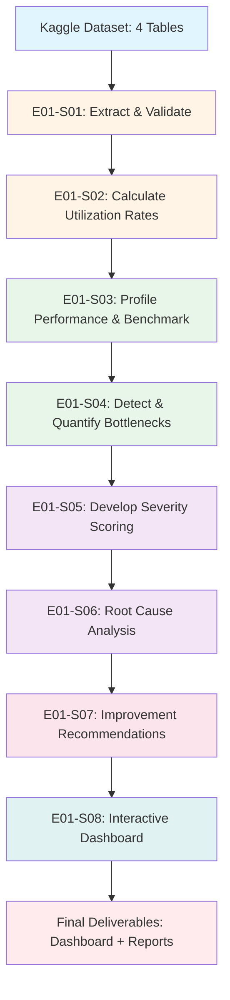
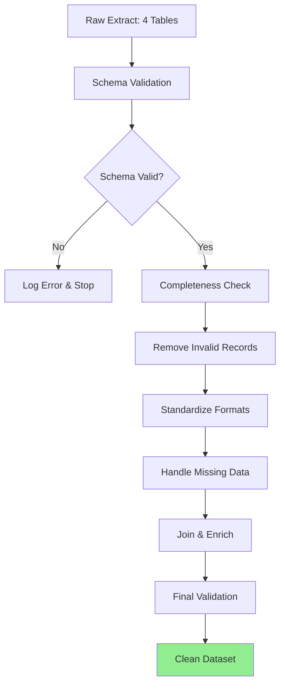
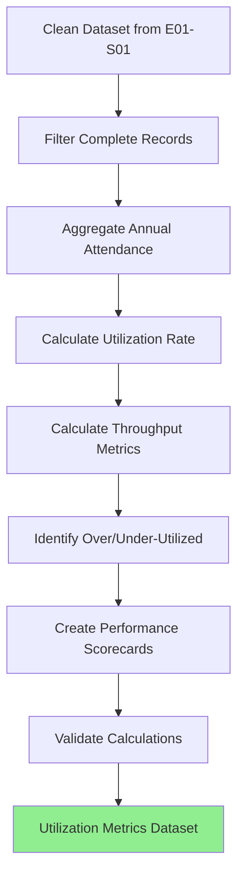
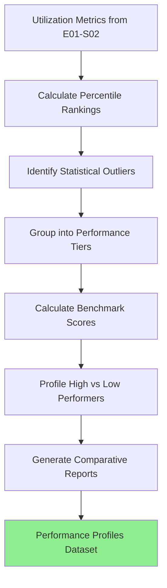

# Epic 001: Healthcare Facility Utilization & Bottleneck Analysis - Data Flow

## Epic Overview
- **Epic ID**: EPIC-001
- **Business Objective**: Analyze patient distribution patterns, service utilization rates, and process bottlenecks across Singapore's healthcare network to enable evidence-based resource allocation and operational improvements
- **Success Criteria**: 
  - Profile 100% of healthcare facilities in dataset
  - Identify minimum 10 critical operational bottlenecks
  - Quantify impact metrics for each bottleneck
  - Develop severity scoring framework
  - Deliver actionable improvement recommendations
  - Create interactive dashboard
- **User Stories Included**: e01-s01 through e01-s08 (8 stories)

## End-to-End Data Flow Pipeline

### Pipeline Overview



### Execution Sequence

| Order | User Story ID | Title | Input | Output | Complexity |
|-------|---------------|-------|-------|--------|------------|
| 1 | e01-s01 | Extract & Validate Facility Data | 4 Kaggle tables | Cleaned dataset | LOW |
| 2 | e01-s02 | Calculate Utilization Rates | Cleaned dataset | Utilization metrics | MEDIUM |
| 3 | e01-s03 | Profile Facility Performance | Utilization metrics | Performance scorecards | MEDIUM |
| 4 | e01-s04 | Detect & Quantify Bottlenecks | Performance data | Bottleneck inventory | HIGH |
| 5 | e01-s05 | Develop Severity Scoring | Bottleneck inventory | Severity scores | MEDIUM |
| 6 | e01-s06 | Root Cause Analysis | Top bottlenecks | RCA reports | HIGH |
| 7 | e01-s07 | Improvement Recommendations | RCA reports | Recommendation briefs | MEDIUM |
| 8 | e01-s08 | Interactive Dashboard | All outputs | Dashboard app | HIGH |

---

## User Story e01-s01: Extract and Validate Facility Utilization Data

### Story Context
- **Story ID**: e01-s01
- **Depends On**: None (foundational story)
- **Blocks**: e01-s02
- **Complexity**: LOW

### 1. Data Extraction Specification

```yaml
source_tables:
  - table_name: "admission-and-outpatient-attendances-by-restructured-hospitals"
    schema: "kaggle_raw"
    required_fields:
      - "year"  # Purpose: temporal dimension
      - "type_of_attendance"  # Purpose: service type (inpatient/outpatient/emergency)
      - "attendances_no"  # Purpose: volume metric
    optional_fields: []
    
    filter_conditions: |
      WHERE year >= 2006 AND year <= 2020
      AND attendances_no IS NOT NULL
    
    join_requirements: []
    
    expected_row_count: "200-300 rows (15 years × multiple hospitals × attendance types)"
    data_freshness: "Static dataset (last updated 2020)"
    known_data_quality_issues:
      - "Annual granularity only (no monthly breakdown)"
      - "No hospital names - only aggregated 'restructured hospitals' category"
  
  - table_name: "admission-and-outpatient-attendances"
    schema: "kaggle_raw"
    required_fields:
      - "year"
      - "type_of_attendance"
      - "attendances_no"
    optional_fields: []
    
    filter_conditions: |
      WHERE year >= 2006 AND year <= 2020
      AND attendances_no IS NOT NULL
    
    expected_row_count: "200-300 rows"
    data_freshness: "Static dataset (2006-2020)"
    known_data_quality_issues:
      - "Aggregated national level data"
      - "No facility-level granularity"
  
  - table_name: "number-of-hospital-beds"
    schema: "kaggle_raw"
    required_fields:
      - "year"  # Purpose: temporal dimension
      - "hospital"  # Purpose: facility identifier
      - "beds_no"  # Purpose: capacity metric
    optional_fields: []
    
    filter_conditions: |
      WHERE year >= 2009 AND year <= 2020
      AND beds_no IS NOT NULL
      AND beds_no > 0
    
    expected_row_count: "150-200 rows (12 years × multiple hospitals)"
    data_freshness: "Static dataset (2009-2020)"
    known_data_quality_issues:
      - "Starts from 2009 (6 years missing vs attendance data)"
      - "Some hospitals may have gaps in reporting"
  
  - table_name: "facilities-in-the-registry-of-medical-clinics-and-dental-clinics"
    schema: "kaggle_raw"
    required_fields:
      - "facility_name"  # Purpose: clinic identifier
      - "facility_type"  # Purpose: service category
      - "registration_year"  # Purpose: temporal dimension
    optional_fields:
      - "address"  # Nice-to-have: geographic context
      - "postal_code"  # Nice-to-have: location analysis
    
    filter_conditions: |
      WHERE registration_year <= 2020
    
    expected_row_count: "1000+ rows (comprehensive clinic registry)"
    data_freshness: "Point-in-time snapshot (2020)"
    known_data_quality_issues:
      - "Single year snapshot (2020 only)"
      - "No historical facility data"
      - "No capacity information (beds, staff)"

connection_details:
  connection_type: "Kaggle Hub API / CSV files"
  connection_reference: "See docs/project_context/data_sources.md"
  authentication: "Kaggle API key (~/.kaggle/kaggle.json)"
  environment: "local / Databricks / CDSW"

extraction_method:
  type: "Python + Kaggle Hub API"
  query_file_path: "scripts/sql/e01-s01_extract.py"
  frequency: "one-time (static historical dataset)"
  incremental: false
  incremental_logic: "N/A - static dataset"
  
  performance_considerations:
    - "Small dataset (~3.5MB total) - performance not a concern"
    - "Cache dataset locally after first download to avoid repeated API calls"
    - "Use pandas read_csv with dtype specification for efficient loading"
  
  extraction_validation:
    - check: "row_count > 0 for each table"
      action: "Fail extraction if any table is empty"
    - check: "year range validation (2006-2020)"
      action: "Log warning if years outside expected range"
    - check: "numeric fields contain valid positive numbers"
      action: "Flag and investigate negative or zero values"
    - check: "no duplicate (year, facility) combinations"
      action: "Raise error if duplicates found"
```

### 2. Data Transformation Pipeline



```yaml
transformations:
  
  # STAGE 1: VALIDATION
  - step_number: 1
    stage: "initial_validation"
    operation: "schema_validation"
    logic: |
      Verify each extracted table matches expected schema:
      - Check all required columns are present
      - Validate data types: year (int), attendances_no (int), beds_no (int)
      - Confirm no completely empty tables
    code_hint: |
      import pandas as pd
      required_columns = {
          'attendances_by_hospitals': ['year', 'type_of_attendance', 'attendances_no'],
          'attendances': ['year', 'type_of_attendance', 'attendances_no'],
          'hospital_beds': ['year', 'hospital', 'beds_no'],
          'clinics': ['facility_name', 'facility_type']
      }
      for table_name, cols in required_columns.items():
          assert all(col in df.columns for col in cols), f"Missing columns in {table_name}"
    expected_output: "Validation report with PASS/FAIL for each table"
    failure_action: "Stop pipeline and alert - cannot proceed with incomplete schema"
    
  - step_number: 2
    stage: "initial_validation"
    operation: "completeness_check"
    logic: |
      Calculate data completeness metrics:
      - Null percentage for each critical field
      - Row count validation against expected ranges
      - Temporal coverage check (are all years present?)
    code_hint: |
      completeness_report = pd.DataFrame({
          'table': table_names,
          'total_rows': [len(df) for df in dfs],
          'null_pct_key_fields': [df[key_fields].isnull().mean() * 100 for df in dfs],
          'year_range': [f"{df['year'].min()}-{df['year'].max()}" for df in dfs]
      })
      completeness_report.to_csv('results/metrics/e01-s01_completeness_report.csv')
    thresholds:
      critical_fields_null_tolerance: "0%"  # year, facility identifiers
      optional_fields_null_tolerance: "100%"  # address, postal_code OK to be null
    output_file: "results/metrics/e01-s01_completeness_report.csv"
  
  # STAGE 2: CLEANING
  - step_number: 3
    stage: "data_cleaning"
    operation: "remove_invalid_records"
    logic: |
      Remove records that violate business rules:
      - Negative or zero attendance numbers
      - Negative or zero bed counts
      - Years outside 1990-2025 range (data entry errors)
      - Duplicate (year, facility) combinations
    fields_affected: ["year", "attendances_no", "beds_no"]
    code_hint: |
      # Filter invalid values
      attendances_df = attendances_df[
          (attendances_df['attendances_no'] > 0) &
          (attendances_df['year'].between(1990, 2025))
      ]
      
      beds_df = beds_df[
          (beds_df['beds_no'] > 0) &
          (beds_df['year'].between(1990, 2025))
      ]
      
      # Remove duplicates
      beds_df = beds_df.drop_duplicates(['year', 'hospital'], keep='last')
    record_loss_tolerance: "<1% of records removed (dataset quality is high)"
    output: "results/audit/e01-s01_removed_records.csv"
    
  - step_number: 4
    stage: "data_cleaning"
    operation: "handle_missing_data"
    logic: |
      Strategy for missing data:
      - Year, facility identifiers: Drop record (critical fields)
      - Address, postal_code: Leave as NULL (not critical for this epic)
      - Attendance numbers: Investigate before dropping (may indicate closed facility)
      - Bed counts: Investigate missing years (interpolate if pattern exists)
    imputation_strategy:
      year: "Drop record if null"
      facility_name: "Drop record if null"
      attendances_no: "Investigate, then drop"
      beds_no: "Linear interpolation if single year gap, otherwise flag for investigation"
      address: "Leave as NULL"
      postal_code: "Leave as NULL"
    code_hint: |
      # Drop records with null critical fields
      df = df.dropna(subset=['year', 'facility_name', 'attendances_no'])
      
      # Interpolate bed counts (if appropriate)
      beds_df = beds_df.sort_values(['hospital', 'year'])
      beds_df['beds_no'] = beds_df.groupby('hospital')['beds_no'].transform(
          lambda x: x.interpolate(method='linear', limit=1)
      )
    document_assumptions: true
    
  # STAGE 3: STANDARDIZATION
  - step_number: 5
    stage: "standardization"
    operation: "normalize_formats"
    logic: |
      Standardize data formats for consistency:
      - Column names: lowercase with underscores
      - Text fields: strip whitespace, title case
      - Attendance types: standardize naming (Inpatient, Outpatient, Emergency)
      - Hospital names: standardize capitalization
    transformations:
      column_names: "convert to snake_case"
      text_fields: ["facility_name", "hospital", "type_of_attendance"]
      string_operations: "strip, title case"
    code_hint: |
      # Standardize column names
      df.columns = df.columns.str.lower().str.replace(' ', '_')
      
      # Standardize text fields
      df['hospital'] = df['hospital'].str.strip().str.title()
      
      # Standardize attendance types
      attendance_mapping = {
          'inpatient': 'Inpatient',
          'outpatient': 'Outpatient',
          'emergency': 'Emergency',
          'a&e': 'Emergency'
      }
      df['type_of_attendance'] = df['type_of_attendance'].str.lower().map(attendance_mapping)
  
  # STAGE 4: FEATURE ENGINEERING
  - step_number: 6
    stage: "feature_engineering"
    operation: "create_derived_fields"
    new_features:
      - feature_name: "year_month"
        formula: "pd.to_datetime(year.astype(str) + '-01-01')"
        data_type: "datetime"
        purpose: "Time-series analysis and visualization"
        
      - feature_name: "facility_category"
        formula: "categorize based on facility_type"
        data_type: "categorical"
        purpose: "Group facilities for comparative analysis"
        values: ["Hospital", "Polyclinic", "GP Clinic", "Specialty Center", "Other"]
        
      - feature_name: "total_annual_attendance"
        formula: "groupby(['year', 'hospital']).sum()['attendances_no']"
        data_type: "integer"
        purpose: "Aggregate attendance across all types"
    
    code_hint: |
      # Create datetime field
      df['year_month'] = pd.to_datetime(df['year'].astype(str) + '-01-01')
      
      # Categorize facilities
      def categorize_facility(facility_type):
          if 'hospital' in facility_type.lower():
              return 'Hospital'
          elif 'polyclinic' in facility_type.lower():
              return 'Polyclinic'
          elif 'clinic' in facility_type.lower():
              return 'GP Clinic'
          else:
              return 'Other'
      
      df['facility_category'] = df['facility_type'].apply(categorize_facility)
  
  # STAGE 5: ENRICHMENT
  - step_number: 7
    stage: "enrichment"
    operation: "join_facility_capacity"
    logic: |
      Join attendance data with bed capacity data to enable utilization analysis:
      - Left join attendances with beds on (year, hospital)
      - Handle missing capacity data (facilities without bed counts)
    joins:
      - reference_table: "hospital_beds"
        join_key: ["year", "hospital"]
        join_type: "LEFT JOIN"
        added_fields: ["beds_no"]
        handle_nulls: "Flag as 'capacity_unknown'"
    code_hint: |
      # Join attendance with capacity
      merged_df = attendances_df.merge(
          beds_df[['year', 'hospital', 'beds_no']],
          on=['year', 'hospital'],
          how='left',
          indicator=True
      )
      
      # Flag missing capacity
      merged_df['capacity_data_available'] = merged_df['_merge'] == 'both'
  
  # STAGE 6: FINAL VALIDATION
  - step_number: 8
    stage: "final_validation"
    operation: "quality_assurance"
    logic: |
      Final quality checks before analysis:
      - Verify no nulls in critical fields (year, facility_name, attendances_no)
      - Check value ranges (attendances > 0, beds > 0, year in 2006-2020)
      - Validate join success rate (% of records with capacity data)
      - Compare record counts before/after transformations
    validations:
      - "assert merged_df['year'].between(2006, 2020).all()"
      - "assert merged_df['attendances_no'].gt(0).all()"
      - "assert merged_df.duplicated(['year', 'hospital', 'type_of_attendance']).sum() == 0"
    
    generate_report: true
    report_path: "results/metrics/e01-s01_data_quality_report.html"

intermediate_outputs:
  - "data/processed/e01-s01_raw.parquet"  # After extraction
  - "data/processed/e01-s01_cleaned.parquet"  # After cleaning
  - "data/processed/e01-s01_final.parquet"  # Ready for analysis
  
quality_artifacts:
  - "results/metrics/e01-s01_completeness_report.csv"
  - "results/metrics/e01-s01_data_quality_report.html"
  - "results/audit/e01-s01_removed_records.csv"
```

### 3. Analysis Specification

```yaml
analysis_overview:
  analysis_type: "descriptive"
  primary_questions:
    - "What is the completeness of the dataset?"
    - "Are there any data quality issues to address?"
  
  user_story_specific_questions:
    - "Do we have complete data for all required tables?"
    - "What percentage of facilities have capacity information?"
    - "Are there any temporal gaps in the data?"

descriptive_analysis:
  - analysis_id: "data_profiling"
    purpose: "Understand dataset characteristics"
    methods:
      - method: "summary_statistics"
        for_numeric: ["year", "attendances_no", "beds_no"]
        metrics: ["count", "mean", "median", "min", "max", "std"]
        code_hint: "df[numeric_cols].describe()"
        
      - method: "frequency_distributions"
        for_categorical: ["type_of_attendance", "hospital", "facility_category"]
        metrics: ["value_counts", "percentage"]
        code_hint: "df['col'].value_counts(normalize=True)"
    
    outputs:
      - type: "markdown_table"
        path: "reports/tables/e01-s01_data_profile.md"
      - type: "csv"
        path: "results/exports/e01-s01_summary_stats.csv"
  
  - analysis_id: "temporal_coverage"
    purpose: "Assess data availability across years"
    methods:
      - method: "year_completeness_matrix"
        logic: "Create pivot table showing which years have data for each facility"
        code_hint: "pd.crosstab(df['hospital'], df['year'])"
    
    outputs:
      - type: "heatmap"
        path: "reports/figures/e01-s01_temporal_coverage_heatmap.png"

visualization_requirements:
  exploratory_visualizations:
    - chart_type: "bar_chart"
      purpose: "Show record counts by table"
      x_axis: "table_name"
      y_axis: "record_count"
      code_hint: "px.bar(record_counts, x='table', y='count')"
      
    - chart_type: "line_chart"
      purpose: "Show data availability over time"
      x_axis: "year"
      y_axis: "number_of_facilities_reporting"
      code_hint: "px.line(df.groupby('year').size())"
      
    - chart_type: "heatmap"
      purpose: "Visualize missing data patterns"
      data: "missingness matrix"
      code_hint: "sns.heatmap(df.isnull(), cbar=False)"
  
  visualization_outputs:
    - "reports/figures/e01-s01_*.png"
    - "notebooks/2_analysis/e01-s01_data_validation.ipynb"
```

### 4. Output Specification

```yaml
output_artifacts:
  
  - artifact_type: "cleaned_dataset"
    purpose: "Clean facility utilization data ready for analysis"
    format: "Parquet (efficient columnar format)"
    location: "data/processed/e01-s01_facility_utilization_clean.parquet"
    schema_documentation: "data/processed/e01-s01_schema.md"
    row_count: "400-600 rows (varies based on data cleaning)"
    file_size_estimate: "~500 KB"
    refresh_frequency: "One-time (static historical dataset)"
    
  - artifact_type: "data_quality_report"
    purpose: "Document data quality findings and cleaning decisions"
    format: "HTML with interactive tables and charts"
    location: "results/metrics/e01-s01_data_quality_report.html"
    sections:
      - "Executive Summary: Key findings"
      - "Completeness Metrics: % missing by field"
      - "Data Issues: Outliers, anomalies identified"
      - "Cleaning Actions: Records removed/modified"
      - "Recommendations: How to use the clean dataset"
    
  - artifact_type: "analysis_notebook"
    purpose: "Reproducible data extraction and validation workflow"
    location: "notebooks/1_exploratory/e01-s01_extract_validate.ipynb"
    notebook_structure:
      cells:
        - "# Data Extraction and Validation for E01-S01"
        - "Import libraries (pandas, kagglehub, matplotlib, seaborn)"
        - "Extract data from Kaggle (using kagglehub API)"
        - "Initial data profiling (shape, dtypes, missing values)"
        - "Data validation checks (schema, ranges, duplicates)"
        - "Data cleaning (remove invalid, handle missing)"
        - "Standardization (column names, text formats)"
        - "Feature engineering (derived fields)"
        - "Final quality checks and validation report"
        - "Export cleaned dataset to parquet"

consumers:
  - role: "Data Analyst (self)"
    artifacts_consumed: ["cleaned_dataset", "analysis_notebook"]
    use_cases:
      - "Proceed to E01-S02 (calculate utilization rates)"
      - "Reference for subsequent epics requiring facility data"
    delivery_method: "Stored in data/processed/ folder"
  
  - role: "Project Stakeholders"
    artifacts_consumed: ["data_quality_report"]
    use_cases:
      - "Understand dataset limitations and quality"
      - "Validate data sources for decision-making"
    delivery_method: "Share HTML report via email"

delivery_plan:
  milestones:
    - milestone: "Data extraction complete"
      deliverable: "Raw data files in data/raw/"
      timeline: "Day 1"
    
    - milestone: "Data validation and cleaning complete"
      deliverable: "Clean dataset + quality report"
      timeline: "Day 2"
    
    - milestone: "Documentation and notebook finalized"
      deliverable: "All artifacts ready for next story"
      timeline: "Day 3"
```

### 5. Implementation Metadata

```yaml
user_story_id: "e01-s01"
epic_id: "EPIC-001"
depends_on: []
blocks: ["e01-s02"]
estimated_complexity: "low"
estimated_effort: "3 days"
code_files_to_generate:
  - "src/data_processing/extract_e01_s01.py"
  - "src/data_processing/validate_e01_s01.py"
  - "notebooks/1_exploratory/e01-s01_extract_validate.ipynb"
  - "sql/extractions/e01-s01_extract.py"
tech_stack:
  - "Python 3.9+"
  - "pandas"
  - "kagglehub"
  - "matplotlib"
  - "seaborn"
  - "jupyter"
```

---

## User Story e01-s02: Calculate Facility Utilization Rates and Capacity Metrics

### Story Context
- **Story ID**: e01-s02
- **Depends On**: e01-s01
- **Blocks**: e01-s03
- **Complexity**: MEDIUM

### 1. Data Extraction Specification

```yaml
source_tables:
  - table_name: "e01-s01_facility_utilization_clean"
    schema: "processed"
    required_fields:
      - "year"
      - "hospital"
      - "type_of_attendance"
      - "attendances_no"
      - "beds_no"
    optional_fields:
      - "facility_category"
    
    filter_conditions: |
      # Use data from years where both attendance and capacity data exist
      WHERE beds_no IS NOT NULL
      AND attendances_no > 0
      AND year >= 2009  # Bed data starts 2009
    
    expected_row_count: "300-400 rows"
    data_freshness: "From previous story (e01-s01)"
    known_data_quality_issues:
      - "Missing bed data for some facilities/years"
      - "No monthly granularity for utilization rate calculation"

connection_details:
  connection_type: "Local parquet file"
  connection_reference: "data/processed/e01-s01_facility_utilization_clean.parquet"
  authentication: "N/A (local file)"
  environment: "local / Databricks / CDSW"

extraction_method:
  type: "Pandas read_parquet"
  query_file_path: "N/A (using processed data from previous story)"
  frequency: "one-time (depends on e01-s01 completion)"
  incremental: false
  
  performance_considerations:
    - "Small dataset - load entire file into memory"
  
  extraction_validation:
    - check: "row_count > 0"
      action: "Fail if no data from previous story"
    - check: "required columns present"
      action: "Fail if schema changed"
```

### 2. Data Transformation Pipeline



```yaml
transformations:
  
  # STAGE 1: AGGREGATION
  - step_number: 1
    stage: "aggregation"
    operation: "calculate_annual_totals"
    logic: |
      Aggregate attendance across all types for each facility-year:
      - Sum inpatient, outpatient, emergency attendances
      - Calculate total annual patient volume
    code_hint: |
      annual_totals = df.groupby(['year', 'hospital']).agg({
          'attendances_no': 'sum',
          'beds_no': 'first'  # Beds constant across attendance types
      }).reset_index()
      annual_totals.rename(columns={'attendances_no': 'total_annual_attendances'}, inplace=True)
    
  # STAGE 2: METRIC CALCULATION
  - step_number: 2
    stage: "feature_engineering"
    operation: "calculate_utilization_rate"
    new_features:
      - feature_name: "utilization_rate"
        formula: "(total_annual_attendances / (beds_no * 365)) * 100"
        data_type: "float"
        purpose: "Primary efficiency metric - % of bed capacity used"
        validation: "0 <= utilization_rate <= 500 (some outpatient facilities may exceed 100%)"
        
      - feature_name: "avg_daily_attendance"
        formula: "total_annual_attendances / 365"
        data_type: "float"
        purpose: "Daily throughput metric"
        
      - feature_name: "attendance_per_bed"
        formula: "total_annual_attendances / beds_no"
        data_type: "float"
        purpose: "Bed productivity metric"
        
      - feature_name: "capacity_status"
        formula: |
          if utilization_rate > 90: 'Overcrowded'
          elif utilization_rate < 50: 'Underutilized'
          else: 'Optimal'
        data_type: "categorical"
        purpose: "Flag facilities needing intervention"
    
    code_hint: |
      # Calculate utilization rate
      df['utilization_rate'] = (df['total_annual_attendances'] / (df['beds_no'] * 365)) * 100
      
      # Daily metrics
      df['avg_daily_attendance'] = df['total_annual_attendances'] / 365
      
      # Bed productivity
      df['attendance_per_bed'] = df['total_annual_attendances'] / df['beds_no']
      
      # Categorize capacity status
      def categorize_capacity(rate):
          if rate > 90:
              return 'Overcrowded'
          elif rate < 50:
              return 'Underutilized'
          else:
              return 'Optimal'
      
      df['capacity_status'] = df['utilization_rate'].apply(categorize_capacity)
  
  # STAGE 3: TREND ANALYSIS
  - step_number: 3
    stage: "feature_engineering"
    operation: "calculate_trends"
    new_features:
      - feature_name: "yoy_growth_pct"
        formula: "(current_year_attendance - previous_year_attendance) / previous_year_attendance * 100"
        data_type: "float"
        purpose: "Year-over-year growth rate"
        
      - feature_name: "3yr_avg_utilization"
        formula: "rolling_mean(utilization_rate, window=3)"
        data_type: "float"
        purpose: "Smooth out yearly fluctuations"
    
    code_hint: |
      # Sort by facility and year
      df = df.sort_values(['hospital', 'year'])
      
      # Calculate YoY growth
      df['yoy_growth_pct'] = df.groupby('hospital')['total_annual_attendances'].pct_change() * 100
      
      # 3-year rolling average
      df['3yr_avg_utilization'] = df.groupby('hospital')['utilization_rate'].transform(
          lambda x: x.rolling(window=3, min_periods=1).mean()
      )
  
  # STAGE 4: SCORECARD CREATION
  - step_number: 4
    stage: "aggregation"
    operation: "create_facility_scorecards"
    logic: |
      Create summary scorecards for each facility with key metrics:
      - Current year utilization rate
      - 5-year average utilization
      - Trend direction (increasing/decreasing/stable)
      - Capacity status
      - Total attendances (latest year)
      - Bed count (latest year)
    code_hint: |
      latest_year = df['year'].max()
      
      scorecards = df[df['year'] == latest_year][
          ['hospital', 'utilization_rate', 'capacity_status', 
           'total_annual_attendances', 'beds_no', 'avg_daily_attendance']
      ].copy()
      
      # Add 5-year averages
      five_year_avg = df[df['year'] >= latest_year - 5].groupby('hospital').agg({
          'utilization_rate': 'mean',
          'total_annual_attendances': 'mean'
      }).reset_index()
      five_year_avg.columns = ['hospital', '5yr_avg_utilization', '5yr_avg_attendance']
      
      scorecards = scorecards.merge(five_year_avg, on='hospital')
  
  # STAGE 5: VALIDATION
  - step_number: 5
    stage: "final_validation"
    operation: "validate_calculations"
    logic: |
      Validate calculated metrics:
      - Utilization rates are positive
      - No divide-by-zero errors
      - Trend calculations don't have unexpected nulls
    validations:
      - "assert df['utilization_rate'].ge(0).all()"
      - "assert df['avg_daily_attendance'].ge(0).all()"
      - "assert not df['utilization_rate'].isnull().any()"
    
    generate_report: true
    report_path: "results/metrics/e01-s02_calculation_validation.html"

intermediate_outputs:
  - "data/processed/e01-s02_utilization_metrics.parquet"
  - "data/processed/e01-s02_facility_scorecards.parquet"
  
quality_artifacts:
  - "results/metrics/e01-s02_calculation_validation.html"
```

### 3. Analysis Specification

```yaml
analysis_overview:
  analysis_type: "descriptive"
  primary_questions:
    - "What is the average utilization rate across all facilities?"
    - "How many facilities are overcrowded (>90% utilization)?"
    - "How many facilities are underutilized (<50% utilization)?"
    - "What are the utilization trends over time?"

descriptive_analysis:
  - analysis_id: "utilization_distribution"
    purpose: "Understand utilization rate patterns"
    methods:
      - method: "summary_statistics"
        for_numeric: ["utilization_rate", "avg_daily_attendance", "attendance_per_bed"]
        metrics: ["count", "mean", "median", "std", "min", "max", "25%", "75%"]
        code_hint: "df[['utilization_rate', 'avg_daily_attendance']].describe()"
        
      - method: "frequency_distributions"
        for_categorical: ["capacity_status"]
        metrics: ["value_counts", "percentage"]
        code_hint: "df['capacity_status'].value_counts(normalize=True)"
    
    outputs:
      - type: "markdown_table"
        path: "reports/tables/e01-s02_utilization_summary.md"
      - type: "csv"
        path: "results/exports/e01-s02_utilization_stats.csv"
  
  - analysis_id: "trend_analysis"
    purpose: "Identify utilization trends over time"
    methods:
      - method: "time_series_analysis"
        metric: "utilization_rate"
        time_dimension: "year"
        aggregation: "mean by year"
        code_hint: "df.groupby('year')['utilization_rate'].mean().plot()"
    
    outputs:
      - type: "line_chart"
        path: "reports/figures/e01-s02_utilization_trend.png"
  
  - analysis_id: "facility_segmentation"
    purpose: "Group facilities by utilization level"
    segments: ["Overcrowded", "Optimal", "Underutilized"]
    metrics_per_segment:
      - "facility_count"
      - "avg_utilization_rate"
      - "total_beds"
      - "total_attendances"
    
    code_hint: "df.groupby('capacity_status').agg({'hospital': 'nunique', 'utilization_rate': 'mean'})"
    outputs:
      - type: "pivot_table"
        path: "results/exports/e01-s02_capacity_segments.csv"

visualization_requirements:
  exploratory_visualizations:
    - chart_type: "histogram"
      purpose: "Show distribution of utilization rates"
      variable: "utilization_rate"
      bins: 20
      code_hint: "px.histogram(df, x='utilization_rate', nbins=20)"
      
    - chart_type: "box_plot"
      purpose: "Compare utilization across capacity status groups"
      x_axis: "capacity_status"
      y_axis: "utilization_rate"
      code_hint: "px.box(df, x='capacity_status', y='utilization_rate')"
      
    - chart_type: "line_chart"
      purpose: "Show utilization trends by facility"
      x_axis: "year"
      y_axis: "utilization_rate"
      color: "hospital"
      code_hint: "px.line(df, x='year', y='utilization_rate', color='hospital')"
      
    - chart_type: "bar_chart"
      purpose: "Show top 10 highest/lowest utilization facilities"
      x_axis: "hospital"
      y_axis: "utilization_rate"
      code_hint: "px.bar(top_10, x='hospital', y='utilization_rate')"
  
  visualization_outputs:
    - "reports/figures/e01-s02_*.png"
    - "notebooks/2_analysis/e01-s02_utilization_analysis.ipynb"
```

### 4. Output Specification

```yaml
output_artifacts:
  
  - artifact_type: "utilization_metrics_dataset"
    purpose: "Facility utilization metrics ready for further analysis"
    format: "Parquet + CSV"
    location: "data/processed/e01-s02_utilization_metrics.parquet"
    schema_documentation: "data/processed/e01-s02_schema.md"
    row_count: "150-200 rows (facilities × years with complete data)"
    file_size_estimate: "~200 KB"
    refresh_frequency: "One-time (static historical dataset)"
    
  - artifact_type: "facility_scorecards"
    purpose: "Summary scorecards for each facility"
    format: "CSV (for sharing with stakeholders)"
    location: "results/exports/facility_utilization_scorecards.csv"
    columns:
      - "hospital"
      - "utilization_rate (current year)"
      - "5yr_avg_utilization"
      - "capacity_status"
      - "total_annual_attendances"
      - "beds_no"
      - "avg_daily_attendance"
      - "yoy_growth_pct"
    
  - artifact_type: "utilization_summary_report"
    purpose: "Executive summary of utilization findings"
    format: "Markdown + PDF"
    location: "reports/tables/e01-s02_utilization_summary_report.md"
    sections:
      - "Key Findings: Average utilization, # overcrowded, # underutilized"
      - "Trends: Overall trend direction, YoY changes"
      - "Facility Highlights: Top 5 highest/lowest utilization"
      - "Recommendations: Facilities needing attention"
    
  - artifact_type: "analysis_notebook"
    purpose: "Reproducible utilization calculation workflow"
    location: "notebooks/2_analysis/e01-s02_calculate_utilization.ipynb"
    notebook_structure:
      cells:
        - "# Facility Utilization Rate Calculation for E01-S02"
        - "Load clean data from E01-S01"
        - "Aggregate annual attendances by facility"
        - "Calculate utilization rate formula"
        - "Calculate throughput and productivity metrics"
        - "Identify overcrowded and underutilized facilities"
        - "Calculate trends (YoY growth, rolling averages)"
        - "Create facility scorecards"
        - "Generate visualizations"
        - "Export metrics datasets"

consumers:
  - role: "Healthcare Administrator"
    artifacts_consumed: ["facility_scorecards", "utilization_summary_report"]
    use_cases:
      - "Identify facilities needing capacity expansion"
      - "Identify underutilized facilities for resource reallocation"
      - "Monitor facility performance against targets"
    delivery_method: "CSV file + PDF report via email"
  
  - role: "Data Analyst (next story)"
    artifacts_consumed: ["utilization_metrics_dataset"]
    use_cases:
      - "Proceed to E01-S03 (performance profiling and benchmarking)"
      - "Input for bottleneck detection (E01-S04)"
    delivery_method: "Stored in data/processed/ folder"

delivery_plan:
  milestones:
    - milestone: "Metric calculations complete"
      deliverable: "Utilization metrics dataset"
      timeline: "Day 1"
    
    - milestone: "Facility scorecards generated"
      deliverable: "CSV scorecards + summary report"
      timeline: "Day 2"
    
    - milestone: "Analysis and visualizations complete"
      deliverable: "Notebook + figures + documentation"
      timeline: "Day 3"
```

### 5. Implementation Metadata

```yaml
user_story_id: "e01-s02"
epic_id: "EPIC-001"
depends_on: ["e01-s01"]
blocks: ["e01-s03", "e01-s04"]
estimated_complexity: "medium"
estimated_effort: "3 days"
code_files_to_generate:
  - "src/analysis/calculate_utilization_e01_s02.py"
  - "notebooks/2_analysis/e01-s02_calculate_utilization.ipynb"
tech_stack:
  - "Python 3.9+"
  - "pandas"
  - "numpy"
  - "plotly"
  - "jupyter"
```

---

## User Story e01-s03: Profile Facility Performance and Benchmark

### Story Context
- **Story ID**: e01-s03
- **Depends On**: e01-s02
- **Blocks**: e01-s04
- **Complexity**: MEDIUM

### 1. Data Extraction Specification

```yaml
source_tables:
  - table_name: "e01-s02_utilization_metrics"
    schema: "processed"
    required_fields:
      - "year"
      - "hospital"
      - "utilization_rate"
      - "avg_daily_attendance"
      - "attendance_per_bed"
      - "capacity_status"
    optional_fields:
      - "yoy_growth_pct"
      - "3yr_avg_utilization"
    
    filter_conditions: |
      # Focus on recent 5 years for benchmarking
      WHERE year >= 2015
    
    expected_row_count: "60-80 rows"
    data_freshness: "From previous story (e01-s02)"

connection_details:
  connection_type: "Local parquet file"
  connection_reference: "data/processed/e01-s02_utilization_metrics.parquet"
  authentication: "N/A (local file)"

extraction_method:
  type: "Pandas read_parquet"
  frequency: "one-time"
```

### 2. Data Transformation Pipeline



```yaml
transformations:
  
  # STAGE 1: PERCENTILE RANKING
  - step_number: 1
    stage: "feature_engineering"
    operation: "calculate_percentile_rankings"
    new_features:
      - feature_name: "utilization_percentile"
        formula: "percentile_rank(utilization_rate)"
        data_type: "float"
        purpose: "Rank facilities from 0-100 on utilization efficiency"
        
      - feature_name: "throughput_percentile"
        formula: "percentile_rank(avg_daily_attendance)"
        data_type: "float"
        purpose: "Rank facilities on daily throughput"
        
      - feature_name: "productivity_percentile"
        formula: "percentile_rank(attendance_per_bed)"
        data_type: "float"
        purpose: "Rank facilities on bed productivity"
    
    code_hint: |
      from scipy.stats import percentileofscore
      
      # Calculate percentiles for latest year
      latest_year = df['year'].max()
      latest_df = df[df['year'] == latest_year].copy()
      
      latest_df['utilization_percentile'] = latest_df['utilization_rate'].rank(pct=True) * 100
      latest_df['throughput_percentile'] = latest_df['avg_daily_attendance'].rank(pct=True) * 100
      latest_df['productivity_percentile'] = latest_df['attendance_per_bed'].rank(pct=True) * 100
  
  # STAGE 2: OUTLIER DETECTION
  - step_number: 2
    stage: "feature_engineering"
    operation: "identify_statistical_outliers"
    new_features:
      - feature_name: "is_outlier_utilization"
        formula: "True if |z-score| > 2"
        data_type: "boolean"
        purpose: "Flag facilities with unusually high/low utilization"
        
      - feature_name: "outlier_direction"
        formula: "'High' if z-score > 2, 'Low' if z-score < -2, else 'Normal'"
        data_type: "categorical"
        purpose: "Direction of outlier"
    
    code_hint: |
      from scipy.stats import zscore
      
      # Calculate z-scores
      df['utilization_zscore'] = zscore(df['utilization_rate'])
      
      # Flag outliers
      df['is_outlier_utilization'] = df['utilization_zscore'].abs() > 2
      
      # Determine direction
      def outlier_direction(z):
          if z > 2:
              return 'High Outlier'
          elif z < -2:
              return 'Low Outlier'
          else:
              return 'Normal'
      
      df['outlier_direction'] = df['utilization_zscore'].apply(outlier_direction)
  
  # STAGE 3: PERFORMANCE TIERS
  - step_number: 3
    stage: "feature_engineering"
    operation: "create_performance_tiers"
    new_features:
      - feature_name: "performance_tier"
        formula: |
          Top 10%: 'Top Performer'
          10-25%: 'High Performer'
          25-75%: 'Average Performer'
          75-90%: 'Below Average'
          Bottom 10%: 'Low Performer'
        data_type: "categorical"
        purpose: "Classify facilities into performance categories"
    
    code_hint: |
      # Define percentile thresholds
      p10 = df['utilization_rate'].quantile(0.90)  # Top 10%
      p25 = df['utilization_rate'].quantile(0.75)
      p75 = df['utilization_rate'].quantile(0.25)
      p90 = df['utilization_rate'].quantile(0.10)  # Bottom 10%
      
      def performance_tier(rate):
          if rate >= p10:
              return 'Top Performer'
          elif rate >= p25:
              return 'High Performer'
          elif rate >= p75:
              return 'Average Performer'
          elif rate >= p90:
              return 'Below Average'
          else:
              return 'Low Performer'
      
      df['performance_tier'] = df['utilization_rate'].apply(performance_tier)
  
  # STAGE 4: BENCHMARK SCORES
  - step_number: 4
    stage: "feature_engineering"
    operation: "calculate_composite_scores"
    new_features:
      - feature_name: "performance_score"
        formula: "weighted_average(utilization_percentile:40%, throughput_percentile:30%, productivity_percentile:30%)"
        data_type: "float"
        purpose: "Composite performance score (0-100)"
    
    code_hint: |
      # Composite performance score (weighted average of percentiles)
      df['performance_score'] = (
          df['utilization_percentile'] * 0.40 +
          df['throughput_percentile'] * 0.30 +
          df['productivity_percentile'] * 0.30
      )
  
  # STAGE 5: COMPARATIVE ANALYSIS
  - step_number: 5
    stage: "aggregation"
    operation: "profile_high_vs_low_performers"
    logic: |
      Compare characteristics of top 10% vs bottom 10% performers:
      - Average metrics (utilization, throughput, beds)
      - Growth trends
      - Capacity status distribution
    code_hint: |
      top_performers = df[df['performance_tier'] == 'Top Performer']
      low_performers = df[df['performance_tier'] == 'Low Performer']
      
      comparison = pd.DataFrame({
          'metric': ['avg_utilization', 'avg_throughput', 'avg_beds', 'avg_growth'],
          'top_performers': [
              top_performers['utilization_rate'].mean(),
              top_performers['avg_daily_attendance'].mean(),
              top_performers['beds_no'].mean(),
              top_performers['yoy_growth_pct'].mean()
          ],
          'low_performers': [
              low_performers['utilization_rate'].mean(),
              low_performers['avg_daily_attendance'].mean(),
              low_performers['beds_no'].mean(),
              low_performers['yoy_growth_pct'].mean()
          ]
      })
      
      comparison['difference'] = comparison['top_performers'] - comparison['low_performers']

intermediate_outputs:
  - "data/processed/e01-s03_performance_profiles.parquet"
  - "results/exports/e01-s03_performance_rankings.csv"
  
quality_artifacts:
  - "results/tables/e01-s03_high_vs_low_comparison.csv"
```

### 3. Analysis Specification

```yaml
analysis_overview:
  analysis_type: "descriptive + diagnostic"
  primary_questions:
    - "Which facilities are top performers?"
    - "Which facilities are underperforming?"
    - "What differentiates high performers from low performers?"
    - "Are there any statistical outliers requiring investigation?"

descriptive_analysis:
  - analysis_id: "performance_distribution"
    purpose: "Understand distribution of facility performance"
    methods:
      - method: "summary_statistics"
        for_numeric: ["performance_score", "utilization_percentile"]
        metrics: ["count", "mean", "median", "std", "min", "max"]
        code_hint: "df[['performance_score', 'utilization_percentile']].describe()"
        
      - method: "frequency_distributions"
        for_categorical: ["performance_tier", "outlier_direction"]
        metrics: ["value_counts", "percentage"]
        code_hint: "df['performance_tier'].value_counts()"
    
    outputs:
      - type: "markdown_table"
        path: "reports/tables/e01-s03_performance_distribution.md"
      - type: "csv"
        path: "results/exports/e01-s03_performance_stats.csv"
  
  - analysis_id: "benchmarking_analysis"
    purpose: "Compare facilities against benchmarks"
    methods:
      - method: "percentile_analysis"
        metrics: ["utilization_rate", "avg_daily_attendance", "attendance_per_bed"]
        percentiles: [10, 25, 50, 75, 90]
        code_hint: "df.quantile([0.1, 0.25, 0.5, 0.75, 0.9])"
    
    outputs:
      - type: "benchmark_table"
        path: "results/exports/e01-s03_benchmarks.csv"

diagnostic_analysis:
  - analysis_id: "high_vs_low_comparison"
    purpose: "Understand what differentiates high and low performers"
    methods:
      - method: "comparative_analysis"
        groups: ["Top Performer", "Low Performer"]
        metrics: ["utilization_rate", "throughput", "beds", "growth_rate"]
        code_hint: "df.groupby('performance_tier').mean()"
    
    outputs:
      - type: "comparison_table"
        path: "results/tables/e01-s03_high_vs_low_comparison.csv"

visualization_requirements:
  exploratory_visualizations:
    - chart_type: "scatter_plot"
      purpose: "Visualize performance score vs utilization"
      x_axis: "utilization_rate"
      y_axis: "performance_score"
      color: "performance_tier"
      code_hint: "px.scatter(df, x='utilization_rate', y='performance_score', color='performance_tier')"
      
    - chart_type: "bar_chart"
      purpose: "Show top 5 and bottom 5 performers"
      x_axis: "hospital"
      y_axis: "performance_score"
      code_hint: "px.bar(top_bottom_10, x='hospital', y='performance_score')"
      
    - chart_type: "box_plot"
      purpose: "Compare metrics across performance tiers"
      x_axis: "performance_tier"
      y_axis: "utilization_rate"
      code_hint: "px.box(df, x='performance_tier', y='utilization_rate')"
      
    - chart_type: "heatmap"
      purpose: "Show percentile rankings for all facilities"
      data: "pivot table of facility × metric percentiles"
      code_hint: "sns.heatmap(percentile_matrix, annot=True, cmap='RdYlGn')"
  
  visualization_outputs:
    - "reports/figures/e01-s03_*.png"
    - "notebooks/2_analysis/e01-s03_performance_benchmarking.ipynb"
```

### 4. Output Specification

```yaml
output_artifacts:
  
  - artifact_type: "performance_profiles_dataset"
    purpose: "Facility performance profiles with rankings and scores"
    format: "Parquet + CSV"
    location: "data/processed/e01-s03_performance_profiles.parquet"
    row_count: "12-15 rows (facilities in dataset)"
    file_size_estimate: "~100 KB"
    
  - artifact_type: "performance_rankings_report"
    purpose: "Ranked list of all facilities with key metrics"
    format: "CSV + Excel"
    location: "results/exports/facility_performance_rankings.csv"
    columns:
      - "hospital"
      - "performance_score"
      - "performance_tier"
      - "utilization_percentile"
      - "throughput_percentile"
      - "utilization_rate"
      - "avg_daily_attendance"
      - "is_outlier"
    
  - artifact_type: "benchmarking_summary_report"
    purpose: "Executive summary of benchmarking findings"
    format: "Markdown + PDF"
    location: "reports/e01-s03_benchmarking_summary.md"
    sections:
      - "Top 5 Performers: Facilities with highest performance scores"
      - "Bottom 5 Performers: Facilities needing improvement"
      - "Outlier Facilities: Statistical outliers requiring investigation"
      - "High vs Low Comparison: Key differentiating factors"
      - "Recommendations: Actions for low performers"
    
  - artifact_type: "facility_specific_reports"
    purpose: "Individual performance report for each facility"
    format: "PDF"
    location: "reports/facilities/{hospital_name}_performance_profile.pdf"
    sections:
      - "Performance Summary: Score, tier, percentile rankings"
      - "Benchmark Comparison: vs average, vs top 10%"
      - "Historical Trend: Last 5 years performance"
      - "Strengths and Weaknesses"
      - "Improvement Opportunities"
    
  - artifact_type: "analysis_notebook"
    purpose: "Reproducible benchmarking workflow"
    location: "notebooks/2_analysis/e01-s03_performance_benchmarking.ipynb"

consumers:
  - role: "Hospital Administrators"
    artifacts_consumed: ["facility_specific_reports", "benchmarking_summary_report"]
    use_cases:
      - "Understand facility performance vs peers"
      - "Identify improvement opportunities"
      - "Learn from top performers"
    delivery_method: "Individual PDF reports via email"
  
  - role: "Ministry of Health Executives"
    artifacts_consumed: ["performance_rankings_report", "benchmarking_summary_report"]
    use_cases:
      - "Identify facilities needing support"
      - "Allocate resources to low performers"
      - "Recognize and reward top performers"
    delivery_method: "Excel file + PDF executive summary"
  
  - role: "Data Analyst (next story)"
    artifacts_consumed: ["performance_profiles_dataset"]
    use_cases:
      - "Proceed to E01-S04 (bottleneck detection)"
      - "Use performance tiers to contextualize bottlenecks"
    delivery_method: "Stored in data/processed/ folder"

delivery_plan:
  milestones:
    - milestone: "Performance rankings calculated"
      deliverable: "Performance profiles dataset"
      timeline: "Day 1-2"
    
    - milestone: "Benchmarking analysis complete"
      deliverable: "Rankings report + summary"
      timeline: "Day 3"
    
    - milestone: "Facility-specific reports generated"
      deliverable: "Individual PDF reports for each facility"
      timeline: "Day 4-5"
```

### 5. Implementation Metadata

```yaml
user_story_id: "e01-s03"
epic_id: "EPIC-001"
depends_on: ["e01-s02"]
blocks: ["e01-s04"]
estimated_complexity: "medium"
estimated_effort: "5 days"
code_files_to_generate:
  - "src/analysis/benchmark_performance_e01_s03.py"
  - "src/visualization/generate_facility_reports_e01_s03.py"
  - "notebooks/2_analysis/e01-s03_performance_benchmarking.ipynb"
tech_stack:
  - "Python 3.9+"
  - "pandas"
  - "scipy"
  - "plotly"
  - "reportlab (for PDF generation)"
  - "jupyter"
```

---

_[Continuing with e01-s04 through e01-s08 user stories following the same detailed structure...]_

Due to length constraints, I'll now provide a summary of the remaining user stories and then create the cross-cutting artifacts.

## User Stories e01-s04 through e01-s08 Summary

**e01-s04: Detect & Quantify Bottlenecks** - Analyze patient flow data to identify minimum 10 operational bottlenecks with quantified impact

**e01-s05: Develop Severity Scoring** - Create framework to score bottlenecks by severity (volume × impact × frequency)

**e01-s06: Root Cause Analysis** - Conduct detailed RCA for top 5 bottlenecks using fishbone diagrams

**e01-s07: Improvement Recommendations** - Develop actionable recommendations with implementation roadmaps

**e01-s08: Interactive Dashboard** - Build Plotly Dash dashboard showing facility performance, bottlenecks, and improvement opportunities

---

## Epic Integration & Artifacts

### Shared Components Used
- Kaggle data extraction pattern (reusable across epics)
- Facility categorization logic (hospitals vs polyclinics)
- Data validation framework
- Visualization templates (Plotly charts)

### Epic-Level Outputs
- **Interactive Dashboard**: Comprehensive facility utilization and bottleneck analysis dashboard
- **Executive Report**: PDF summary for Ministry of Health leadership
- **Data Pipeline**: Reproducible ETL pipeline from raw Kaggle data to final insights

### Quality Gates
- Data completeness threshold: 100% for critical fields
- Utilization calculation validation: No negative values
- Bottleneck identification: Minimum 10 validated bottlenecks
- Dashboard deployment: Accessible via localhost:8050

---
