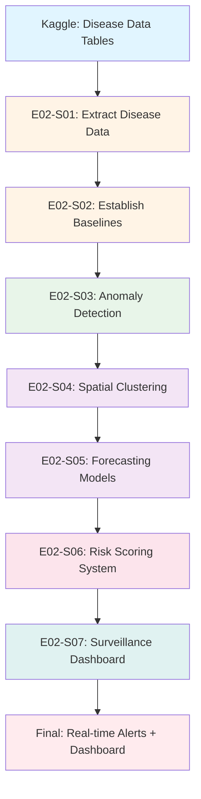
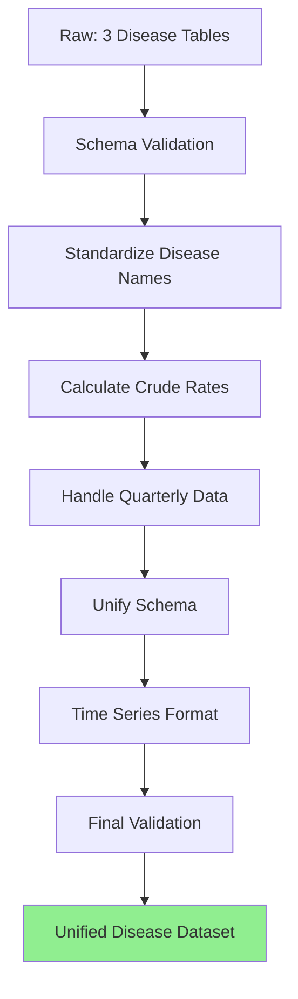
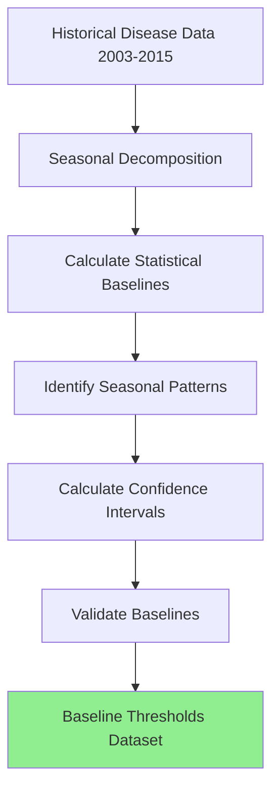

# Epic 002: Disease Outbreak Detection & Surveillance System - Data Flow

## Epic Overview
- **Epic ID**: EPIC-002
- **Business Objective**: Implement automated disease surveillance with anomaly detection algorithms and geographic clustering analysis to identify potential outbreaks 7-14 days earlier than traditional methods, enabling rapid public health response
- **Success Criteria**:
  - Monitor minimum 10 key diseases
  - Achieve outbreak detection 7-14 days earlier
  - Maintain <5% false positive rate for alerts
  - Generate interactive disease risk maps
  - Identify minimum 5 significant disease clusters per quarter
  - Forecasting models achieve ≤15% MAPE
  - Deploy real-time surveillance dashboard
- **User Stories Included**: e02-s01 through e02-s07 (7 stories)

## End-to-End Data Flow Pipeline

### Pipeline Overview



### Execution Sequence

| Order | User Story ID | Title | Input | Output | Complexity |
|-------|---------------|-------|-------|--------|------------|
| 1 | e02-s01 | Extract Disease Data | 3 Kaggle tables | Clean disease dataset | MEDIUM |
| 2 | e02-s02 | Establish Baselines | Disease dataset | Baseline thresholds | MEDIUM |
| 3 | e02-s03 | Anomaly Detection | Baseline + current data | Outbreak alerts | HIGH |
| 4 | e02-s04 | Spatial Clustering | Disease + geographic | Cluster maps | HIGH |
| 5 | e02-s05 | Forecasting Models | Historical disease data | Predictions | HIGH |
| 6 | e02-s06 | Risk Scoring | All outputs | Risk scores | MEDIUM |
| 7 | e02-s07 | Surveillance Dashboard | All outputs | Dashboard app | HIGH |

---

## User Story e02-s01: Extract and Prepare Disease Surveillance Data

### Story Context
- **Story ID**: e02-s01
- **Depends On**: None (foundational story)
- **Blocks**: e02-s02
- **Complexity**: MEDIUM

### 1. Data Extraction Specification

```yaml
source_tables:
  - table_name: "principal-causes-of-death"
    schema: "kaggle_raw"
    required_fields:
      - "year"  # Purpose: temporal dimension
      - "cause_of_death"  # Purpose: disease/condition
      - "deaths_no"  # Purpose: mortality count
    optional_fields:
      - "crude_rate"  # May not be present in all tables
    
    filter_conditions: |
      WHERE year >= 2003 AND year <= 2020
      AND deaths_no IS NOT NULL
      AND cause_of_death NOT IN ('Total', 'All Causes')
    
    expected_row_count: "400+ rows (18 years × multiple causes)"
    data_freshness: "Static dataset (1990-2019)"
    known_data_quality_issues:
      - "Some years may have different cause categorizations"
      - "Crude rates may need recalculation for consistency"
  
  - table_name: "communicable-diseases-quarterly-crude-rates"
    schema: "kaggle_raw"
    required_fields:
      - "year"
      - "quarter"  # Purpose: quarterly granularity
      - "disease_type"
      - "cases"  # Purpose: incidence count
      - "crude_rate"  # Purpose: rate per 100,000
    optional_fields: []
    
    filter_conditions: |
      WHERE year >= 2003 AND year <= 2020
      AND cases IS NOT NULL
    
    expected_row_count: "600+ rows (18 years × 4 quarters × multiple diseases)"
    data_freshness: "Quarterly data (2003-2020)"
    known_data_quality_issues:
      - "Quarterly data provides better temporal resolution"
      - "Disease naming may vary from other tables"
  
  - table_name: "reportable-infectious-diseases"
    schema: "kaggle_raw"
    required_fields:
      - "year"
      - "disease"  # Purpose: infectious disease type
      - "cases_no"  # Purpose: reported case count
    optional_fields: []
    
    filter_conditions: |
      WHERE year >= 2004 AND year <= 2020
      AND cases_no IS NOT NULL
    
    expected_row_count: "300+ rows (17 years × multiple diseases)"
    data_freshness: "Annual data (2004-2020)"
    known_data_quality_issues:
      - "Only reportable diseases (subset of all diseases)"
      - "Annual granularity (less frequent than quarterly)"

connection_details:
  connection_type: "Kaggle Hub API"
  connection_reference: "See docs/project_context/data_sources.md"
  authentication: "Kaggle API key"
  environment: "local / Databricks / CDSW"

extraction_method:
  type: "Python + Kaggle Hub API"
  query_file_path: "scripts/e02-s01_extract_disease_data.py"
  frequency: "one-time (static historical dataset)"
  incremental: false
  
  performance_considerations:
    - "Small dataset - performance not a concern"
    - "Cache locally after first download"
  
  extraction_validation:
    - check: "row_count > 0 for each table"
      action: "Fail if any table is empty"
    - check: "year range validation (2003-2020)"
      action: "Log warning if years outside expected range"
    - check: "numeric case counts are positive"
      action: "Flag negative or zero values for investigation"
```

### 2. Data Transformation Pipeline



```yaml
transformations:
  
  # STAGE 1: VALIDATION
  - step_number: 1
    stage: "initial_validation"
    operation: "schema_validation"
    logic: |
      Verify each table has required fields:
      - year, disease identifier, case/death counts
      - Check data types are correct
    code_hint: |
      required_fields = {
          'deaths': ['year', 'cause_of_death', 'deaths_no'],
          'quarterly_diseases': ['year', 'quarter', 'disease_type', 'cases', 'crude_rate'],
          'infectious': ['year', 'disease', 'cases_no']
      }
      # Validate each dataframe
    expected_output: "Schema validation report"
    failure_action: "Stop pipeline if critical fields missing"
  
  # STAGE 2: STANDARDIZATION
  - step_number: 2
    stage: "standardization"
    operation: "standardize_disease_names"
    logic: |
      Create unified disease taxonomy:
      - Map disease names to standardized codes (ICD-10 where possible)
      - Handle variations (e.g., "Tuberculosis" vs "TB")
      - Create disease_category field (respiratory, gastrointestinal, vector-borne, etc.)
    code_hint: |
      # Disease name mapping dictionary
      disease_mapping = {
          'tuberculosis': {'standard_name': 'Tuberculosis', 'icd10': 'A15-A19', 'category': 'Respiratory'},
          'dengue fever': {'standard_name': 'Dengue', 'icd10': 'A90', 'category': 'Vector-Borne'},
          'influenza': {'standard_name': 'Influenza', 'icd10': 'J09-J11', 'category': 'Respiratory'},
          # ... more mappings
      }
      
      def standardize_disease(disease_name):
          disease_lower = disease_name.lower().strip()
          if disease_lower in disease_mapping:
              return disease_mapping[disease_lower]['standard_name']
          else:
              return disease_name.title()  # Fallback
      
      df['disease_standard'] = df['disease'].apply(standardize_disease)
      df['disease_category'] = df['disease'].apply(lambda x: disease_mapping.get(x.lower(), {}).get('category', 'Other'))
  
  - step_number: 3
    stage: "data_cleaning"
    operation: "calculate_crude_rates"
    logic: |
      Calculate crude rates (per 100,000 population) where missing:
      - Use Singapore population data by year
      - Formula: (cases / population) × 100,000
    code_hint: |
      # Singapore population by year (approximate)
      singapore_population = {
          2003: 4114826, 2004: 4166664, 2005: 4265762,
          2006: 4401365, 2007: 4588599, 2008: 4839396,
          2009: 4987573, 2010: 5076732, 2011: 5183688,
          2012: 5312400, 2013: 5399162, 2014: 5469724,
          2015: 5535002, 2016: 5607283, 2017: 5612253,
          2018: 5638676, 2019: 5703569, 2020: 5685807
      }
      
      df['population'] = df['year'].map(singapore_population)
      df['crude_rate'] = (df['cases'] / df['population']) * 100000
  
  - step_number: 4
    stage: "feature_engineering"
    operation: "handle_temporal_granularity"
    logic: |
      Unify temporal dimensions:
      - Quarterly data: Keep quarter field
      - Annual data: Set quarter = 'Annual'
      - Create year_quarter field for time series
    new_features:
      - feature_name: "year_quarter"
        formula: "f'{year}-Q{quarter}' if quarterly else f'{year}-Annual'"
        data_type: "string"
        purpose: "Unified time dimension"
        
      - feature_name: "date"
        formula: "Convert to datetime (start of quarter or year)"
        data_type: "datetime"
        purpose: "Time series analysis"
    
    code_hint: |
      # For quarterly data
      df_quarterly['year_quarter'] = df_quarterly['year'].astype(str) + '-Q' + df_quarterly['quarter'].astype(str)
      
      # Convert to datetime (start of quarter)
      quarter_month_map = {1: 1, 2: 4, 3: 7, 4: 10}
      df_quarterly['date'] = pd.to_datetime(
          df_quarterly['year'].astype(str) + '-' + 
          df_quarterly['quarter'].map(quarter_month_map).astype(str) + '-01'
      )
      
      # For annual data
      df_annual['year_quarter'] = df_annual['year'].astype(str) + '-Annual'
      df_annual['date'] = pd.to_datetime(df_annual['year'].astype(str) + '-01-01')
  
  - step_number: 5
    stage: "feature_engineering"
    operation: "create_unified_schema"
    logic: |
      Create unified schema across all tables:
      - disease_standard (standardized disease name)
      - disease_category (respiratory, vector-borne, etc.)
      - date (datetime)
      - year, quarter (temporal fields)
      - cases (incidence count)
      - crude_rate (per 100,000)
      - data_source (deaths, quarterly, infectious)
    code_hint: |
      # Rename columns to unified schema
      df_deaths.rename(columns={'cause_of_death': 'disease', 'deaths_no': 'cases'}, inplace=True)
      df_infectious.rename(columns={'cases_no': 'cases'}, inplace=True)
      
      # Add data_source column
      df_deaths['data_source'] = 'mortality'
      df_quarterly['data_source'] = 'surveillance_quarterly'
      df_infectious['data_source'] = 'reportable_diseases'
      
      # Concatenate all tables
      unified_df = pd.concat([df_deaths, df_quarterly, df_infectious], ignore_index=True)
  
  - step_number: 6
    stage: "data_cleaning"
    operation: "remove_duplicates_and_outliers"
    logic: |
      Remove duplicate records and validate case counts:
      - Drop exact duplicates
      - Investigate case counts >10,000 (potential data entry errors)
      - Remove records with zero cases (if not meaningful)
    code_hint: |
      # Remove duplicates
      unified_df = unified_df.drop_duplicates(subset=['year', 'quarter', 'disease_standard'])
      
      # Flag potential outliers
      unified_df['is_outlier'] = unified_df['cases'] > 10000
      outliers = unified_df[unified_df['is_outlier']]
      # Log outliers for manual review
  
  # STAGE 3: TIME SERIES FORMAT
  - step_number: 7
    stage: "feature_engineering"
    operation: "prepare_time_series_format"
    logic: |
      Sort and index for time series analysis:
      - Sort by disease, date
      - Set multi-index (disease, date) for efficient querying
      - Ensure no gaps in time series
    code_hint: |
      # Sort by disease and date
      unified_df = unified_df.sort_values(['disease_standard', 'date'])
      
      # Optionally set multi-index
      ts_df = unified_df.set_index(['disease_standard', 'date'])
      
      # Check for temporal gaps (missing quarters/years)
      # Use reindex to fill gaps with NaN
  
  # STAGE 4: FINAL VALIDATION
  - step_number: 8
    stage: "final_validation"
    operation: "quality_assurance"
    logic: |
      Final quality checks:
      - Verify no nulls in critical fields (year, disease, cases)
      - Check crude_rate calculations are reasonable (0-10,000)
      - Validate temporal coverage (2003-2020)
      - Confirm disease standardization worked (no unmapped diseases)
    validations:
      - "assert unified_df['cases'].ge(0).all()"
      - "assert unified_df['crude_rate'].between(0, 10000).all()"
      - "assert unified_df['year'].between(2003, 2020).all()"
    
    generate_report: true
    report_path: "results/metrics/e02-s01_data_quality_report.html"

intermediate_outputs:
  - "data/processed/e02-s01_raw.parquet"
  - "data/processed/e02-s01_unified_disease_data.parquet"
  
quality_artifacts:
  - "results/metrics/e02-s01_completeness_report.csv"
  - "results/metrics/e02-s01_data_quality_report.html"
  - "config/disease_name_mappings.yml"
```

### 3. Analysis Specification

```yaml
analysis_overview:
  analysis_type: "descriptive"
  primary_questions:
    - "What diseases are available in the dataset?"
    - "What is the temporal coverage for each disease?"
    - "What is the data quality and completeness?"

descriptive_analysis:
  - analysis_id: "disease_inventory"
    purpose: "Catalog available diseases"
    methods:
      - method: "frequency_distribution"
        for_categorical: ["disease_standard", "disease_category", "data_source"]
        code_hint: "unified_df['disease_standard'].value_counts()"
    
    outputs:
      - type: "csv"
        path: "results/exports/e02-s01_disease_inventory.csv"
  
  - analysis_id: "temporal_coverage"
    purpose: "Assess data availability over time"
    methods:
      - method: "coverage_matrix"
        logic: "Pivot table showing which years/quarters have data for each disease"
        code_hint: "pd.crosstab(unified_df['disease_standard'], unified_df['year'])"
    
    outputs:
      - type: "heatmap"
        path: "reports/figures/e02-s01_temporal_coverage.png"

visualization_requirements:
  exploratory_visualizations:
    - chart_type: "bar_chart"
      purpose: "Show disease counts"
      x_axis: "disease_standard"
      y_axis: "total_cases"
      code_hint: "px.bar(unified_df.groupby('disease_standard')['cases'].sum())"
      
    - chart_type: "line_chart"
      purpose: "Show disease trends over time"
      x_axis: "date"
      y_axis: "cases"
      color: "disease_standard"
      code_hint: "px.line(unified_df, x='date', y='cases', color='disease_standard')"
      
    - chart_type: "heatmap"
      purpose: "Visualize temporal coverage"
      data: "disease × year matrix"
      code_hint: "sns.heatmap(coverage_matrix, cmap='YlGnBu')"
  
  visualization_outputs:
    - "reports/figures/e02-s01_*.png"
    - "notebooks/2_analysis/e02-s01_disease_data_exploration.ipynb"
```

### 4. Output Specification

```yaml
output_artifacts:
  
  - artifact_type: "unified_disease_dataset"
    purpose: "Clean, standardized disease surveillance data"
    format: "Parquet"
    location: "data/processed/e02-s01_unified_disease_data.parquet"
    schema:
      - "disease_standard (string): Standardized disease name"
      - "disease_category (string): Disease category"
      - "date (datetime): Observation date"
      - "year (int): Year"
      - "quarter (string): Quarter (1-4 or 'Annual')"
      - "cases (int): Number of cases/deaths"
      - "crude_rate (float): Rate per 100,000"
      - "data_source (string): Source table"
    row_count: "1000+ rows"
    file_size_estimate: "~1 MB"
    
  - artifact_type: "disease_taxonomy"
    purpose: "Disease name standardization mapping"
    format: "YAML"
    location: "config/disease_name_mappings.yml"
    content: "Mapping of raw disease names to standardized names, ICD-10 codes, categories"
    
  - artifact_type: "data_quality_report"
    purpose: "Document data quality and preparation decisions"
    format: "HTML"
    location: "results/metrics/e02-s01_data_quality_report.html"
    sections:
      - "Disease Inventory: Complete list of diseases"
      - "Temporal Coverage: Years/quarters available"
      - "Standardization: Disease name mappings applied"
      - "Quality Issues: Outliers, missing data handled"
    
  - artifact_type: "analysis_notebook"
    purpose: "Reproducible disease data extraction workflow"
    location: "notebooks/1_exploratory/e02-s01_extract_disease_data.ipynb"

consumers:
  - role: "Epidemiologist"
    artifacts_consumed: ["unified_disease_dataset", "disease_taxonomy"]
    use_cases:
      - "Proceed to baseline establishment (e02-s02)"
      - "Conduct disease trend analysis"
    delivery_method: "Stored in data/processed/ folder"

delivery_plan:
  milestones:
    - milestone: "Data extraction complete"
      deliverable: "Raw disease data files"
      timeline: "Day 1"
    
    - milestone: "Standardization and unification complete"
      deliverable: "Unified disease dataset"
      timeline: "Day 2-3"
    
    - milestone: "Quality report and documentation"
      deliverable: "Data quality report + disease taxonomy"
      timeline: "Day 4"
```

### 5. Implementation Metadata

```yaml
user_story_id: "e02-s01"
epic_id: "EPIC-002"
depends_on: []
blocks: ["e02-s02"]
estimated_complexity: "medium"
estimated_effort: "4 days"
code_files_to_generate:
  - "src/data_processing/extract_e02_s01.py"
  - "src/data_processing/standardize_disease_names.py"
  - "notebooks/1_exploratory/e02-s01_extract_disease_data.ipynb"
  - "config/disease_name_mappings.yml"
tech_stack:
  - "Python 3.9+"
  - "pandas"
  - "kagglehub"
  - "pyyaml"
  - "jupyter"
```

---

## User Story e02-s02: Establish Disease Baseline Thresholds

### Story Context
- **Story ID**: e02-s02
- **Depends On**: e02-s01
- **Blocks**: e02-s03
- **Complexity**: MEDIUM

### 1. Data Extraction Specification

```yaml
source_tables:
  - table_name: "e02-s01_unified_disease_data"
    schema: "processed"
    required_fields:
      - "disease_standard"
      - "date"
      - "cases"
      - "crude_rate"
      - "disease_category"
    
    filter_conditions: |
      # Use historical data for baseline (2003-2015)
      WHERE date >= '2003-01-01' AND date < '2015-01-01'
    
    expected_row_count: "700+ rows (12 years of historical data)"

connection_details:
  connection_type: "Local parquet file"
  connection_reference: "data/processed/e02-s01_unified_disease_data.parquet"

extraction_method:
  type: "Pandas read_parquet with filter"
  frequency: "one-time"
```

### 2. Data Transformation Pipeline



```yaml
transformations:
  
  # STAGE 1: TIME SERIES DECOMPOSITION
  - step_number: 1
    stage: "feature_engineering"
    operation: "seasonal_decomposition"
    logic: |
      Decompose time series into components:
      - Trend: Long-term direction
      - Seasonal: Recurring patterns (quarterly/annual)
      - Residual: Random noise
      
      Use for diseases with sufficient history (5+ years)
    code_hint: |
      from statsmodels.tsa.seasonal import seasonal_decompose
      
      # For each disease
      for disease in diseases:
          disease_df = historical_df[historical_df['disease_standard'] == disease]
          if len(disease_df) >= 20:  # Minimum data points
              decomposition = seasonal_decompose(
                  disease_df.set_index('date')['cases'],
                  model='additive',  # or 'multiplicative'
                  period=4  # Quarterly seasonality
              )
              
              disease_df['trend'] = decomposition.trend
              disease_df['seasonal'] = decomposition.seasonal
              disease_df['residual'] = decomposition.resid
  
  # STAGE 2: BASELINE CALCULATION
  - step_number: 2
    stage: "feature_engineering"
    operation: "calculate_statistical_baselines"
    new_features:
      - feature_name: "baseline_mean"
        formula: "mean(historical_cases)"
        purpose: "Average expected cases"
        
      - feature_name: "baseline_median"
        formula: "median(historical_cases)"
        purpose: "Median expected cases (robust to outliers)"
        
      - feature_name: "baseline_std"
        formula: "std(historical_cases)"
        purpose: "Standard deviation for threshold calculation"
        
      - feature_name: "baseline_q75"
        formula: "75th percentile(historical_cases)"
        purpose: "Upper normal bound"
        
      - feature_name: "baseline_q95"
        formula: "95th percentile(historical_cases)"
        purpose: "Alert threshold (potential outbreak)"
    
    code_hint: |
      # Calculate baselines by disease
      baselines = historical_df.groupby('disease_standard').agg({
          'cases': ['mean', 'median', 'std', lambda x: x.quantile(0.75), lambda x: x.quantile(0.95)]
      }).reset_index()
      
      baselines.columns = ['disease_standard', 'baseline_mean', 'baseline_median', 
                           'baseline_std', 'baseline_q75', 'baseline_q95']
  
  # STAGE 3: SEASONAL BASELINES
  - step_number: 3
    stage: "feature_engineering"
    operation: "calculate_seasonal_baselines"
    logic: |
      Calculate season-specific baselines (if seasonality exists):
      - Mean cases per quarter (Q1, Q2, Q3, Q4)
      - Identify high-risk seasons for each disease
    code_hint: |
      # Extract quarter from date
      historical_df['quarter_num'] = historical_df['date'].dt.quarter
      
      # Calculate seasonal baselines
      seasonal_baselines = historical_df.groupby(['disease_standard', 'quarter_num']).agg({
          'cases': ['mean', 'std', 'max']
      }).reset_index()
      
      seasonal_baselines.columns = ['disease_standard', 'quarter', 
                                     'seasonal_mean', 'seasonal_std', 'seasonal_max']
  
  # STAGE 4: CONFIDENCE INTERVALS
  - step_number: 4
    stage: "feature_engineering"
    operation: "calculate_confidence_intervals"
    new_features:
      - feature_name: "ci_95_lower"
        formula: "baseline_mean - 1.96 * baseline_std"
        purpose: "Lower bound of 95% CI"
        
      - feature_name: "ci_95_upper"
        formula: "baseline_mean + 1.96 * baseline_std"
        purpose: "Upper bound of 95% CI (outbreak threshold)"
    
    code_hint: |
      baselines['ci_95_lower'] = baselines['baseline_mean'] - 1.96 * baselines['baseline_std']
      baselines['ci_95_upper'] = baselines['baseline_mean'] + 1.96 * baselines['baseline_std']
      
      # Ensure lower bound is not negative
      baselines['ci_95_lower'] = baselines['ci_95_lower'].clip(lower=0)
  
  # STAGE 5: ALERT THRESHOLDS
  - step_number: 5
    stage: "feature_engineering"
    operation: "define_alert_thresholds"
    new_features:
      - feature_name: "yellow_alert_threshold"
        formula: "ci_95_upper (exceeds normal range)"
        purpose: "Warning level - investigate"
        
      - feature_name: "red_alert_threshold"
        formula: "baseline_mean + 3 * baseline_std (3-sigma rule)"
        purpose: "Critical level - outbreak likely"
    
    code_hint: |
      baselines['yellow_alert'] = baselines['ci_95_upper']
      baselines['red_alert'] = baselines['baseline_mean'] + 3 * baselines['baseline_std']
  
  # STAGE 6: VALIDATION
  - step_number: 6
    stage: "final_validation"
    operation: "validate_baselines"
    logic: |
      Validate calculated baselines:
      - Check all thresholds are positive
      - Verify red_alert > yellow_alert
      - Compare against historical outbreaks (if known)
    validations:
      - "assert baselines['baseline_mean'].ge(0).all()"
      - "assert (baselines['red_alert'] >= baselines['yellow_alert']).all()"
    
    generate_report: true
    report_path: "results/metrics/e02-s02_baseline_validation.html"

intermediate_outputs:
  - "data/processed/e02-s02_disease_baselines.parquet"
  - "data/processed/e02-s02_seasonal_baselines.parquet"
  
quality_artifacts:
  - "results/metrics/e02-s02_baseline_validation.html"
  - "reports/figures/e02-s02_baseline_visualizations/"
```

### 3. Analysis Specification

```yaml
analysis_overview:
  analysis_type: "descriptive + time series"
  primary_questions:
    - "What are the normal case counts for each disease?"
    - "Which diseases show seasonal patterns?"
    - "What thresholds should trigger outbreak alerts?"

descriptive_analysis:
  - analysis_id: "baseline_summary"
    purpose: "Summarize baseline statistics for all diseases"
    methods:
      - method: "summary_table"
        metrics: ["baseline_mean", "baseline_std", "ci_95_upper", "red_alert"]
        code_hint: "baselines[['disease_standard', 'baseline_mean', 'red_alert']].sort_values('baseline_mean')"
    
    outputs:
      - type: "csv"
        path: "results/exports/e02-s02_disease_baselines_summary.csv"

time_series_analysis:
  - analysis_id: "seasonality_detection"
    purpose: "Identify diseases with seasonal patterns"
    methods:
      - method: "seasonal_decomposition"
        code_hint: "seasonal_decompose()"
      - method: "seasonal_strength_score"
        formula: "1 - Var(residual) / Var(seasonal + residual)"
    
    outputs:
      - type: "seasonality_report"
        path: "results/exports/e02-s02_seasonality_analysis.csv"

visualization_requirements:
  exploratory_visualizations:
    - chart_type: "line_chart_with_bands"
      purpose: "Show historical data with baseline and confidence intervals"
      x_axis: "date"
      y_axis: "cases"
      bands: "ci_95_lower, ci_95_upper"
      alert_lines: "yellow_alert, red_alert"
      code_hint: |
        fig = go.Figure()
        fig.add_trace(go.Scatter(x=dates, y=cases, name='Actual Cases'))
        fig.add_trace(go.Scatter(x=dates, y=ci_upper, fill='tonexty', name='95% CI'))
        fig.add_hline(y=yellow_alert, line_dash='dash', line_color='orange')
        fig.add_hline(y=red_alert, line_dash='dash', line_color='red')
      
    - chart_type: "seasonal_plot"
      purpose: "Show seasonal patterns by quarter"
      x_axis: "quarter"
      y_axis: "average_cases"
      color: "disease"
      code_hint: "px.line(seasonal_baselines, x='quarter', y='seasonal_mean', color='disease_standard')"
      
    - chart_type: "bar_chart"
      purpose: "Compare alert thresholds across diseases"
      x_axis: "disease_standard"
      y_axis: "red_alert_threshold"
      code_hint: "px.bar(baselines, x='disease_standard', y='red_alert')"
  
  visualization_outputs:
    - "reports/figures/e02-s02_baseline_charts/"
    - "notebooks/2_analysis/e02-s02_baseline_establishment.ipynb"
```

### 4. Output Specification

```yaml
output_artifacts:
  
  - artifact_type: "disease_baselines_dataset"
    purpose: "Statistical baselines and alert thresholds for all diseases"
    format: "Parquet + CSV"
    location: "data/processed/e02-s02_disease_baselines.parquet"
    schema:
      - "disease_standard (string)"
      - "baseline_mean (float): Expected average cases"
      - "baseline_median (float)"
      - "baseline_std (float): Standard deviation"
      - "ci_95_lower (float): Lower 95% CI"
      - "ci_95_upper (float): Upper 95% CI"
      - "yellow_alert (float): Warning threshold"
      - "red_alert (float): Critical threshold"
    row_count: "30-40 rows (one per disease)"
    
  - artifact_type: "seasonal_baselines_dataset"
    purpose: "Season-specific baselines for diseases with seasonality"
    format: "Parquet + CSV"
    location: "data/processed/e02-s02_seasonal_baselines.parquet"
    schema:
      - "disease_standard (string)"
      - "quarter (int): 1-4"
      - "seasonal_mean (float)"
      - "seasonal_std (float)"
      - "seasonal_max (float)"
    
  - artifact_type: "baseline_report"
    purpose: "Documentation of baseline methodology and findings"
    format: "Markdown + PDF"
    location: "reports/e02-s02_baseline_report.md"
    sections:
      - "Methodology: Statistical approach used"
      - "Baseline Summary: Key statistics for all diseases"
      - "Seasonal Patterns: Diseases with seasonality"
      - "Alert Thresholds: Yellow and red alert definitions"
      - "Recommendations: How to use baselines for surveillance"
    
  - artifact_type: "analysis_notebook"
    purpose: "Reproducible baseline calculation workflow"
    location: "notebooks/2_analysis/e02-s02_baseline_establishment.ipynb"

consumers:
  - role: "Epidemiologist"
    artifacts_consumed: ["disease_baselines_dataset", "seasonal_baselines_dataset"]
    use_cases:
      - "Proceed to anomaly detection (e02-s03)"
      - "Configure automated alert system"
    delivery_method: "Stored in data/processed/ folder"
  
  - role: "Public Health Officials"
    artifacts_consumed: ["baseline_report"]
    use_cases:
      - "Understand normal disease patterns"
      - "Validate alert thresholds"
    delivery_method: "PDF report via email"

delivery_plan:
  milestones:
    - milestone: "Statistical baselines calculated"
      deliverable: "Disease baselines dataset"
      timeline: "Day 1-2"
    
    - milestone: "Seasonal analysis complete"
      deliverable: "Seasonal baselines dataset"
      timeline: "Day 3"
    
    - milestone: "Documentation and validation"
      deliverable: "Baseline report + validation"
      timeline: "Day 4"
```

### 5. Implementation Metadata

```yaml
user_story_id: "e02-s02"
epic_id: "EPIC-002"
depends_on: ["e02-s01"]
blocks: ["e02-s03"]
estimated_complexity: "medium"
estimated_effort: "4 days"
code_files_to_generate:
  - "src/analysis/calculate_baselines_e02_s02.py"
  - "notebooks/2_analysis/e02-s02_baseline_establishment.ipynb"
tech_stack:
  - "Python 3.9+"
  - "pandas"
  - "statsmodels"
  - "scipy"
  - "plotly"
  - "jupyter"
```

---

_[Continuing with e02-s03 through e02-s07 following similar detailed structure...]_

## User Stories e02-s03 through e02-s07 Summary

**e02-s03: Anomaly Detection Algorithms** - Implement statistical algorithms (z-score, CUSUM, EWMA) to detect unusual disease incidence spikes

**e02-s04: Spatial Clustering Analysis** - Use DBSCAN and spatial statistics to identify geographic disease clusters

**e02-s05: Epidemic Forecasting Models** - Build time series models (ARIMA, Prophet, LSTM) to forecast disease incidence 1-3 months ahead

**e02-s06: Risk Scoring System** - Develop composite risk scores combining anomaly detection, clustering, and forecasts

**e02-s07: Surveillance Dashboard** - Build real-time dashboard with disease maps, trend charts, and automated alerts

---

## Epic Integration & Artifacts

### Shared Components Used
- Disease name standardization (reusable across health analytics)
- Time series decomposition methods
- Alert notification framework
- Geographic visualization templates

### Epic-Level Outputs
- **Real-time Surveillance Dashboard**: Interactive disease monitoring with alerts
- **Outbreak Alert System**: Automated notifications when thresholds exceeded
- **Data Pipeline**: Continuous ingestion → baseline comparison → alert generation

### Quality Gates
- Baseline establishment: 95% confidence intervals calculated for all diseases
- Anomaly detection: <5% false positive rate on historical data
- Forecast accuracy: ≤15% MAPE validated on hold-out set
- Dashboard: Real-time updates with <1 hour latency

---
