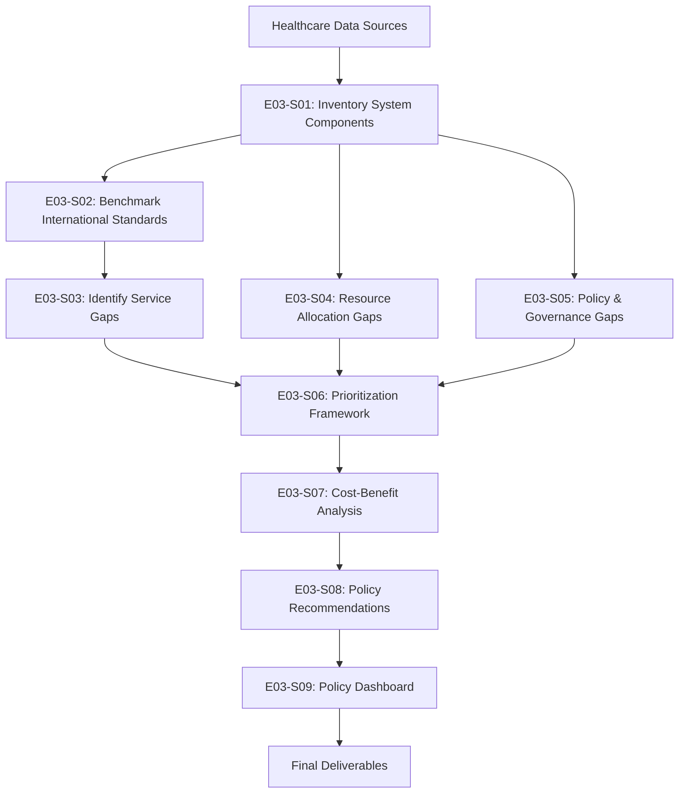
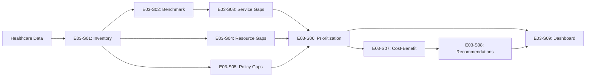

# Epic 003: Healthcare System Gap Analysis & Policy Recommendations - Complete Data Flow

## Epic Overview

- **Epic ID**: EPIC-003
- **Business Objective**: Conduct comprehensive gap analysis across the care continuum to identify minimum 8 high-impact intervention opportunities with quantified impact assessments
- **Success Criteria**: 
  - Identify minimum 8 policy intervention opportunities (3+ policy gaps, 2+ resource gaps, 2+ program gaps, 1+ governance gap)
  - Quantify affected population, severity, and cost for each gap
  - Develop evidence-based policy recommendations
  - Create priority ranking framework
  - Cost-benefit analysis for top 5 interventions
- **User Stories Included**: E03-S01 through E03-S09

## End-to-End Data Flow Pipeline

### Pipeline Overview



### Execution Sequence

| Order | User Story ID | Story Title | Dependencies | Outputs | Duration |
|-------|---------------|-------------|--------------|---------|----------|
| 1 | E03-S01 | Inventory System Components | None | Component inventory | 3 days |
| 2 | E03-S02 | Benchmark International Standards | E03-S01 | Benchmark comparison | 4 days |
| 3 | E03-S03 | Identify Service Gaps | E03-S01, E03-S02 | Service gap list | 5 days |
| 4 | E03-S04 | Resource Allocation Gaps | E03-S01 | Resource gap analysis | 4 days |
| 5 | E03-S05 | Policy & Governance Gaps | E03-S01 | Policy gap list | 4 days |
| 6 | E03-S06 | Prioritization Framework | E03-S03, E03-S04, E03-S05 | Prioritized gaps | 3 days |
| 7 | E03-S07 | Cost-Benefit Analysis | E03-S06 | CBA reports | 5 days |
| 8 | E03-S08 | Policy Recommendations | E03-S07 | Recommendation briefs | 5 days |
| 9 | E03-S09 | Policy Dashboard | E03-S06, E03-S08 | Interactive dashboard | 5 days |

---

## User Story E03-S01: Inventory Healthcare System Components

### Story Context

- **Story ID**: e03-s01
- **Depends On**: None (foundational)
- **Blocks**: e03-s02, e03-s03, e03-s04, e03-s05
- **Complexity**: low

### 1. Data Extraction Specification

```yaml
source_tables:
  - table_name: "health-facilities-and-beds-in-inpatient-facilities-public-not-for-profit-private"
    required_fields: ["year", "institution_type", "facility_type_a", "public_private", "no_of_facilities", "no_beds"]
    filter_conditions: "WHERE year = 2020"
    purpose: "Inventory hospital and inpatient facilities"
  
  - table_name: "health-facilities-primary-care-dental-clinics-and-pharmacies"
    required_fields: ["year", "institution_type", "sector", "facility_type_b", "no_of_facilities"]
    filter_conditions: "WHERE year = 2020"
    purpose: "Inventory primary care facilities"
  
  - table_name: "number-of-doctors"
    required_fields: ["year", "sector", "specialist_non-specialist", "count"]
    filter_conditions: "WHERE year = 2019"
    purpose: "Workforce inventory - doctors"
  
  - table_name: "number-of-nurses-and-midwives"
    required_fields: ["year", "type", "sector", "count"]
    filter_conditions: "WHERE year = 2019"
    purpose: "Workforce inventory - nurses"

connection_details:
  connection_type: "Kaggle Hub / Local CSV"
  code_example: |
    import pandas as pd
    from pathlib import Path
    
    facilities_df = pd.read_csv('data/facilities.csv')
    workforce_df = pd.read_csv('data/doctors.csv')
```

### 2. Data Transformation Pipeline

```yaml
transformations:
  
  - step_number: 1
    stage: "inventory_creation"
    operation: "create_facility_inventory"
    logic: |
      Create comprehensive facility inventory:
      - Categorize by type (hospital, clinic, pharmacy)
      - Categorize by ownership (public, private, not-for-profit)
      - Count facilities and capacity (beds)
    code_hint: |
      facility_inventory = facilities_df.groupby(['facility_type', 'public_private']).agg({
          'no_of_facilities': 'sum',
          'no_beds': 'sum'
      }).reset_index()
  
  - step_number: 2
    stage: "inventory_creation"
    operation: "create_workforce_inventory"
    logic: |
      Create workforce inventory by:
      - Professional type (doctors, nurses, pharmacists)
      - Specialization level
      - Sector (public/private)
    code_hint: |
      workforce_inventory = pd.concat([
          doctors_df.groupby('sector')['count'].sum().rename('doctors'),
          nurses_df.groupby('sector')['count'].sum().rename('nurses')
      ], axis=1)
  
  - step_number: 3
    stage: "service_mapping"
    operation: "map_available_services"
    logic: |
      Map available healthcare services:
      - Primary care services
      - Secondary/tertiary care
      - Specialty services
      - Support services (pharmacy, dental)
    output_location: "data/processed/e03_s01_system_inventory.csv"
```

### 3. Analysis Specification

```yaml
analysis_overview:
  analysis_type: "descriptive"
  primary_questions:
    - "What healthcare components currently exist?"
    - "What is the distribution of facilities and workforce?"

descriptive_analysis:
  - analysis_id: "component_profiling"
    purpose: "Profile current system components"
    methods:
      - method: "summary_statistics"
        for_facilities: "Count by type and ownership"
        for_workforce: "Count by profession and sector"
    outputs:
      - type: "inventory_report"
        path: "results/tables/e03_s01_system_inventory.csv"

visualization_requirements:
  exploratory_visualizations:
    - chart_type: "bar_chart"
      purpose: "Facilities by type"
      x_axis: "facility_type"
      y_axis: "facility_count"
      output: "reports/figures/e03_s01_facility_inventory.png"
```

### 4. Output Specification

```yaml
output_artifacts:
  
  - artifact_type: "system_inventory"
    purpose: "Comprehensive inventory of healthcare system components"
    format: "Excel with multiple sheets"
    location: "results/exports/e03_s01_system_inventory.xlsx"
    excel_sheets:
      - "Facility Inventory"
      - "Workforce Inventory"
      - "Service Mapping"
      - "Summary Statistics"

consumers:
  - role: "Policy Analyst (E03-S02, E03-S03)"
    artifacts_consumed: ["system_inventory"]
    use_cases: ["Gap identification", "Benchmarking"]
```

### 5. Implementation Metadata

```yaml
user_story_id: "e03-s01"
epic_id: "EPIC-003"
depends_on: []
blocks: ["e03-s02", "e03-s03", "e03-s04", "e03-s05"]
estimated_complexity: "low"
estimated_duration: "3 days"

code_files_to_generate:
  - "src/analysis/inventory_e03_s01_system.py"
  - "notebooks/2_analysis/e03_s01_system_inventory.ipynb"
```

---

## User Story E03-S02: Benchmark Against International Standards

### Story Context

- **Story ID**: e03-s02
- **Depends On**: e03-s01
- **Blocks**: e03-s03
- **Complexity**: medium

### 1. Data Extraction Specification

```yaml
source_tables:
  - table_name: "e03_s01_system_inventory"
    location: "data/processed/e03_s01_system_inventory.csv"
  
external_data_sources:
  - source: "WHO Global Health Observatory"
    metrics: ["Doctors per 1000 population", "Nurses per 1000", "Hospital beds per 1000"]
    countries: ["Singapore", "Japan", "South Korea", "UK", "Australia", "OECD average"]
  
  - source: "Manual research / published reports"
    data: "International healthcare standards and benchmarks"
```

### 2. Data Transformation Pipeline

```yaml
transformations:
  
  - step_number: 1
    stage: "benchmark_preparation"
    operation: "calculate_per_capita_ratios"
    logic: |
      Calculate Singapore's per capita ratios:
      - Doctors per 1000 population
      - Nurses per 1000 population
      - Hospital beds per 1000 population
    code_hint: |
      singapore_population = 5_700_000  # 2020 estimate
      
      ratios = {
          'doctors_per_1000': (total_doctors / singapore_population) * 1000,
          'nurses_per_1000': (total_nurses / singapore_population) * 1000,
          'beds_per_1000': (total_beds / singapore_population) * 1000
      }
  
  - step_number: 2
    stage: "benchmark_comparison"
    operation: "compare_with_international_standards"
    logic: |
      Compare Singapore metrics with:
      - OECD averages
      - Regional leaders (Japan, South Korea)
      - Similar developed countries
    code_hint: |
      benchmark_comparison = pd.DataFrame({
          'Country': ['Singapore', 'Japan', 'South Korea', 'OECD Avg'],
          'Doctors_per_1000': [singapore_ratio, japan_ratio, korea_ratio, oecd_avg],
          'Nurses_per_1000': [...],
          'Beds_per_1000': [...]
      })
      
      # Calculate gaps
      benchmark_comparison['Doctor_Gap_vs_OECD'] = (
          benchmark_comparison['Doctors_per_1000'] - oecd_avg_doctors
      )
```

### 3. Analysis Specification

```yaml
analysis_overview:
  analysis_type: "comparative/diagnostic"
  primary_questions:
    - "How does Singapore compare to international standards?"
    - "Where are the significant gaps?"

diagnostic_analysis:
  - analysis_id: "gap_identification"
    purpose: "Identify areas below international standards"
    methods:
      - method: "gap_calculation"
        formula: "Singapore_value - Benchmark_value"
      - method: "percentage_difference"
        formula: "(Singapore - Benchmark) / Benchmark * 100"
```

### 4. Output Specification

```yaml
output_artifacts:
  
  - artifact_type: "benchmark_report"
    purpose: "International comparison and gap identification"
    format: "PDF + Excel"
    location: "reports/epic-003/e03_s02_international_benchmark.pdf"
```

### 5. Implementation Metadata

```yaml
user_story_id: "e03-s02"
epic_id: "EPIC-003"
depends_on: ["e03-s01"]
blocks: ["e03-s03"]
estimated_duration: "4 days"
```

---

## User Story E03-S03: Identify Service Gaps

### Story Context

- **Story ID**: e03-s03
- **Depends On**: e03-s01, e03-s02
- **Blocks**: e03-s06
- **Complexity**: medium-high

### 1. Data Extraction Specification

```yaml
source_tables:
  - table_name: "e03_s01_system_inventory"
  - table_name: "e03_s02_benchmark_comparison"
  
additional_data:
  - "Population health needs assessment"
  - "Service utilization patterns"
  - "Unmet demand indicators"
```

### 2. Data Transformation Pipeline

```yaml
transformations:
  
  - step_number: 1
    stage: "gap_analysis"
    operation: "identify_service_availability_gaps"
    logic: |
      Identify gaps in service availability:
      - Compare current services vs. population health needs
      - Identify missing or underrepresented services
      - Quantify unmet demand
    code_hint: |
      service_gaps = []
      
      # Example gap: Mental health services
      if mental_health_facilities < population_need_estimate * 0.5:
          gap = {
              'gap_id': 'SG-001',
              'gap_type': 'Service Availability',
              'description': 'Insufficient mental health facilities',
              'current_state': f'{mental_health_facilities} facilities',
              'required_state': f'{needed_facilities} facilities',
              'affected_population': population_with_mental_health_needs,
              'severity': 'High'
          }
          service_gaps.append(gap)
  
  - step_number: 2
    stage: "impact_quantification"
    operation: "quantify_gap_impacts"
    logic: |
      For each identified gap:
      - Estimate affected population
      - Calculate severity score
      - Estimate cost implications
    code_hint: |
      for gap in service_gaps:
          gap['affected_population_count'] = estimate_affected_population(gap)
          gap['severity_score'] = calculate_severity(gap)
          gap['annual_cost_impact'] = estimate_cost_impact(gap)
```

### 3. Analysis Specification

```yaml
analysis_overview:
  analysis_type: "diagnostic"
  primary_questions:
    - "What service gaps exist in the healthcare system?"
    - "What is the impact of each gap?"
```

### 4. Output Specification

```yaml
output_artifacts:
  
  - artifact_type: "service_gap_inventory"
    purpose: "List of identified service gaps with impact quantification"
    format: "Excel"
    location: "results/exports/e03_s03_service_gaps.xlsx"
```

### 5. Implementation Metadata

```yaml
user_story_id: "e03-s03"
epic_id: "EPIC-003"
depends_on: ["e03-s01", "e03-s02"]
estimated_duration: "5 days"
```

---

## User Story E03-S04: Identify Resource Allocation Gaps

### Story Context

- **Story ID**: e03-s04
- **Depends On**: e03-s01
- **Blocks**: e03-s06
- **Complexity**: medium

### 1. Data Extraction Specification

```yaml
source_tables:
  - table_name: "e03_s01_system_inventory"
  - table_name: "government-health-expenditure"
    purpose: "Analyze spending patterns"
```

### 2. Data Transformation Pipeline

```yaml
transformations:
  
  - step_number: 1
    stage: "resource_analysis"
    operation: "analyze_resource_distribution"
    logic: |
      Analyze resource distribution:
      - Geographic distribution of facilities and workforce
      - Public vs. private sector allocation
      - Specialty distribution
    code_hint: |
      resource_distribution = facilities_df.groupby(['region', 'facility_type']).agg({
          'no_of_facilities': 'sum',
          'no_beds': 'sum'
      })
      
      # Identify imbalances
      coefficient_of_variation = resource_distribution.std() / resource_distribution.mean()
      
      if coefficient_of_variation > threshold:
          gap_identified = True
```

### 3. Analysis Specification

```yaml
analysis_overview:
  analysis_type: "diagnostic"
  primary_questions:
    - "Are resources equitably distributed?"
    - "Where are resource misallocations?"
```

### 4. Output Specification

```yaml
output_artifacts:
  
  - artifact_type: "resource_gap_analysis"
    format: "Excel + PDF report"
    location: "results/exports/e03_s04_resource_gaps.xlsx"
```

### 5. Implementation Metadata

```yaml
user_story_id: "e03-s04"
epic_id: "EPIC-003"
depends_on: ["e03-s01"]
estimated_duration: "4 days"
```

---

## User Story E03-S05: Identify Policy & Governance Gaps

### Story Context

- **Story ID**: e03-s05
- **Depends On**: e03-s01
- **Blocks**: e03-s06
- **Complexity**: medium

### 1. Data Extraction Specification

```yaml
source_tables:
  - table_name: "e03_s01_system_inventory"
  
external_sources:
  - "Policy documents review"
  - "Regulatory framework analysis"
  - "International best practices"
```

### 2. Data Transformation Pipeline

```yaml
transformations:
  
  - step_number: 1
    stage: "policy_analysis"
    operation: "identify_policy_gaps"
    logic: |
      Identify policy and governance gaps through:
      - Regulatory gap analysis
      - Governance structure assessment
      - Data infrastructure evaluation
    code_hint: |
      policy_gaps = [
          {
              'gap_id': 'PG-001',
              'gap_type': 'Policy',
              'description': 'Lack of integrated health information system',
              'impact': 'Data fragmentation, inefficient coordination',
              'recommendation': 'Implement national health data exchange'
          }
      ]
```

### 3. Output Specification

```yaml
output_artifacts:
  
  - artifact_type: "policy_gap_report"
    format: "PDF"
    location: "reports/epic-003/e03_s05_policy_gaps.pdf"
```

### 5. Implementation Metadata

```yaml
user_story_id: "e03-s05"
epic_id: "EPIC-003"
estimated_duration: "4 days"
```

---

## User Story E03-S06: Develop Prioritization Framework

### Story Context

- **Story ID**: e03-s06
- **Depends On**: e03-s03, e03-s04, e03-s05
- **Blocks**: e03-s07, e03-s08
- **Complexity**: medium

### 1. Data Extraction Specification

```yaml
source_tables:
  - table_name: "e03_s03_service_gaps"
  - table_name: "e03_s04_resource_gaps"
  - table_name: "e03_s05_policy_gaps"
```

### 2. Data Transformation Pipeline

```yaml
transformations:
  
  - step_number: 1
    stage: "scoring"
    operation: "apply_prioritization_framework"
    logic: |
      Score each gap on multiple criteria:
      - Impact Score (1-5): Population affected, severity
      - Urgency Score (1-5): Timeframe for intervention
      - Feasibility Score (1-5): Implementation complexity, cost
    code_hint: |
      def score_impact(gap):
          if gap['affected_population'] > 100000:
              return 5
          elif gap['affected_population'] > 50000:
              return 4
          # ... etc
      
      all_gaps['impact_score'] = all_gaps.apply(score_impact, axis=1)
      all_gaps['urgency_score'] = all_gaps.apply(score_urgency, axis=1)
      all_gaps['feasibility_score'] = all_gaps.apply(score_feasibility, axis=1)
      
      # Overall priority score
      all_gaps['priority_score'] = (
          all_gaps['impact_score'] * 0.5 +
          all_gaps['urgency_score'] * 0.3 +
          all_gaps['feasibility_score'] * 0.2
      )
      
      all_gaps['priority_rank'] = all_gaps['priority_score'].rank(ascending=False)
```

### 3. Output Specification

```yaml
output_artifacts:
  
  - artifact_type: "prioritized_gap_list"
    format: "Excel"
    location: "results/exports/e03_s06_prioritized_gaps.xlsx"
```

### 5. Implementation Metadata

```yaml
user_story_id: "e03-s06"
epic_id: "EPIC-003"
estimated_duration: "3 days"
```

---

## User Story E03-S07: Conduct Cost-Benefit Analysis

### Story Context

- **Story ID**: e03-s07
- **Depends On**: e03-s06
- **Blocks**: e03-s08
- **Complexity**: high

### 1. Data Extraction Specification

```yaml
source_tables:
  - table_name: "e03_s06_prioritized_gaps"
    filter: "Top 5 by priority_rank"
  
  - table_name: "government-health-expenditure"
    purpose: "Baseline spending data"
```

### 2. Data Transformation Pipeline

```yaml
transformations:
  
  - step_number: 1
    stage: "cost_estimation"
    operation: "estimate_intervention_costs"
    logic: |
      For each top 5 gap, estimate:
      - Implementation costs (capital, operational)
      - Ongoing costs (maintenance, staffing)
      - Timeline (years)
    code_hint: |
      for gap in top_5_gaps:
          costs = {
              'capital_cost': estimate_capital_cost(gap),
              'annual_operational_cost': estimate_operational_cost(gap),
              'implementation_years': estimate_timeline(gap)
          }
          gap['total_cost_5yr'] = costs['capital_cost'] + (costs['annual_operational_cost'] * 5)
  
  - step_number: 2
    stage: "benefit_estimation"
    operation: "estimate_intervention_benefits"
    logic: |
      Estimate benefits:
      - Lives saved / health outcomes improved
      - Cost savings (reduced emergency visits, complications)
      - Economic benefits (productivity gains)
    code_hint: |
      for gap in top_5_gaps:
          benefits = {
              'health_outcomes': estimate_health_benefits(gap),
              'cost_savings': estimate_cost_savings(gap),
              'economic_value': monetize_benefits(benefits)
          }
          gap['total_benefit_5yr'] = benefits['economic_value']
  
  - step_number: 3
    stage: "roi_calculation"
    operation: "calculate_roi"
    logic: |
      Calculate ROI and benefit-cost ratio
    code_hint: |
      gap['roi'] = (gap['total_benefit_5yr'] - gap['total_cost_5yr']) / gap['total_cost_5yr']
      gap['benefit_cost_ratio'] = gap['total_benefit_5yr'] / gap['total_cost_5yr']
```

### 3. Output Specification

```yaml
output_artifacts:
  
  - artifact_type: "cost_benefit_analysis_reports"
    purpose: "Detailed CBA for each top 5 gap"
    format: "PDF (one per gap)"
    location: "reports/cba/"
    
    report_structure:
      sections:
        - "Gap Overview"
        - "Cost Breakdown"
        - "Benefit Estimation"
        - "ROI Analysis"
        - "Sensitivity Analysis"
```

### 5. Implementation Metadata

```yaml
user_story_id: "e03-s07"
epic_id: "EPIC-003"
estimated_duration: "5 days"
```

---

## User Story E03-S08: Develop Policy Recommendations

### Story Context

- **Story ID**: e03-s08
- **Depends On**: e03-s07
- **Blocks**: e03-s09
- **Complexity**: high

### 1. Data Extraction Specification

```yaml
source_tables:
  - table_name: "e03_s06_prioritized_gaps"
  - table_name: "e03_s07_cost_benefit_analysis"
```

### 2. Data Transformation Pipeline

```yaml
transformations:
  
  - step_number: 1
    stage: "recommendation_development"
    operation: "create_policy_recommendations"
    logic: |
      For each gap, develop:
      - Specific policy recommendation
      - Implementation roadmap
      - Success metrics
      - Risk mitigation strategies
    code_hint: |
      for gap in all_gaps:
          recommendation = {
              'recommendation_id': f"REC-{gap['gap_id']}",
              'gap_addressed': gap['gap_id'],
              'policy_action': 'Specific policy action',
              'implementation_steps': ['Step 1', 'Step 2', ...],
              'timeline': '2-3 years',
              'responsible_agency': 'Ministry of Health',
              'success_metrics': ['Metric 1', 'Metric 2'],
              'expected_outcomes': 'Quantified outcomes'
          }
```

### 3. Output Specification

```yaml
output_artifacts:
  
  - artifact_type: "policy_briefs"
    purpose: "Concise policy recommendations for decision-makers"
    format: "PDF (2 pages each)"
    location: "reports/policy_briefs/"
    structure: "One brief per gap (minimum 8)"
    
    brief_structure:
      - "Executive Summary (1 paragraph)"
      - "Gap Description"
      - "Policy Recommendation"
      - "Expected Impact"
      - "Implementation Roadmap"
      - "Success Metrics"
  
  - artifact_type: "comprehensive_policy_report"
    format: "PDF"
    location: "reports/epic-003/e03_s08_policy_recommendations.pdf"
```

### 5. Implementation Metadata

```yaml
user_story_id: "e03-s08"
epic_id: "EPIC-003"
estimated_duration: "5 days"
```

---

## User Story E03-S09: Create Policy Dashboard

### Story Context

- **Story ID**: e03-s09
- **Depends On**: e03-s06, e03-s08
- **Blocks**: None (final deliverable)
- **Complexity**: high

### 1. Data Extraction Specification

```yaml
source_tables:
  - table_name: "e03_s06_prioritized_gaps"
  - table_name: "e03_s08_recommendations"
```

### 2. Dashboard Specification

```yaml
dashboard_structure:
  tool: "Plotly Dash"
  
  components:
    - component_type: "KPI_cards"
      metrics:
        - "Total Gaps Identified: {total_gaps}"
        - "High Priority Interventions: {high_priority_count}"
        - "Total Population Affected: {affected_population:,}"
        - "Estimated Investment Required: ${total_investment:,}"
    
    - component_type: "priority_matrix"
      title: "Gap Prioritization Matrix"
      x_axis: "Feasibility Score"
      y_axis: "Impact Score"
      size: "Affected Population"
      color: "Gap Type"
    
    - component_type: "data_table"
      title: "Gap Inventory"
      data: "all_gaps"
      features: ["sorting", "filtering", "detail_view"]
    
    - component_type: "recommendation_cards"
      title: "Policy Recommendations"
      data: "recommendations"
      display: "Card view with key details"
```

### 3. Output Specification

```yaml
output_artifacts:
  
  - artifact_type: "policy_dashboard"
    purpose: "Interactive dashboard for policy makers"
    tool: "Plotly Dash"
    url: "http://localhost:8050/epic003_policy_dashboard"
    
    deployment:
      local_run: "python src/visualization/epic003_policy_dashboard.py"
```

### 5. Implementation Metadata

```yaml
user_story_id: "e03-s09"
epic_id: "EPIC-003"
estimated_duration: "5 days"
```

---

## Epic Integration & Artifacts

### Shared Components Used

- Gap identification framework (reusable for other analyses)
- Prioritization scoring methodology
- Cost-benefit analysis template

### Epic-Level Outputs

- Minimum 8 identified gaps with impact quantification
- Policy briefs for Ministry of Health
- Interactive policy dashboard
- Cost-benefit analysis for top interventions

### Complete Data Lineage


