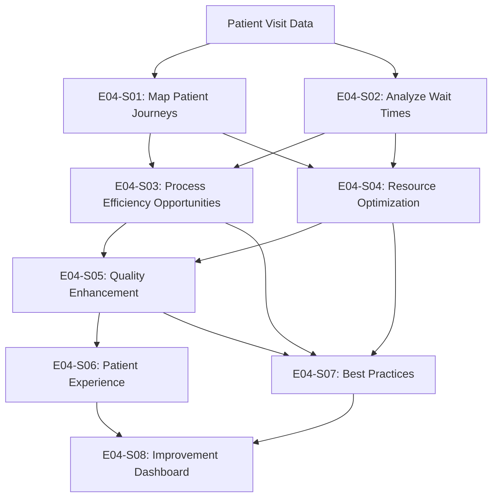
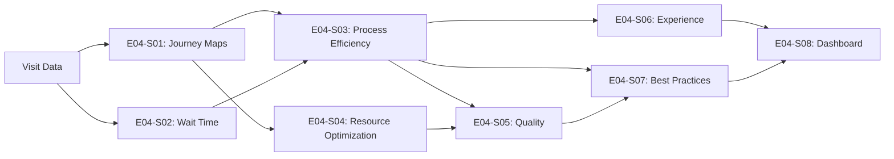

# Epic 004: Process Optimization & Improvement Opportunities - Complete Data Flow

## Epic Overview

- **Epic ID**: EPIC-004
- **Business Objective**: Conduct patient journey mapping, wait time analysis, and best practice identification to document minimum 15 validated improvement opportunities with quantified business value
- **Success Criteria**: 
  - Document minimum 15 validated improvement opportunities (5+ process efficiency, 3+ resource optimization, 4+ quality enhancement, 3+ patient experience)
  - Each opportunity includes baseline metrics, expected improvement, ROI, and implementation roadmap
  - Patient journey maps for major care pathways
  - Best practice playbooks from high-performing facilities
- **User Stories Included**: E04-S01 through E04-S08

## End-to-End Data Flow Pipeline

### Pipeline Overview



### Execution Sequence

| Order | User Story ID | Story Title | Dependencies | Outputs | Duration |
|-------|---------------|-------------|--------------|---------|----------|
| 1 | E04-S01 | Map Patient Journeys | None | Journey maps | 5 days |
| 2 | E04-S02 | Analyze Wait Times | None | Wait time analysis | 4 days |
| 3 | E04-S03 | Process Efficiency Opportunities | E04-S01, E04-S02 | 5+ opportunities | 5 days |
| 4 | E04-S04 | Resource Optimization | E04-S01, E04-S02 | 3+ opportunities | 4 days |
| 5 | E04-S05 | Quality Enhancement | E04-S03, E04-S04 | 4+ opportunities | 4 days |
| 6 | E04-S06 | Patient Experience | E04-S03 | 3+ opportunities | 4 days |
| 7 | E04-S07 | Best Practices Documentation | E04-S03, E04-S04, E04-S05 | Playbooks | 5 days |
| 8 | E04-S08 | Improvement Dashboard | All previous | Dashboard | 5 days |

---

## User Story E04-S01: Map Patient Journeys

### Story Context

- **Story ID**: e04-s01
- **Depends On**: None
- **Blocks**: e04-s03, e04-s04
- **Complexity**: medium-high

### 1. Data Extraction Specification

```yaml
source_tables:
  - table_name: "admission-and-outpatient-attendances-by-restructured-hospitals"
    required_fields: ["year", "hospital", "type_of_attendance", "no_of_attendances"]
    purpose: "Understand patient visit patterns"
  
  - table_name: "hospital-admission-rate-by-age-and-sex"
    required_fields: ["year", "facility_type_a", "age", "sex", "rate"]
    purpose: "Patient demographics and admission patterns"
```

### 2. Data Transformation Pipeline

```yaml
transformations:
  
  - step_number: 1
    stage: "journey_mapping"
    operation: "identify_patient_pathways"
    logic: |
      Map typical patient journeys:
      1. Primary care pathway: GP clinic → Specialist referral → Treatment
      2. Emergency pathway: Emergency → Admission → Discharge
      3. Chronic care pathway: Initial diagnosis → Regular follow-ups → Management
    code_hint: |
      # Define journey stages
      primary_care_journey = {
          'stages': [
              {'stage': 'Initial Contact', 'avg_duration_days': 0},
              {'stage': 'GP Visit', 'avg_duration_days': 1},
              {'stage': 'Referral Wait', 'avg_duration_days': 14},
              {'stage': 'Specialist Visit', 'avg_duration_days': 1},
              {'stage': 'Treatment', 'avg_duration_days': 30}
          ]
      }
  
  - step_number: 2
    stage: "friction_point_identification"
    operation: "identify_delays_and_bottlenecks"
    logic: |
      For each journey stage, identify:
      - Average wait time
      - Friction points (delays > expected)
      - Dropout rates
    code_hint: |
      friction_points = []
      for stage in journey_stages:
          if stage['avg_wait_time'] > stage['expected_wait_time'] * 1.5:
              friction_points.append({
                  'stage': stage['name'],
                  'wait_time': stage['avg_wait_time'],
                  'excess_wait': stage['avg_wait_time'] - stage['expected_wait_time'],
                  'patients_affected': stage['patient_volume']
              })
```

### 3. Analysis Specification

```yaml
analysis_overview:
  analysis_type: "process_analysis"
  primary_questions:
    - "What are the typical patient journeys?"
    - "Where are the friction points and delays?"

descriptive_analysis:
  - analysis_id: "journey_profiling"
    purpose: "Profile patient pathways"
    methods:
      - method: "process_mapping"
        output: "Visual journey maps"
```

### 4. Output Specification

```yaml
output_artifacts:
  
  - artifact_type: "patient_journey_maps"
    purpose: "Visual representations of patient pathways"
    format: "PDF + Mermaid diagrams"
    location: "reports/journey_maps/"
    structure: "One map per major pathway"
  
  - artifact_type: "friction_point_inventory"
    format: "Excel"
    location: "results/exports/e04_s01_friction_points.xlsx"
```

### 5. Implementation Metadata

```yaml
user_story_id: "e04-s01"
epic_id: "EPIC-004"
estimated_duration: "5 days"
```

---

## User Story E04-S02: Analyze Wait Times

### Story Context

- **Story ID**: e04-s02
- **Depends On**: None
- **Blocks**: e04-s03, e04-s04
- **Complexity**: medium

### 1. Data Extraction Specification

```yaml
source_tables:
  - table_name: "e01_s02_annual_utilization_metrics"
    location: "data/processed/e01_s02_annual_utilization_metrics.parquet"
    purpose: "Utilization data as proxy for wait times"
  
additional_analysis:
  - "Queuing theory models based on utilization rates"
  - "Estimated wait times from capacity analysis"
```

### 2. Data Transformation Pipeline

```yaml
transformations:
  
  - step_number: 1
    stage: "wait_time_estimation"
    operation: "estimate_wait_times_from_utilization"
    logic: |
      Use queuing theory to estimate wait times:
      Wait time ∝ utilization / (1 - utilization)
    code_hint: |
      df['utilization_ratio'] = df['utilization_rate_pct'] / 100
      df['estimated_wait_multiplier'] = df['utilization_ratio'] / (1 - df['utilization_ratio'])
      
      # Assume baseline: 30 min wait at 70% utilization
      baseline_wait = 30
      baseline_util = 0.70
      baseline_factor = baseline_util / (1 - baseline_util)
      
      df['estimated_wait_time_min'] = (df['estimated_wait_multiplier'] / baseline_factor) * baseline_wait
  
  - step_number: 2
    stage: "wait_time_analysis"
    operation: "analyze_wait_time_patterns"
    logic: |
      Analyze wait time patterns:
      - By facility
      - By time of day/week (if data available)
      - By service type
    code_hint: |
      wait_time_analysis = df.groupby(['facility_id', 'service_type']).agg({
          'estimated_wait_time_min': ['mean', 'median', 'max'],
          'patients_affected': 'sum'
      })
```

### 3. Output Specification

```yaml
output_artifacts:
  
  - artifact_type: "wait_time_analysis_report"
    format: "PDF + Excel"
    location: "reports/epic-004/e04_s02_wait_time_analysis.pdf"
```

### 5. Implementation Metadata

```yaml
user_story_id: "e04-s02"
epic_id: "EPIC-004"
estimated_duration: "4 days"
```

---

## User Story E04-S03: Identify Process Efficiency Opportunities

### Story Context

- **Story ID**: e04-s03
- **Depends On**: e04-s01, e04-s02
- **Blocks**: e04-s05, e04-s06, e04-s07
- **Complexity**: high

### 1. Data Extraction Specification

```yaml
source_tables:
  - table_name: "e04_s01_friction_points"
  - table_name: "e04_s02_wait_time_analysis"
```

### 2. Data Transformation Pipeline

```yaml
transformations:
  
  - step_number: 1
    stage: "opportunity_identification"
    operation: "identify_process_improvements"
    logic: |
      Identify process efficiency opportunities:
      - Long wait time reduction opportunities
      - Workflow streamlining
      - Automation potential
      - Appointment scheduling optimization
    code_hint: |
      opportunities = []
      
      # Example: Wait time reduction
      for facility in high_wait_facilities:
          opp = {
              'opp_id': 'PE-001',
              'category': 'Process Efficiency',
              'title': 'Reduce specialist referral wait time',
              'current_baseline': f'{current_wait_days} days average wait',
              'target_state': f'{target_wait_days} days average wait',
              'expected_improvement': f'{reduction_pct}% reduction',
              'implementation_complexity': 'Medium',
              'estimated_cost': 100000,
              'expected_annual_benefit': 250000,
              'roi': 1.5,
              'patients_benefited_annually': 5000
          }
          opportunities.append(opp)
  
  - step_number: 2
    stage: "quantification"
    operation: "quantify_opportunity_value"
    logic: |
      For each opportunity:
      - Estimate implementation cost
      - Calculate expected benefit
      - Calculate ROI
    code_hint: |
      for opp in opportunities:
          opp['annual_time_saved_hours'] = calculate_time_savings(opp)
          opp['annual_cost_savings'] = opp['annual_time_saved_hours'] * cost_per_hour
          opp['roi'] = (opp['annual_cost_savings'] * 3 - opp['estimated_cost']) / opp['estimated_cost']
```

### 3. Output Specification

```yaml
output_artifacts:
  
  - artifact_type: "process_efficiency_opportunities"
    purpose: "List of 5+ process efficiency improvements"
    format: "Excel"
    location: "results/exports/e04_s03_process_opportunities.xlsx"
```

### 5. Implementation Metadata

```yaml
user_story_id: "e04-s03"
epic_id: "EPIC-004"
estimated_duration: "5 days"
```

---

## User Story E04-S04: Identify Resource Optimization Opportunities

### Story Context

- **Story ID**: e04-s04
- **Depends On**: e04-s01, e04-s02
- **Blocks**: e04-s05, e04-s07
- **Complexity**: medium-high

### 1. Data Transformation Pipeline

```yaml
transformations:
  
  - step_number: 1
    stage: "resource_analysis"
    operation: "identify_optimization_opportunities"
    logic: |
      Identify resource optimization opportunities:
      - Staff reallocation (move from underutilized to overutilized facilities)
      - Equipment sharing
      - Space utilization improvements
    code_hint: |
      # Identify underutilized and overutilized facilities
      underutilized = facilities_df[facilities_df['utilization_rate_pct'] < 50]
      overutilized = facilities_df[facilities_df['utilization_rate_pct'] > 90]
      
      # Calculate reallocation potential
      excess_capacity = underutilized['excess_capacity'].sum()
      capacity_shortage = overutilized['capacity_shortage'].sum()
      
      reallocation_opportunity = min(excess_capacity, capacity_shortage)
```

### 3. Output Specification

```yaml
output_artifacts:
  
  - artifact_type: "resource_optimization_opportunities"
    purpose: "List of 3+ resource optimization improvements"
    format: "Excel"
    location: "results/exports/e04_s04_resource_opportunities.xlsx"
```

### 5. Implementation Metadata

```yaml
user_story_id: "e04-s04"
epic_id: "EPIC-004"
estimated_duration: "4 days"
```

---

## User Story E04-S05: Identify Quality Enhancement Opportunities

### Story Context

- **Story ID**: e04-s05
- **Depends On**: e04-s03, e04-s04
- **Blocks**: e04-s07
- **Complexity**: medium

### 1. Data Transformation Pipeline

```yaml
transformations:
  
  - step_number: 1
    stage: "quality_analysis"
    operation: "identify_quality_improvements"
    logic: |
      Identify quality enhancement opportunities:
      - Reduce readmission rates
      - Improve care coordination
      - Enhance infection control
      - Standardize clinical protocols
    code_hint: |
      quality_opportunities = [
          {
              'opp_id': 'QE-001',
              'category': 'Quality Enhancement',
              'title': 'Reduce preventable readmissions',
              'current_baseline': 'X% readmission rate',
              'target_state': 'Y% readmission rate',
              'expected_improvement': 'Z% reduction',
              'patients_benefited': population_size
          }
      ]
```

### 3. Output Specification

```yaml
output_artifacts:
  
  - artifact_type: "quality_enhancement_opportunities"
    purpose: "List of 4+ quality improvements"
    format: "Excel"
    location: "results/exports/e04_s05_quality_opportunities.xlsx"
```

### 5. Implementation Metadata

```yaml
user_story_id: "e04-s05"
epic_id: "EPIC-004"
estimated_duration: "4 days"
```

---

## User Story E04-S06: Identify Patient Experience Improvements

### Story Context

- **Story ID**: e04-s06
- **Depends On**: e04-s03
- **Blocks**: e04-s08
- **Complexity**: medium

### 1. Data Transformation Pipeline

```yaml
transformations:
  
  - step_number: 1
    stage: "experience_analysis"
    operation: "identify_experience_improvements"
    logic: |
      Identify patient experience opportunities:
      - Communication improvements
      - Convenience enhancements
      - Comfort improvements
      - Digital service enhancements
    code_hint: |
      experience_opportunities = [
          {
              'opp_id': 'PX-001',
              'category': 'Patient Experience',
              'title': 'Implement online appointment booking',
              'current_baseline': 'Phone-only booking',
              'target_state': 'Online and phone booking',
              'expected_improvement': 'Reduce booking time, increase convenience'
          }
      ]
```

### 3. Output Specification

```yaml
output_artifacts:
  
  - artifact_type: "patient_experience_opportunities"
    purpose: "List of 3+ patient experience improvements"
    format: "Excel"
    location: "results/exports/e04_s06_experience_opportunities.xlsx"
```

### 5. Implementation Metadata

```yaml
user_story_id: "e04-s06"
epic_id: "EPIC-004"
estimated_duration: "4 days"
```

---

## User Story E04-S07: Document Best Practices

### Story Context

- **Story ID**: e04-s07
- **Depends On**: e04-s03, e04-s04, e04-s05
- **Blocks**: e04-s08
- **Complexity**: medium

### 1. Data Extraction Specification

```yaml
source_tables:
  - table_name: "e01_s03_facility_profiles"
    filter: "High performers"
    purpose: "Identify best practice sources"
```

### 2. Data Transformation Pipeline

```yaml
transformations:
  
  - step_number: 1
    stage: "best_practice_identification"
    operation: "extract_best_practices"
    logic: |
      From high-performing facilities:
      - Identify what they do differently
      - Document processes and methods
      - Create replicable playbooks
    code_hint: |
      high_performers = facilities_df[facilities_df['performance_category'] == 'High Performer']
      
      best_practices = []
      for facility in high_performers:
          practices = analyze_facility_practices(facility)
          best_practices.extend(practices)
```

### 3. Output Specification

```yaml
output_artifacts:
  
  - artifact_type: "best_practice_playbooks"
    purpose: "Documented best practices (5+)"
    format: "PDF playbooks"
    location: "reports/playbooks/"
    structure: "One playbook per practice"
    
    playbook_structure:
      - "Practice Overview"
      - "Implementation Steps"
      - "Expected Outcomes"
      - "Success Factors"
      - "Case Study"
```

### 5. Implementation Metadata

```yaml
user_story_id: "e04-s07"
epic_id: "EPIC-004"
estimated_duration: "5 days"
```

---

## User Story E04-S08: Create Improvement Dashboard

### Story Context

- **Story ID**: e04-s08
- **Depends On**: All previous
- **Blocks**: None (final deliverable)
- **Complexity**: high

### 1. Dashboard Specification

```yaml
dashboard_structure:
  tool: "Plotly Dash"
  
  components:
    - component_type: "KPI_cards"
      metrics:
        - "Total Opportunities: {total_opportunities}"
        - "Expected Annual Savings: ${total_savings:,}"
        - "Patients Benefited: {patients_benefited:,}"
    
    - component_type: "opportunity_table"
      title: "All Improvement Opportunities"
      data: "all_opportunities"
      features: ["sorting", "filtering", "detail_view"]
    
    - component_type: "roi_chart"
      title: "Opportunities by ROI"
      x_axis: "opportunity_title"
      y_axis: "roi"
```

### 3. Output Specification

```yaml
output_artifacts:
  
  - artifact_type: "improvement_dashboard"
    purpose: "Interactive dashboard of all opportunities"
    tool: "Plotly Dash"
    url: "http://localhost:8050/epic004_improvement_dashboard"
```

### 5. Implementation Metadata

```yaml
user_story_id: "e04-s08"
epic_id: "EPIC-004"
estimated_duration: "5 days"
```

---

## Epic Integration & Artifacts

### Epic-Level Outputs

- Minimum 15 improvement opportunities documented
- Patient journey maps
- Best practice playbooks (5+)
- Interactive improvement dashboard

### Complete Data Lineage


