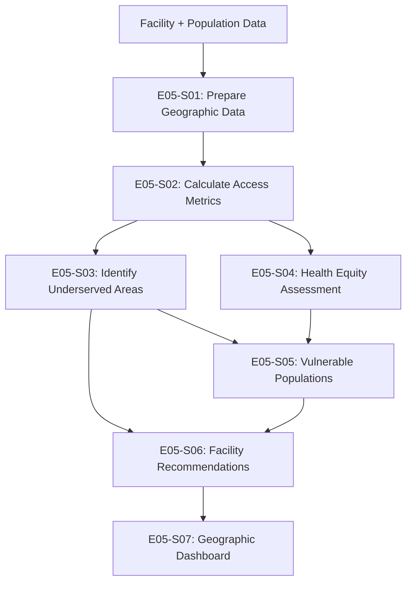
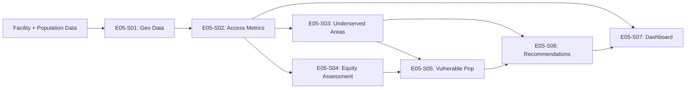

# Epic 005: Geographic Access & Health Equity Analysis - Complete Data Flow

## Epic Overview

- **Epic ID**: EPIC-005
- **Business Objective**: Conduct geographic access analysis and equity assessment to identify minimum 3 underserved areas requiring intervention and promote health equity across Singapore
- **Success Criteria**: 
  - Geographic access maps for all planning areas
  - Identify minimum 3 underserved geographic areas (>5km from nearest facility)
  - Quantify affected populations with demographic profiles
  - Health equity scorecard with disparity metrics
  - Evidence-based recommendations for facility placement or mobile services
- **User Stories Included**: E05-S01 through E05-S07

## End-to-End Data Flow Pipeline

### Pipeline Overview



### Execution Sequence

| Order | User Story ID | Story Title | Dependencies | Outputs | Duration |
|-------|---------------|-------------|--------------|---------|----------|
| 1 | E05-S01 | Prepare Geographic Data | None | Geo datasets | 4 days |
| 2 | E05-S02 | Calculate Access Metrics | E05-S01 | Access scores | 5 days |
| 3 | E05-S03 | Identify Underserved Areas | E05-S02 | 3+ areas | 4 days |
| 4 | E05-S04 | Health Equity Assessment | E05-S02 | Equity scorecard | 5 days |
| 5 | E05-S05 | Vulnerable Populations | E05-S03, E05-S04 | Population profiles | 4 days |
| 6 | E05-S06 | Facility Recommendations | E05-S03, E05-S05 | Recommendations | 5 days |
| 7 | E05-S07 | Geographic Dashboard | All previous | Dashboard | 5 days |

---

## User Story E05-S01: Prepare Geographic Data

### Story Context

- **Story ID**: e05-s01
- **Depends On**: None
- **Blocks**: e05-s02
- **Complexity**: medium

### 1. Data Extraction Specification

```yaml
source_tables:
  - table_name: "health-facilities-primary-care-dental-clinics-and-pharmacies"
    required_fields: ["facility_type_b", "no_of_facilities", "sector"]
    purpose: "Facility locations"
  
  - table_name: "health-facilities-and-beds-in-inpatient-facilities"
    required_fields: ["facility_type_a", "no_of_facilities"]
    purpose: "Hospital locations"
  
external_data_sources:
  - source: "Singapore Open Data"
    dataset: "Planning Area Boundaries"
    purpose: "Geographic boundaries"
  
  - source: "Singapore Department of Statistics"
    dataset: "Population by Planning Area"
    purpose: "Population distribution"
  
  - source: "OneMap API"
    dataset: "Facility addresses and coordinates"
    purpose: "Geocoding facility locations"
```

### 2. Data Transformation Pipeline

```yaml
transformations:
  
  - step_number: 1
    stage: "geocoding"
    operation: "geocode_facility_locations"
    logic: |
      Convert facility addresses to lat/long coordinates:
      - Use OneMap API or manual geocoding
      - Create facility location dataset with coordinates
    code_hint: |
      import requests
      
      def geocode_address(address):
          api_url = "https://developers.onemap.sg/commonapi/search"
          params = {'searchVal': address, 'returnGeom': 'Y', 'getAddrDetails': 'Y'}
          response = requests.get(api_url, params=params)
          if response.status_code == 200:
              data = response.json()
              if data['found'] > 0:
                  return {
                      'latitude': float(data['results'][0]['LATITUDE']),
                      'longitude': float(data['results'][0]['LONGITUDE'])
                  }
          return None
      
      facilities_df['coordinates'] = facilities_df['address'].apply(geocode_address)
  
  - step_number: 2
    stage: "population_mapping"
    operation: "map_population_distribution"
    logic: |
      Create population distribution dataset:
      - Population by planning area
      - Demographic breakdowns (age, income)
      - Coordinates for population centroids
    code_hint: |
      import geopandas as gpd
      
      # Load planning area boundaries
      planning_areas = gpd.read_file('data/geographic/planning_areas.geojson')
      
      # Merge with population data
      population_gdf = planning_areas.merge(
          population_df,
          left_on='planning_area_name',
          right_on='planning_area'
      )
  
  - step_number: 3
    stage: "data_integration"
    operation: "create_geographic_dataset"
    logic: |
      Integrate all geographic components:
      - Facility locations (points)
      - Population distribution (polygons)
      - Planning area boundaries
    output_location: "data/processed/e05_s01_geographic_dataset.geojson"
```

### 3. Output Specification

```yaml
output_artifacts:
  
  - artifact_type: "geographic_dataset"
    purpose: "Integrated geographic data for analysis"
    format: "GeoJSON + Shapefile"
    location: "data/processed/e05_s01_geographic_dataset.geojson"
    
    layers:
      - "facilities (points)"
      - "planning_areas (polygons)"
      - "population_centroids (points)"
```

### 5. Implementation Metadata

```yaml
user_story_id: "e05-s01"
epic_id: "EPIC-005"
estimated_duration: "4 days"

code_files_to_generate:
  - "src/data_processing/geocode_e05_s01_facilities.py"
  - "notebooks/2_analysis/e05_s01_prepare_geographic_data.ipynb"
```

---

## User Story E05-S02: Calculate Access Metrics

### Story Context

- **Story ID**: e05-s02
- **Depends On**: e05-s01
- **Blocks**: e05-s03, e05-s04
- **Complexity**: high

### 1. Data Extraction Specification

```yaml
source_tables:
  - table_name: "e05_s01_geographic_dataset"
    location: "data/processed/e05_s01_geographic_dataset.geojson"
```

### 2. Data Transformation Pipeline

```yaml
transformations:
  
  - step_number: 1
    stage: "distance_calculation"
    operation: "calculate_travel_distances"
    logic: |
      For each residential area (planning area centroid):
      - Calculate straight-line distance to nearest facility
      - Calculate travel distance along road network (if data available)
      - Estimate travel time
    code_hint: |
      from scipy.spatial import cKDTree
      import numpy as np
      
      # Extract coordinates
      facility_coords = np.array([(f['latitude'], f['longitude']) for f in facilities])
      population_coords = np.array([(p['latitude'], p['longitude']) for p in population_centroids])
      
      # Build KD-tree for efficient nearest neighbor search
      tree = cKDTree(facility_coords)
      
      # Find nearest facility for each population centroid
      distances, indices = tree.query(population_coords)
      
      # Convert to kilometers (approximately)
      # 1 degree latitude ≈ 111 km
      population_df['distance_to_nearest_facility_km'] = distances * 111
      population_df['nearest_facility_id'] = facilities.iloc[indices]['facility_id'].values
  
  - step_number: 2
    stage: "access_scoring"
    operation: "calculate_accessibility_scores"
    logic: |
      Create accessibility score (0-100):
      - 100: < 1km from facility
      - 75: 1-2km
      - 50: 2-5km
      - 25: 5-10km
      - 0: > 10km
    code_hint: |
      def calculate_access_score(distance_km):
          if distance_km < 1:
              return 100
          elif distance_km < 2:
              return 75
          elif distance_km < 5:
              return 50
          elif distance_km < 10:
              return 25
          else:
              return 0
      
      population_df['access_score'] = population_df['distance_to_nearest_facility_km'].apply(calculate_access_score)
  
  - step_number: 3
    stage: "service_coverage_analysis"
    operation: "calculate_service_coverage"
    logic: |
      Calculate coverage metrics:
      - % population within 1km of facility
      - % population within 5km
      - Average distance to nearest facility
    code_hint: |
      coverage_metrics = {
          'pct_within_1km': (population_df['distance_to_nearest_facility_km'] < 1).sum() / len(population_df) * 100,
          'pct_within_5km': (population_df['distance_to_nearest_facility_km'] < 5).sum() / len(population_df) * 100,
          'avg_distance_km': population_df['distance_to_nearest_facility_km'].mean()
      }
```

### 3. Analysis Specification

```yaml
analysis_overview:
  analysis_type: "spatial_analysis"
  primary_questions:
    - "How accessible are healthcare facilities geographically?"
    - "Which areas have poor access?"

spatial_analysis:
  - analysis_id: "access_mapping"
    purpose: "Map healthcare accessibility"
    methods:
      - method: "choropleth_mapping"
        data: "population_df with access_score"
        visualization: "Color-coded map by access score"
    
    outputs:
      - type: "access_heatmap"
        path: "reports/figures/e05_s02_access_heatmap.png"
```

### 4. Output Specification

```yaml
output_artifacts:
  
  - artifact_type: "access_metrics_dataset"
    purpose: "Calculated accessibility metrics"
    format: "GeoJSON + CSV"
    location: "data/processed/e05_s02_access_metrics.geojson"
    
    fields:
      - "planning_area"
      - "population"
      - "distance_to_nearest_facility_km"
      - "access_score"
      - "nearest_facility_id"
  
  - artifact_type: "access_heatmap"
    purpose: "Visual representation of access"
    format: "PNG + Interactive HTML"
    location: "reports/figures/e05_s02_access_heatmap.png"
```

### 5. Implementation Metadata

```yaml
user_story_id: "e05-s02"
epic_id: "EPIC-005"
estimated_duration: "5 days"

code_files_to_generate:
  - "src/analysis/calculate_e05_s02_access_metrics.py"
  - "notebooks/2_analysis/e05_s02_calculate_access_metrics.ipynb"
```

---

## User Story E05-S03: Identify Underserved Areas

### Story Context

- **Story ID**: e05-s03
- **Depends On**: e05-s02
- **Blocks**: e05-s05, e05-s06
- **Complexity**: medium

### 1. Data Extraction Specification

```yaml
source_tables:
  - table_name: "e05_s02_access_metrics"
    location: "data/processed/e05_s02_access_metrics.geojson"
```

### 2. Data Transformation Pipeline

```yaml
transformations:
  
  - step_number: 1
    stage: "identification"
    operation: "identify_healthcare_deserts"
    logic: |
      Identify underserved areas (healthcare deserts):
      - Criteria: > 5km from nearest facility
      - OR: Access score < 25
      - AND: Population > minimum threshold
    code_hint: |
      underserved_areas = population_df[
          (population_df['distance_to_nearest_facility_km'] > 5) &
          (population_df['population'] > 1000)  # Minimum population threshold
      ].copy()
      
      # Rank by severity (distance * population)
      underserved_areas['severity_score'] = (
          underserved_areas['distance_to_nearest_facility_km'] *
          underserved_areas['population'] / 1000
      )
      
      underserved_areas = underserved_areas.sort_values('severity_score', ascending=False)
  
  - step_number: 2
    stage: "quantification"
    operation: "quantify_impact"
    logic: |
      For each underserved area:
      - Affected population count
      - Distance to nearest facility
      - Travel burden (population × distance)
    code_hint: |
      for idx, area in underserved_areas.iterrows():
          area['affected_population'] = area['population']
          area['travel_burden'] = area['population'] * area['distance_to_nearest_facility_km']
```

### 3. Analysis Specification

```yaml
analysis_overview:
  analysis_type: "diagnostic"
  primary_questions:
    - "Which areas are underserved?"
    - "How many people are affected?"
```

### 4. Output Specification

```yaml
output_artifacts:
  
  - artifact_type: "underserved_areas_list"
    purpose: "List of minimum 3 underserved areas"
    format: "Excel + GeoJSON"
    location: "results/exports/e05_s03_underserved_areas.xlsx"
    
    includes:
      - "Area name and boundaries"
      - "Affected population"
      - "Distance to nearest facility"
      - "Severity score"
```

### 5. Implementation Metadata

```yaml
user_story_id: "e05-s03"
epic_id: "EPIC-005"
estimated_duration: "4 days"
```

---

## User Story E05-S04: Health Equity Assessment

### Story Context

- **Story ID**: e05-s04
- **Depends On**: e05-s02
- **Blocks**: e05-s05
- **Complexity**: high

### 1. Data Extraction Specification

```yaml
source_tables:
  - table_name: "e05_s02_access_metrics"
  
external_data:
  - "Income levels by planning area"
  - "Demographic characteristics (age, ethnicity)"
  - "Health outcomes data (if available)"
```

### 2. Data Transformation Pipeline

```yaml
transformations:
  
  - step_number: 1
    stage: "disparity_analysis"
    operation: "calculate_equity_metrics"
    logic: |
      Calculate health equity metrics:
      - Gini coefficient for healthcare access
      - Concentration index by income quintile
      - Access disparities by demographic groups
    code_hint: |
      # Gini coefficient for access
      def gini_coefficient(access_scores, populations):
          # Sort by access score
          sorted_indices = np.argsort(access_scores)
          sorted_access = access_scores[sorted_indices]
          sorted_pop = populations[sorted_indices]
          
          # Calculate cumulative shares
          cum_pop = np.cumsum(sorted_pop) / np.sum(sorted_pop)
          cum_access = np.cumsum(sorted_access * sorted_pop) / np.sum(sorted_access * sorted_pop)
          
          # Calculate Gini
          gini = 1 - 2 * np.trapz(cum_access, cum_pop)
          return gini
      
      gini = gini_coefficient(
          population_df['access_score'].values,
          population_df['population'].values
      )
  
  - step_number: 2
    stage: "demographic_disparity"
    operation: "analyze_demographic_disparities"
    logic: |
      Compare access across demographic groups:
      - By income level
      - By age group (elderly vs. general population)
      - By ethnicity
    code_hint: |
      # Access by income quintile
      income_analysis = population_df.groupby('income_quintile').agg({
          'access_score': 'mean',
          'population': 'sum',
          'distance_to_nearest_facility_km': 'mean'
      })
      
      # Calculate disparity ratio (lowest vs. highest income)
      disparity_ratio = (
          income_analysis.loc['Q1', 'access_score'] /
          income_analysis.loc['Q5', 'access_score']
      )
```

### 3. Analysis Specification

```yaml
analysis_overview:
  analysis_type: "equity_analysis"
  primary_questions:
    - "Are there health equity disparities?"
    - "Which groups are disadvantaged?"

equity_analysis:
  - analysis_id: "disparity_quantification"
    purpose: "Measure inequity"
    methods:
      - method: "gini_coefficient"
        interpretation: "0 = perfect equality, 1 = perfect inequality"
      - method: "concentration_index"
        interpretation: "Negative = pro-poor, Positive = pro-rich"
```

### 4. Output Specification

```yaml
output_artifacts:
  
  - artifact_type: "health_equity_scorecard"
    purpose: "Comprehensive equity assessment"
    format: "PDF + Excel"
    location: "reports/epic-005/e05_s04_equity_scorecard.pdf"
    
    sections:
      - "Overall Equity Metrics (Gini, Concentration Index)"
      - "Access by Income Level"
      - "Access by Age Group"
      - "Access by Geographic Region"
      - "Recommendations for Equity Improvements"
```

### 5. Implementation Metadata

```yaml
user_story_id: "e05-s04"
epic_id: "EPIC-005"
estimated_duration: "5 days"
```

---

## User Story E05-S05: Profile Vulnerable Populations

### Story Context

- **Story ID**: e05-s05
- **Depends On**: e05-s03, e05-s04
- **Blocks**: e05-s06
- **Complexity**: medium

### 1. Data Transformation Pipeline

```yaml
transformations:
  
  - step_number: 1
    stage: "vulnerable_population_identification"
    operation: "identify_at_risk_groups"
    logic: |
      Identify vulnerable populations in underserved areas:
      - Elderly (>65 years) with limited mobility
      - Low-income households
      - People with disabilities
      - Chronic disease patients
    code_hint: |
      vulnerable_pop = []
      
      for area in underserved_areas:
          profile = {
              'area': area['planning_area'],
              'elderly_count': area['population_65_plus'],
              'low_income_count': area['population_low_income'],
              'disabled_count': area['population_disabled'],
              'chronic_disease_prevalence': area['chronic_disease_rate'],
              'total_vulnerable': calculate_vulnerable_population(area)
          }
          vulnerable_pop.append(profile)
```

### 4. Output Specification

```yaml
output_artifacts:
  
  - artifact_type: "vulnerable_population_profiles"
    purpose: "Profiles of at-risk populations"
    format: "Excel"
    location: "results/exports/e05_s05_vulnerable_populations.xlsx"
```

### 5. Implementation Metadata

```yaml
user_story_id: "e05-s05"
epic_id: "EPIC-005"
estimated_duration: "4 days"
```

---

## User Story E05-S06: Develop Facility Placement Recommendations

### Story Context

- **Story ID**: e05-s06
- **Depends On**: e05-s03, e05-s05
- **Blocks**: e05-s07
- **Complexity**: high

### 1. Data Transformation Pipeline

```yaml
transformations:
  
  - step_number: 1
    stage: "site_selection"
    operation: "identify_optimal_locations"
    logic: |
      For each underserved area, recommend:
      - New facility locations (optimal placement)
      - Mobile clinic routes
      - Telemedicine hubs
    code_hint: |
      recommendations = []
      
      for area in underserved_areas:
          # Calculate optimal location (population-weighted centroid)
          optimal_location = calculate_optimal_location(area)
          
          recommendation = {
              'area': area['planning_area'],
              'intervention_type': determine_intervention_type(area),  # Facility, mobile clinic, or telemedicine
              'recommended_location': optimal_location,
              'affected_population': area['population'],
              'expected_access_improvement': estimate_improvement(area, optimal_location),
              'estimated_cost': estimate_facility_cost(intervention_type),
              'priority': calculate_priority(area)
          }
          recommendations.append(recommendation)
```

### 4. Output Specification

```yaml
output_artifacts:
  
  - artifact_type: "facility_placement_recommendations"
    purpose: "Evidence-based recommendations for new facilities"
    format: "PDF + GeoJSON"
    location: "reports/epic-005/e05_s06_facility_recommendations.pdf"
    
    sections:
      - "Recommended Locations (map + coordinates)"
      - "Intervention Type Rationale"
      - "Cost-Benefit Analysis"
      - "Implementation Timeline"
      - "Expected Access Improvements"
```

### 5. Implementation Metadata

```yaml
user_story_id: "e05-s06"
epic_id: "EPIC-005"
estimated_duration: "5 days"
```

---

## User Story E05-S07: Create Geographic Dashboard

### Story Context

- **Story ID**: e05-s07
- **Depends On**: All previous
- **Blocks**: None (final deliverable)
- **Complexity**: high

### 1. Dashboard Specification

```yaml
dashboard_structure:
  tool: "Plotly Dash with Mapbox"
  
  components:
    - component_type: "KPI_cards"
      metrics:
        - "Underserved Areas: {underserved_count}"
        - "Population Affected: {affected_population:,}"
        - "Average Access Score: {avg_access_score}"
        - "Gini Coefficient: {gini:.2f}"
    
    - component_type: "interactive_map"
      title: "Healthcare Access Map"
      map_layers:
        - "Access heatmap (choropleth)"
        - "Facility locations (markers)"
        - "Underserved areas (highlighted)"
        - "Recommended facility locations (proposed markers)"
      interactivity: "Click for details, zoom, pan"
    
    - component_type: "equity_charts"
      charts:
        - "Access by Income Quintile (bar chart)"
        - "Access by Planning Area (ranked bar)"
        - "Disparity metrics (gauge charts)"
    
    - component_type: "recommendation_table"
      title: "Facility Placement Recommendations"
      data: "recommendations"
      features: ["sorting", "filtering", "detail_view"]
```

### 3. Output Specification

```yaml
output_artifacts:
  
  - artifact_type: "geographic_dashboard"
    purpose: "Interactive geographic access dashboard"
    tool: "Plotly Dash"
    url: "http://localhost:8050/epic005_geographic_dashboard"
    
    deployment:
      local_run: "python src/visualization/epic005_geographic_dashboard.py"
      requirements: "plotly, dash, geopandas, mapbox"
```

### 5. Implementation Metadata

```yaml
user_story_id: "e05-s07"
epic_id: "EPIC-005"
estimated_duration: "5 days"
```

---

## Epic Integration & Artifacts

### Epic-Level Outputs

- Geographic access maps and heatmaps
- Minimum 3 underserved areas identified
- Health equity scorecard
- Facility placement recommendations
- Interactive geographic dashboard

### Complete Data Lineage


