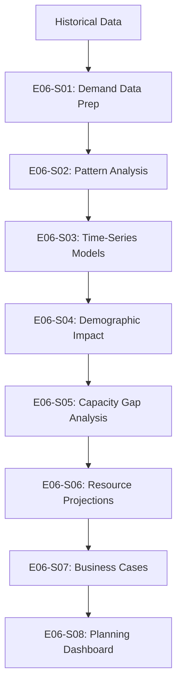

# Epic 006: Predictive Healthcare Demand Forecasting - Complete Data Flow

## Epic Overview

- **Epic ID**: EPIC-006
- **Business Objective**: Build predictive models to forecast healthcare demand and capacity needs with minimum 85% accuracy for 1-year and 5-year horizons, enabling proactive capacity planning
- **Success Criteria**: 
  - Time-series forecasting models with 85%+ accuracy
  - Demand forecasts for 1-year and 5-year horizons
  - Identify minimum 5 capacity gaps
  - Resource requirement projections with confidence intervals
  - Business cases for minimum 3 capacity expansions
- **User Stories Included**: E06-S01 through E06-S08

## End-to-End Data Flow Pipeline

### Pipeline Overview



### Execution Sequence

| Order | User Story ID | Story Title | Dependencies | Outputs | Duration |
|-------|---------------|-------------|--------------|---------|----------|
| 1 | E06-S01 | Prepare Demand Data | None | Time-series data | 5 days |
| 2 | E06-S02 | Analyze Demand Patterns | E06-S01 | Pattern insights | 4 days |
| 3 | E06-S03 | Build Forecasting Models | E06-S02 | ML models (85%+ accuracy) | 8 days |
| 4 | E06-S04 | Demographic Impact Modeling | E06-S03 | Adjusted forecasts | 5 days |
| 5 | E06-S05 | Identify Capacity Gaps | E06-S04 | 5+ gaps | 4 days |
| 6 | E06-S06 | Project Resource Requirements | E06-S05 | Resource forecasts | 5 days |
| 7 | E06-S07 | Build Business Cases | E06-S06 | 3+ business cases | 6 days |
| 8 | E06-S08 | Capacity Planning Dashboard | All previous | Dashboard | 5 days |

---

## User Story E06-S01: Prepare Demand Data for Forecasting

### Story Context

- **Story ID**: e06-s01
- **Depends On**: None
- **Blocks**: e06-s02
- **Complexity**: medium

### 1. Data Extraction Specification

```yaml
source_tables:
  
  # Utilization tables
  - table_name: "admissions-and-outpatient-attendances"
    required_fields: ["year", "admissions", "total_outpatient_attendances"]
    time_range: "1990-2020"
    purpose: "Historical demand data"
  
  - table_name: "subsidised-and-private-patient-days"
    required_fields: ["year", "subsidised_patient_days", "private_patient_days"]
    purpose: "Inpatient volume trends"
  
  - table_name: "bed-occupancy-rate-bor"
    required_fields: ["year", "bed_occupancy_rate"]
    purpose: "Capacity utilization"
  
  - table_name: "average-length-of-stay-alos"
    required_fields: ["year", "alos"]
    purpose: "Length of stay trends"
  
  # Demographic tables
  - table_name: "population-and-population-structure"
    required_fields: ["year", "total_population", "age_groups"]
    purpose: "Population trends"
  
  - table_name: "life-expectancy-by-sex"
    required_fields: ["year", "life_expectancy"]
    purpose: "Aging trends"
  
  # Disease burden
  - table_name: "principal-causes-of-death"
    required_fields: ["year", "cause", "deaths"]
    purpose: "Disease burden trends"
  
  - table_name: "top-4-conditions-of-polyclinic-attendances"
    required_fields: ["year", "condition", "attendances"]
    purpose: "Common conditions demand"
```

### 2. Data Transformation Pipeline


```yaml
transformations:
  
  - step_number: 1
    stage: "time_series_structuring"
    operation: "create_time_series_datasets"
    logic: |
      Create time-series datasets for key metrics:
      - Total admissions by year
      - Total outpatient visits by year
      - Total patient days by year
      - Bed occupancy rate by year
      - Population by year
    code_hint: |
      import pandas as pd
      
      # Aggregate annual demand
      annual_demand = pd.DataFrame({
          'year': range(1990, 2021),
          'admissions': admissions_df.groupby('year')['admissions'].sum(),
          'outpatient_visits': outpatient_df.groupby('year')['total_outpatient_attendances'].sum(),
          'patient_days': patient_days_df.groupby('year')[['subsidised_patient_days', 'private_patient_days']].sum().sum(axis=1),
          'bed_occupancy_rate': bor_df.groupby('year')['bed_occupancy_rate'].mean()
      })
  
  - step_number: 2
    stage: "feature_engineering"
    operation: "create_predictive_features"
    logic: |
      Engineer features for forecasting:
      - Trend component (year index)
      - Population growth rate
      - Aging index (% population 65+)
      - Disease burden index
      - Economic indicators (GDP if available)
    code_hint: |
      # Trend component
      annual_demand['year_index'] = annual_demand['year'] - annual_demand['year'].min()
      
      # Population growth rate
      annual_demand['population_growth_rate'] = (
          population_df['total_population'].pct_change()
      )
      
      # Aging index
      annual_demand['aging_index'] = (
          population_df['population_65_plus'] / population_df['total_population'] * 100
      )
      
      # Demand per capita
      annual_demand['admissions_per_1000'] = (
          annual_demand['admissions'] / population_df['total_population'] * 1000
      )
  
  - step_number: 3
    stage: "stationarity_testing"
    operation: "test_stationarity"
    logic: |
      Test for stationarity (required for ARIMA models):
      - Augmented Dickey-Fuller test
      - If non-stationary, apply differencing
    code_hint: |
      from statsmodels.tsa.stattools import adfuller
      
      def test_stationarity(timeseries):
          result = adfuller(timeseries.dropna())
          p_value = result[1]
          return p_value < 0.05  # True if stationary
      
      # Test each metric
      for metric in ['admissions', 'outpatient_visits', 'patient_days']:
          is_stationary = test_stationarity(annual_demand[metric])
          print(f"{metric} stationary: {is_stationary}")
          
          if not is_stationary:
              # Apply differencing
              annual_demand[f'{metric}_diff'] = annual_demand[metric].diff()
  
  - step_number: 4
    stage: "train_test_split"
    operation: "split_time_series"
    logic: |
      Split data for model training and validation:
      - Training: 1990-2017 (80%)
      - Testing: 2018-2020 (20%)
    code_hint: |
      train_cutoff_year = 2017
      
      train_data = annual_demand[annual_demand['year'] <= train_cutoff_year]
      test_data = annual_demand[annual_demand['year'] > train_cutoff_year]
    
    output_location: "data/processed/e06_s01_demand_timeseries.csv"
```

### 3. Output Specification

```yaml
output_artifacts:
  
  - artifact_type: "time_series_dataset"
    purpose: "Prepared data for forecasting models"
    format: "CSV"
    location: "data/processed/e06_s01_demand_timeseries.csv"
    
    time_series_metrics:
      - "admissions"
      - "outpatient_visits"
      - "patient_days"
      - "bed_occupancy_rate"
      - "population"
      - "aging_index"
```

### 5. Implementation Metadata

```yaml
user_story_id: "e06-s01"
epic_id: "EPIC-006"
estimated_duration: "5 days"

code_files_to_generate:
  - "src/data_processing/prepare_e06_s01_demand_data.py"
  - "notebooks/2_analysis/e06_s01_prepare_demand_data.ipynb"
```

---

## User Story E06-S02: Analyze Historical Demand Patterns

### Story Context

- **Story ID**: e06-s02
- **Depends On**: e06-s01
- **Blocks**: e06-s03
- **Complexity**: medium

### 1. Data Extraction Specification

```yaml
source_tables:
  - table_name: "e06_s01_demand_timeseries"
    location: "data/processed/e06_s01_demand_timeseries.csv"
```

### 2. Analysis Specification

```yaml
analysis_overview:
  analysis_type: "time_series_analysis"
  primary_questions:
    - "What are the historical demand trends?"
    - "Are there seasonal patterns?"
    - "What is the growth rate?"

time_series_analyses:
  
  - analysis_id: "trend_analysis"
    purpose: "Identify long-term trends"
    methods:
      - method: "linear_regression"
        code_hint: |
          from scipy import stats
          
          # Calculate trend for admissions
          x = annual_demand['year_index'].values
          y = annual_demand['admissions'].values
          
          slope, intercept, r_value, p_value, std_err = stats.linregress(x, y)
          
          annual_growth_rate = (slope / annual_demand['admissions'].mean()) * 100
          print(f"Annual growth rate: {annual_growth_rate:.2f}%")
      
      - method: "compound_annual_growth_rate"
        formula: "CAGR = (Ending Value / Beginning Value)^(1/years) - 1"
        code_hint: |
          def calculate_cagr(start_value, end_value, years):
              return (end_value / start_value) ** (1 / years) - 1
          
          admissions_cagr = calculate_cagr(
              annual_demand.iloc[0]['admissions'],
              annual_demand.iloc[-1]['admissions'],
              len(annual_demand) - 1
          ) * 100
  
  - analysis_id: "seasonality_detection"
    purpose: "Detect seasonal patterns"
    methods:
      - method: "seasonal_decomposition"
        code_hint: |
          from statsmodels.tsa.seasonal import seasonal_decompose
          
          # Decompose time series
          decomposition = seasonal_decompose(
              annual_demand['admissions'],
              model='additive',
              period=5  # 5-year cycles if any
          )
          
          trend = decomposition.trend
          seasonal = decomposition.seasonal
          residual = decomposition.resid
  
  - analysis_id: "correlation_analysis"
    purpose: "Identify demand drivers"
    methods:
      - method: "correlation_matrix"
        code_hint: |
          correlation_matrix = annual_demand[[
              'admissions', 'population', 'aging_index', 'population_growth_rate'
          ]].corr()
          
          # Find strongest correlates with admissions
          admission_correlations = correlation_matrix['admissions'].sort_values(ascending=False)
```

### 4. Output Specification

```yaml
output_artifacts:
  
  - artifact_type: "demand_pattern_report"
    purpose: "Historical demand pattern insights"
    format: "PDF"
    location: "reports/epic-006/e06_s02_demand_patterns.pdf"
    
    sections:
      - "Trend Analysis (growth rates)"
      - "Seasonal Patterns"
      - "Demand Drivers (correlations)"
      - "Key Insights & Implications"
  
  - artifact_type: "pattern_visualizations"
    purpose: "Charts showing demand patterns"
    format: "PNG"
    location: "reports/figures/e06_s02_*.png"
```

### 5. Implementation Metadata

```yaml
user_story_id: "e06-s02"
epic_id: "EPIC-006"
estimated_duration: "4 days"
```

---

## User Story E06-S03: Build Time-Series Forecasting Models

### Story Context

- **Story ID**: e06-s03
- **Depends On**: e06-s02
- **Blocks**: e06-s04
- **Complexity**: very high

### 1. Model Specification

```yaml
forecasting_models:
  
  - model_id: "arima_model"
    algorithm: "ARIMA (AutoRegressive Integrated Moving Average)"
    purpose: "Capture linear trends and autocorrelation"
    parameters:
      - "p: autoregressive order (0-5)"
      - "d: differencing order (0-2)"
      - "q: moving average order (0-5)"
    
    code_hint: |
      from statsmodels.tsa.arima.model import ARIMA
      from itertools import product
      
      # Grid search for best (p, d, q)
      p_values = range(0, 6)
      d_values = range(0, 3)
      q_values = range(0, 6)
      
      best_aic = float('inf')
      best_params = None
      
      for p, d, q in product(p_values, d_values, q_values):
          try:
              model = ARIMA(train_data['admissions'], order=(p, d, q))
              fitted_model = model.fit()
              
              if fitted_model.aic < best_aic:
                  best_aic = fitted_model.aic
                  best_params = (p, d, q)
          except:
              continue
      
      # Train final model with best parameters
      final_arima = ARIMA(train_data['admissions'], order=best_params)
      arima_model = final_arima.fit()
      
      # Forecast
      forecast_1yr = arima_model.forecast(steps=1)
      forecast_5yr = arima_model.forecast(steps=5)
  
  - model_id: "prophet_model"
    algorithm: "Facebook Prophet"
    purpose: "Handle seasonality and holidays"
    parameters:
      - "yearly_seasonality: True"
      - "changepoint_prior_scale: 0.05"
    
    code_hint: |
      from prophet import Prophet
      
      # Prepare data for Prophet
      prophet_df = train_data[['year', 'admissions']].rename(
          columns={'year': 'ds', 'admissions': 'y'}
      )
      prophet_df['ds'] = pd.to_datetime(prophet_df['ds'], format='%Y')
      
      # Train model
      prophet_model = Prophet(
          yearly_seasonality=True,
          changepoint_prior_scale=0.05
      )
      prophet_model.fit(prophet_df)
      
      # Forecast
      future = prophet_model.make_future_dataframe(periods=5, freq='Y')
      forecast = prophet_model.predict(future)
      
      forecast_1yr = forecast.iloc[-5]['yhat']
      forecast_5yr = forecast.iloc[-1]['yhat']
  
  - model_id: "lstm_model"
    algorithm: "LSTM (Long Short-Term Memory Neural Network)"
    purpose: "Capture complex non-linear patterns"
    parameters:
      - "layers: [50, 50]"
      - "dropout: 0.2"
      - "epochs: 100"
    
    code_hint: |
      from tensorflow.keras.models import Sequential
      from tensorflow.keras.layers import LSTM, Dense, Dropout
      import numpy as np
      
      # Prepare sequences
      def create_sequences(data, seq_length=5):
          X, y = [], []
          for i in range(len(data) - seq_length):
              X.append(data[i:i+seq_length])
              y.append(data[i+seq_length])
          return np.array(X), np.array(y)
      
      seq_length = 5
      X_train, y_train = create_sequences(train_data['admissions'].values, seq_length)
      X_train = X_train.reshape((X_train.shape[0], X_train.shape[1], 1))
      
      # Build LSTM model
      lstm_model = Sequential([
          LSTM(50, activation='relu', return_sequences=True, input_shape=(seq_length, 1)),
          Dropout(0.2),
          LSTM(50, activation='relu'),
          Dropout(0.2),
          Dense(1)
      ])
      
      lstm_model.compile(optimizer='adam', loss='mse')
      lstm_model.fit(X_train, y_train, epochs=100, batch_size=8, verbose=0)
      
      # Forecast (iterative)
      forecast_5yr = []
      current_sequence = train_data['admissions'].values[-seq_length:]
      
      for i in range(5):
          next_pred = lstm_model.predict(current_sequence.reshape(1, seq_length, 1))[0, 0]
          forecast_5yr.append(next_pred)
          current_sequence = np.append(current_sequence[1:], next_pred)
  
  - model_id: "ensemble_model"
    algorithm: "Weighted Ensemble"
    purpose: "Combine predictions from multiple models"
    
    code_hint: |
      # Ensemble: weighted average based on validation accuracy
      arima_weight = 0.3
      prophet_weight = 0.4
      lstm_weight = 0.3
      
      ensemble_forecast_1yr = (
          arima_weight * forecast_arima_1yr +
          prophet_weight * forecast_prophet_1yr +
          lstm_weight * forecast_lstm_1yr
      )
      
      ensemble_forecast_5yr = (
          arima_weight * forecast_arima_5yr[-1] +
          prophet_weight * forecast_prophet_5yr +
          lstm_weight * forecast_lstm_5yr[-1]
      )
```

### 2. Model Evaluation

```yaml
evaluation_metrics:
  
  - metric: "Mean Absolute Percentage Error (MAPE)"
    formula: "MAPE = mean(|actual - predicted| / actual) * 100"
    target: "< 15% (85%+ accuracy)"
    code_hint: |
      def calculate_mape(actual, predicted):
          return np.mean(np.abs((actual - predicted) / actual)) * 100
      
      mape_arima = calculate_mape(test_data['admissions'].values, arima_predictions)
      mape_prophet = calculate_mape(test_data['admissions'].values, prophet_predictions)
      mape_lstm = calculate_mape(test_data['admissions'].values, lstm_predictions)
      mape_ensemble = calculate_mape(test_data['admissions'].values, ensemble_predictions)
  
  - metric: "Root Mean Squared Error (RMSE)"
    formula: "RMSE = sqrt(mean((actual - predicted)^2))"
    code_hint: |
      from sklearn.metrics import mean_squared_error
      
      rmse_arima = np.sqrt(mean_squared_error(test_data['admissions'], arima_predictions))
  
  - metric: "Confidence Intervals"
    purpose: "Quantify forecast uncertainty"
    code_hint: |
      # For ARIMA, Prophet provides built-in confidence intervals
      forecast_prophet_ci = forecast[['yhat_lower', 'yhat_upper']]
      
      # For ensemble, calculate based on model agreement
      predictions_matrix = np.column_stack([arima_pred, prophet_pred, lstm_pred])
      ci_lower = np.percentile(predictions_matrix, 5, axis=1)
      ci_upper = np.percentile(predictions_matrix, 95, axis=1)
```

### 4. Output Specification

```yaml
output_artifacts:
  
  - artifact_type: "trained_models"
    purpose: "Serialized forecasting models"
    format: "Pickle / H5"
    location: "models/e06_s03_forecasting_models/"
    models:
      - "arima_model.pkl"
      - "prophet_model.pkl"
      - "lstm_model.h5"
  
  - artifact_type: "forecast_results"
    purpose: "Demand forecasts with confidence intervals"
    format: "Excel"
    location: "results/exports/e06_s03_demand_forecasts.xlsx"
    
    sheets:
      - "1-Year Forecast (by metric)"
      - "5-Year Forecast (by metric)"
      - "Model Comparison (accuracy metrics)"
  
  - artifact_type: "model_evaluation_report"
    purpose: "Model performance and selection"
    format: "PDF"
    location: "reports/epic-006/e06_s03_model_evaluation.pdf"
```

### 5. Implementation Metadata

```yaml
user_story_id: "e06-s03"
epic_id: "EPIC-006"
estimated_duration: "8 days"

code_files_to_generate:
  - "src/models/train_e06_s03_forecasting_models.py"
  - "notebooks/3_feature_engineering/e06_s03_build_forecasting_models.ipynb"
```

---

## User Story E06-S04: Demographic Impact Modeling

### Story Context

- **Story ID**: e06-s04
- **Depends On**: e06-s03
- **Blocks**: e06-s05
- **Complexity**: high

### 1. Data Transformation Pipeline

```yaml
transformations:
  
  - step_number: 1
    stage: "demographic_projection"
    operation: "project_population_changes"
    logic: |
      Project demographic changes for 1-year and 5-year horizons:
      - Total population growth
      - Aging population (65+) growth
      - Birth rate changes
    code_hint: |
      # Use historical population growth rates
      avg_population_growth_rate = population_df['population_growth_rate'].mean()
      
      population_2021 = population_df.loc[population_df['year'] == 2020, 'total_population'].values[0]
      population_2022 = population_2021 * (1 + avg_population_growth_rate)
      population_2025 = population_2021 * (1 + avg_population_growth_rate) ** 5
      
      # Project aging population
      aging_rate = (population_df['population_65_plus'] / population_df['total_population']).pct_change().mean()
      pct_65_plus_2022 = pct_65_plus_2020 * (1 + aging_rate)
      pct_65_plus_2025 = pct_65_plus_2020 * (1 + aging_rate) ** 5
  
  - step_number: 2
    stage: "demand_adjustment"
    operation: "adjust_forecasts_for_demographics"
    logic: |
      Adjust demand forecasts based on demographic changes:
      - Elderly typically have 3-4x higher healthcare utilization
      - Adjust admissions forecast by aging factor
    code_hint: |
      # Calculate aging adjustment factor
      elderly_utilization_multiplier = 3.5
      
      aging_adjustment_2022 = 1 + (
          (pct_65_plus_2022 - pct_65_plus_2020) * elderly_utilization_multiplier
      )
      
      aging_adjustment_2025 = 1 + (
          (pct_65_plus_2025 - pct_65_plus_2020) * elderly_utilization_multiplier
      )
      
      # Apply adjustment to forecasts
      adjusted_forecast_2022 = base_forecast_2022 * aging_adjustment_2022
      adjusted_forecast_2025 = base_forecast_2025 * aging_adjustment_2025
```

### 4. Output Specification

```yaml
output_artifacts:
  
  - artifact_type: "demographic_adjusted_forecasts"
    purpose: "Demand forecasts adjusted for demographic changes"
    format: "Excel"
    location: "results/exports/e06_s04_adjusted_forecasts.xlsx"
```

### 5. Implementation Metadata

```yaml
user_story_id: "e06-s04"
epic_id: "EPIC-006"
estimated_duration: "5 days"
```

---

## User Story E06-S05: Identify Capacity Gaps

### Story Context

- **Story ID**: e06-s05
- **Depends On**: e06-s04
- **Blocks**: e06-s06
- **Complexity**: medium

### 1. Data Transformation Pipeline

```yaml
transformations:
  
  - step_number: 1
    stage: "capacity_comparison"
    operation: "compare_demand_vs_capacity"
    logic: |
      Compare forecasted demand against current capacity:
      - Current beds available
      - Current staffing levels
      - Forecasted demand
      - Identify gaps where demand > capacity
    code_hint: |
      # Current capacity
      current_beds = facilities_df['no_of_beds'].sum()
      current_doctors = workforce_df[workforce_df['profession'] == 'Doctors']['count'].sum()
      
      # Capacity requirements (based on forecasted demand)
      forecasted_patient_days_2022 = adjusted_forecast_2022['patient_days']
      forecasted_patient_days_2025 = adjusted_forecast_2025['patient_days']
      
      # Calculate required beds (assuming 85% target occupancy)
      required_beds_2022 = forecasted_patient_days_2022 / 365 / 0.85
      required_beds_2025 = forecasted_patient_days_2025 / 365 / 0.85
      
      # Identify gaps
      bed_gap_2022 = max(0, required_beds_2022 - current_beds)
      bed_gap_2025 = max(0, required_beds_2025 - current_beds)
  
  - step_number: 2
    stage: "gap_prioritization"
    operation: "prioritize_capacity_gaps"
    logic: |
      Prioritize capacity gaps by:
      - Magnitude of gap
      - Urgency (1-year vs. 5-year)
      - Impact on population
    code_hint: |
      capacity_gaps = []
      
      if bed_gap_2022 > 0:
          capacity_gaps.append({
              'gap_type': 'Hospital Beds',
              'current_capacity': current_beds,
              'required_2022': required_beds_2022,
              'gap_2022': bed_gap_2022,
              'gap_2025': bed_gap_2025,
              'priority': 'High' if bed_gap_2022 > current_beds * 0.1 else 'Medium'
          })
```

### 4. Output Specification

```yaml
output_artifacts:
  
  - artifact_type: "capacity_gap_analysis"
    purpose: "Minimum 5 identified capacity gaps"
    format: "Excel"
    location: "results/exports/e06_s05_capacity_gaps.xlsx"
    
    fields:
      - "Gap Type (beds, staff, equipment)"
      - "Current Capacity"
      - "Required Capacity (1-year, 5-year)"
      - "Gap Size"
      - "Priority"
```

### 5. Implementation Metadata

```yaml
user_story_id: "e06-s05"
epic_id: "EPIC-006"
estimated_duration: "4 days"
```

---

## User Story E06-S06: Project Resource Requirements

### Story Context

- **Story ID**: e06-s06
- **Depends On**: e06-s05
- **Blocks**: e06-s07
- **Complexity**: medium

### 1. Data Transformation Pipeline

```yaml
transformations:
  
  - step_number: 1
    stage: "resource_projection"
    operation: "calculate_resource_requirements"
    logic: |
      For each capacity gap, calculate required resources:
      - Beds: direct from gap analysis
      - Staff: use ratios (e.g., 1 doctor per 10 beds, 3 nurses per doctor)
      - Equipment: based on bed additions
      - Space: square footage requirements
    code_hint: |
      for gap in capacity_gaps:
          if gap['gap_type'] == 'Hospital Beds':
              beds_needed = gap['gap_2025']
              
              # Calculate staff requirements
              doctors_needed = beds_needed / 10  # 1 doctor per 10 beds
              nurses_needed = doctors_needed * 3  # 3 nurses per doctor
              allied_health_needed = beds_needed / 20
              
              # Equipment requirements
              # ... (based on facility standards)
              
              gap['resource_requirements'] = {
                  'beds': beds_needed,
                  'doctors': doctors_needed,
                  'nurses': nurses_needed,
                  'allied_health': allied_health_needed
              }
```

### 4. Output Specification

```yaml
output_artifacts:
  
  - artifact_type: "resource_projection_report"
    purpose: "Detailed resource requirements with confidence intervals"
    format: "Excel + PDF"
    location: "results/exports/e06_s06_resource_projections.xlsx"
```

### 5. Implementation Metadata

```yaml
user_story_id: "e06-s06"
epic_id: "EPIC-006"
estimated_duration: "5 days"
```

---

## User Story E06-S07: Build Business Cases for Capacity Expansion

### Story Context

- **Story ID**: e06-s07
- **Depends On**: e06-s06
- **Blocks**: e06-s08
- **Complexity**: high

### 1. Data Transformation Pipeline

```yaml
transformations:
  
  - step_number: 1
    stage: "cost_benefit_analysis"
    operation: "calculate_expansion_roi"
    logic: |
      For top 3 capacity gaps, build business cases:
      - Capital costs (construction, equipment)
      - Operating costs (staff, maintenance)
      - Revenue projections
      - Cost-benefit analysis
      - ROI calculation
    code_hint: |
      def build_business_case(gap):
          # Capital costs
          cost_per_bed = 500000  # SGD (example)
          capital_cost = gap['beds_needed'] * cost_per_bed
          
          # Annual operating costs
          annual_cost_per_bed = 100000  # SGD (example)
          annual_operating_cost = gap['beds_needed'] * annual_cost_per_bed
          
          # Revenue projections
          revenue_per_patient_day = 500  # SGD
          annual_revenue = gap['additional_patient_days'] * revenue_per_patient_day
          
          # Calculate NPV (10-year horizon, 5% discount rate)
          discount_rate = 0.05
          years = 10
          
          npv = -capital_cost  # Initial investment
          for year in range(1, years + 1):
              annual_net_cashflow = annual_revenue - annual_operating_cost
              npv += annual_net_cashflow / (1 + discount_rate) ** year
          
          roi = (npv / capital_cost) * 100
          payback_period = capital_cost / (annual_revenue - annual_operating_cost)
          
          return {
              'capital_cost': capital_cost,
              'annual_operating_cost': annual_operating_cost,
              'annual_revenue': annual_revenue,
              'npv_10yr': npv,
              'roi': roi,
              'payback_period': payback_period
          }
      
      # Build business cases for top 3 gaps
      top_gaps = sorted(capacity_gaps, key=lambda x: x['gap_2025'], reverse=True)[:3]
      
      business_cases = []
      for gap in top_gaps:
          business_case = build_business_case(gap)
          business_case['gap'] = gap
          business_cases.append(business_case)
```

### 4. Output Specification

```yaml
output_artifacts:
  
  - artifact_type: "business_case_documents"
    purpose: "Minimum 3 comprehensive business cases"
    format: "PDF"
    location: "reports/epic-006/e06_s07_business_cases_*.pdf"
    
    sections_per_case:
      - "Executive Summary"
      - "Current Situation & Need"
      - "Proposed Solution"
      - "Resource Requirements"
      - "Financial Analysis (costs, revenue, NPV, ROI)"
      - "Implementation Timeline"
      - "Risks & Mitigation"
      - "Recommendations"
```

### 5. Implementation Metadata

```yaml
user_story_id: "e06-s07"
epic_id: "EPIC-006"
estimated_duration: "6 days"
```

---

## User Story E06-S08: Create Capacity Planning Dashboard

### Story Context

- **Story ID**: e06-s08
- **Depends On**: All previous
- **Blocks**: None (final deliverable)
- **Complexity**: high

### 1. Dashboard Specification

```yaml
dashboard_structure:
  tool: "Plotly Dash"
  
  components:
    - component_type: "KPI_cards"
      metrics:
        - "Forecast Accuracy: {mape:.1f}% error"
        - "1-Year Demand Forecast: {forecast_1yr:,}"
        - "5-Year Demand Forecast: {forecast_5yr:,}"
        - "Capacity Gaps Identified: {gap_count}"
    
    - component_type: "demand_forecast_chart"
      title: "Healthcare Demand Forecast (1-Year & 5-Year)"
      chart_type: "Line chart with confidence intervals"
      data:
        - "Historical actual (1990-2020)"
        - "Forecasted (2021-2025)"
        - "Confidence intervals (95%)"
      interactivity: "Toggle metrics, zoom timeline"
    
    - component_type: "capacity_gap_table"
      title: "Capacity Gaps & Resource Requirements"
      data: "capacity_gaps"
      columns:
        - "Gap Type"
        - "Current Capacity"
        - "Required (2022)"
        - "Required (2025)"
        - "Gap Size"
        - "Priority"
      features: ["sorting", "filtering", "download"]
    
    - component_type: "business_case_cards"
      title: "Top 3 Business Cases"
      data: "business_cases"
      display_per_card:
        - "Gap description"
        - "Capital cost"
        - "NPV"
        - "ROI %"
        - "Payback period"
      actions: ["View full report"]
    
    - component_type: "model_performance_chart"
      title: "Model Accuracy Comparison"
      chart_type: "Bar chart"
      metrics: ["MAPE", "RMSE"]
      models: ["ARIMA", "Prophet", "LSTM", "Ensemble"]
```

### 4. Output Specification

```yaml
output_artifacts:
  
  - artifact_type: "capacity_planning_dashboard"
    purpose: "Interactive capacity planning tool"
    tool: "Plotly Dash"
    url: "http://localhost:8050/epic006_capacity_planning"
    
    deployment:
      local_run: "python src/visualization/epic006_capacity_planning_dashboard.py"
      requirements: "plotly, dash, pandas, numpy"
```

### 5. Implementation Metadata

```yaml
user_story_id: "e06-s08"
epic_id: "EPIC-006"
estimated_duration: "5 days"

code_files_to_generate:
  - "src/visualization/epic006_capacity_planning_dashboard.py"
```

---

## Epic Integration & Artifacts

### Epic-Level Outputs

- Time-series forecasting models with 85%+ accuracy
- 1-year and 5-year demand forecasts with confidence intervals
- Minimum 5 capacity gaps identified
- Resource requirement projections
- Minimum 3 business cases for capacity expansion
- Interactive capacity planning dashboard

### Complete Data Lineage


### Critical Success Factors

- Model accuracy ≥ 85% (MAPE ≤ 15%)
- Forecasts cover 1-year and 5-year horizons
- Minimum 5 capacity gaps with quantified impacts
- Minimum 3 business cases with financial analysis
- Interactive dashboard for scenario planning
