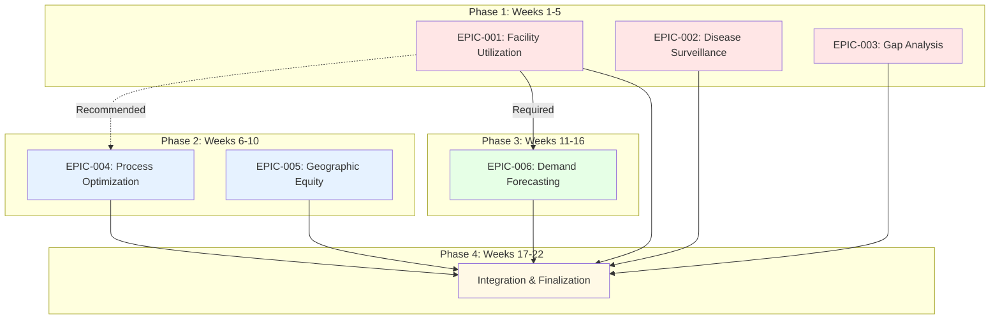

# Project Execution Plan: MOH Healthcare Data Analysis

**Purpose**: Comprehensive execution roadmap for all epics and user stories with dependencies, sequencing, and resource allocation.

**Last Updated**: 2 February 2026

---

## Executive Summary

This project consists of **6 epics** with **40+ user stories** spanning descriptive, diagnostic, predictive, and prescriptive analytics for Singapore's healthcare system.

**Total Estimated Duration**: 22-28 weeks (5.5-7 months)

**Key Deliverables**:
- 6 interactive dashboards
- 15+ analytical reports
- 10+ predictive models
- Comprehensive policy recommendations

---

## Epic Priority and Sequencing

| Epic ID | Title | Priority | Complexity | Duration | Dependencies | Start After |
|---------|-------|----------|------------|----------|--------------|-------------|
| EPIC-001 | Facility Utilization & Bottleneck Analysis | CRITICAL | MEDIUM | 2-3 weeks | None | Week 1 |
| EPIC-002 | Disease Outbreak Surveillance System | CRITICAL | HIGH | 4-5 weeks | None | Week 1 (parallel) |
| EPIC-003 | Healthcare System Gap Analysis | CRITICAL | MEDIUM | 3-4 weeks | None | Week 1 (parallel) |
| EPIC-004 | Process Optimization & Improvement | HIGH | MEDIUM-HIGH | 3-4 weeks | EPIC-001 (recommended) | Week 4 |
| EPIC-005 | Geographic Access & Health Equity | HIGH | MEDIUM-HIGH | 3-4 weeks | None | Week 8 (parallel) |
| EPIC-006 | Predictive Demand Forecasting | MEDIUM | MEDIUM-HIGH | 4-5 weeks | EPIC-001 (baseline data) | Week 12 |

**Recommended Execution Strategy**:
- **Phase 1 (Weeks 1-5)**: Execute EPIC-001, EPIC-002, EPIC-003 in parallel (critical foundational epics)
- **Phase 2 (Weeks 6-10)**: Execute EPIC-004 and EPIC-005 (build on Phase 1 insights)
- **Phase 3 (Weeks 11-16)**: Execute EPIC-006 (predictive models require baseline data)
- **Phase 4 (Weeks 17-22)**: Integration, dashboard refinement, final reports

---

## Detailed Execution Timeline

### Phase 1: Foundation & Critical Analytics (Weeks 1-5)

#### Workstream A: EPIC-001 (Facility Utilization)

| Week | User Stories | Deliverables | Effort (days) |
|------|--------------|--------------|---------------|
| 1 | e01-s01: Extract & Validate Facility Data | Clean dataset + quality report | 3 |
| 1-2 | e01-s02: Calculate Utilization Rates | Utilization metrics dataset | 3 |
| 2 | e01-s03: Profile Facility Performance | Performance scorecards | 5 |
| 2-3 | e01-s04: Detect & Quantify Bottlenecks | Bottleneck inventory | 5 |
| 3 | e01-s05: Develop Severity Scoring | Severity scores + framework | 3 |
| 3-4 | e01-s06: Root Cause Analysis | RCA reports for top 5 bottlenecks | 5 |
| 4 | e01-s07: Improvement Recommendations | Recommendation briefs | 3 |
| 4-5 | e01-s08: Interactive Dashboard | Dashboard deployed | 5 |

**Total Duration**: 3 weeks (15 working days)

**Key Milestone**: Facility utilization dashboard live by end of Week 5

---

#### Workstream B: EPIC-002 (Disease Surveillance) - PARALLEL

| Week | User Stories | Deliverables | Effort (days) |
|------|--------------|--------------|---------------|
| 1-2 | e02-s01: Extract Disease Data | Unified disease dataset | 4 |
| 2 | e02-s02: Establish Baselines | Baseline thresholds | 4 |
| 2-3 | e02-s03: Anomaly Detection Algorithms | Anomaly detection models | 5 |
| 3-4 | e02-s04: Spatial Clustering | Geographic cluster maps | 5 |
| 4 | e02-s05: Forecasting Models | Epidemic forecasting models | 5 |
| 4-5 | e02-s06: Risk Scoring System | Risk scores + alerts | 3 |
| 5 | e02-s07: Surveillance Dashboard | Dashboard deployed | 5 |

**Total Duration**: 5 weeks (25 working days)

**Key Milestone**: Disease surveillance dashboard with real-time alerts by end of Week 5

---

#### Workstream C: EPIC-003 (Gap Analysis) - PARALLEL

| Week | User Stories | Deliverables | Effort (days) |
|------|--------------|--------------|---------------|
| 1-2 | e03-s01: Inventory System Components | System component catalog | 3 |
| 2 | e03-s02: Benchmark International Standards | Benchmark comparison report | 3 |
| 2-3 | e03-s03: Identify Service Gaps | Service gap analysis | 3 |
| 3 | e03-s04: Resource Allocation Gaps | Resource gap analysis | 3 |
| 3-4 | e03-s05: Policy & Governance Gaps | Policy gap analysis | 3 |
| 4 | e03-s06: Prioritization Framework | Priority ranking framework | 3 |
| 4-5 | e03-s07: Cost-Benefit Analysis | CBA for top interventions | 4 |
| 5 | e03-s08: Policy Recommendations | Policy recommendation briefs | 3 |
| 5 | e03-s09: Policy Dashboard | Dashboard deployed | 3 |

**Total Duration**: 4 weeks (20 working days)

**Key Milestone**: Policy recommendations report delivered to MOH stakeholders by end of Week 5

---

### Phase 2: Process Optimization & Equity (Weeks 6-10)

#### Workstream D: EPIC-004 (Process Optimization)

**Dependency**: Recommended to complete EPIC-001 first (utilization context)

| Week | User Stories | Deliverables | Effort (days) |
|------|--------------|--------------|---------------|
| 6 | e04-s01: Extract Process Data | Process data cleaned | 3 |
| 6-7 | e04-s02: Patient Journey Mapping | Journey maps + friction points | 4 |
| 7 | e04-s03: Wait Time Analysis | Wait time analysis report | 4 |
| 7-8 | e04-s04: Identify Improvements (15+) | Improvement opportunity briefs | 5 |
| 8 | e04-s05: Best Practice Discovery | Best practice playbooks | 3 |
| 8-9 | e04-s06: ROI Quantification | ROI analysis for opportunities | 4 |
| 9 | e04-s07: Implementation Roadmaps | Roadmaps with effort estimates | 3 |
| 9-10 | e04-s08: Process Optimization Dashboard | Dashboard deployed | 4 |

**Total Duration**: 4 weeks (20 working days)

**Key Milestone**: Process improvement dashboard + playbooks by end of Week 10

---

#### Workstream E: EPIC-005 (Geographic Equity) - PARALLEL

| Week | User Stories | Deliverables | Effort (days) |
|------|--------------|--------------|---------------|
| 6-7 | e05-s01: Extract Geographic Data | Geographic + facility data | 3 |
| 7 | e05-s02: Calculate Access Metrics | Travel distance/time metrics | 4 |
| 7-8 | e05-s03: Identify Underserved Areas | Healthcare desert map | 4 |
| 8 | e05-s04: Quantify Populations At-Risk | Population profiles | 3 |
| 8-9 | e05-s05: Health Equity Metrics | Equity scorecard | 4 |
| 9 | e05-s06: Intervention Recommendations | Facility placement recommendations | 3 |
| 9-10 | e05-s07: Geographic Dashboard | Interactive map dashboard | 4 |

**Total Duration**: 4 weeks (20 working days)

**Key Milestone**: Geographic access dashboard + equity scorecard by end of Week 10

---

### Phase 3: Predictive Analytics (Weeks 11-16)

#### Workstream F: EPIC-006 (Demand Forecasting)

**Dependency**: Requires EPIC-001 completion (baseline utilization data)

| Week | User Stories | Deliverables | Effort (days) |
|------|--------------|--------------|---------------|
| 11-12 | e06-s01: Extract Historical Demand Data | Historical demand dataset | 3 |
| 12 | e06-s02: Feature Engineering for Forecasting | Feature set for models | 4 |
| 12-13 | e06-s03: Build Forecasting Models | Trained ARIMA, Prophet, ML models | 5 |
| 13-14 | e06-s04: Demographic Impact Modeling | Demographic shift analysis | 5 |
| 14 | e06-s05: Capacity Gap Analysis | Future capacity gap report | 4 |
| 14-15 | e06-s06: Resource Needs Projection | Resource requirements forecast | 4 |
| 15-16 | e06-s07: Business Case Development | Business cases for expansions | 4 |
| 16 | e06-s08: Forecasting Dashboard | Dashboard with predictions | 5 |

**Total Duration**: 5 weeks (25 working days)

**Key Milestone**: Demand forecasting models + capacity planning dashboard by end of Week 16

---

### Phase 4: Integration & Finalization (Weeks 17-22)

| Week | Activities | Deliverables |
|------|-----------|--------------|
| 17 | Dashboard integration and cross-linking | Unified navigation across dashboards |
| 18 | Executive summary reports for all epics | 6 executive PDF reports |
| 19 | Policy brief compilation | Comprehensive policy recommendation document |
| 20 | Stakeholder review and feedback incorporation | Revised dashboards and reports |
| 21 | User training and documentation | User guides, training materials |
| 22 | Final handoff and deployment | Production deployment complete |

---

## Dependencies Graph

---

## Resource Allocation

### Team Structure (Recommended)

| Role | Quantity | Allocation | Responsibilities |
|------|----------|------------|------------------|
| Lead Data Analyst | 1 | 100% | Project oversight, technical lead, stakeholder management |
| Data Analyst | 2 | 100% | Data extraction, transformation, analysis |
| Data Scientist | 1 | 50% | Predictive modeling, ML algorithms (EPIC-002, EPIC-006) |
| Visualization Specialist | 1 | 75% | Dashboard development (Plotly Dash) |
| Healthcare Domain Expert | 1 | 25% | Requirements clarification, validation |
| Project Manager | 1 | 50% | Timeline management, coordination |

**Total FTE**: ~4.5 full-time equivalents

---

### Technology Stack

| Component | Technology | Purpose |
|-----------|-----------|---------|
| Data Extraction | Python + Kaggle Hub API | Access Kaggle dataset |
| Data Processing | Pandas, NumPy | ETL and transformations |
| Statistical Analysis | SciPy, Statsmodels | Hypothesis testing, time series |
| Machine Learning | scikit-learn, Prophet | Predictive models |
| Visualization | Plotly, Seaborn | Charts and graphs |
| Dashboards | Plotly Dash | Interactive dashboards |
| Database (optional) | SQLite or PostgreSQL | Data storage |
| Notebooks | Jupyter | Analysis documentation |
| Version Control | Git + GitHub | Code management |
| Documentation | Markdown, Sphinx | Technical docs |

---

## Critical Path Analysis

**Critical Path**: EPIC-001 → EPIC-004 → EPIC-006 → Integration (14 weeks minimum)

**Parallel Paths**:
- EPIC-002 (5 weeks) - can run parallel to EPIC-001
- EPIC-003 (4 weeks) - can run parallel to EPIC-001
- EPIC-005 (4 weeks) - can run parallel to EPIC-004

**Optimization Opportunities**:
- Run Phase 1 epics in parallel (saves 6 weeks vs sequential)
- Run Phase 2 epics in parallel (saves 4 weeks vs sequential)
- Shared components reduce development time across epics

**Fastest Completion**: 18 weeks with full parallelization
**Most Realistic**: 22 weeks with resource constraints

---

## Risk Management

### High-Priority Risks

| Risk | Impact | Probability | Mitigation Strategy |
|------|--------|-------------|---------------------|
| Kaggle API outage | High | Low | Cache dataset locally after first download |
| Data quality issues | High | Medium | Robust validation framework (shared component) |
| Scope creep | Medium | High | Strict adherence to user story acceptance criteria |
| Resource unavailability | High | Medium | Cross-training, documentation |
| Stakeholder requirement changes | Medium | Medium | Agile sprints, regular demos |
| Technical debt accumulation | Medium | High | Code reviews, refactoring sprints |
| Dashboard performance issues | Medium | Low | Optimize queries, use caching |

---

## Quality Gates

### Epic Completion Criteria

All epics must pass the following gates:

1. **Data Quality**: >95% completeness for critical fields
2. **Code Quality**: Unit tests with >80% coverage
3. **Documentation**: README, API docs, user guides complete
4. **Peer Review**: Code review by at least one other analyst
5. **Stakeholder Sign-off**: Demo accepted by business stakeholders
6. **Deployment**: Production deployment successful

---

## Communication Plan

### Stakeholder Updates

| Frequency | Audience | Format | Content |
|-----------|----------|--------|---------|
| Weekly | Project team | Stand-up meeting | Progress, blockers, next steps |
| Bi-weekly | Management | Status report | Milestones, risks, decisions needed |
| Monthly | MOH Leadership | Executive dashboard | Key insights, recommendations |
| Ad-hoc | Domain experts | Review sessions | Validation of analysis approach |

### Deliverable Review Schedule

| Phase | Week | Review Type | Attendees |
|-------|------|-------------|-----------|
| Phase 1 End | Week 5 | Epic demos (001, 002, 003) | All stakeholders |
| Phase 2 End | Week 10 | Epic demos (004, 005) | All stakeholders |
| Phase 3 End | Week 16 | Epic demo (006) | All stakeholders |
| Phase 4 End | Week 22 | Final handoff | All stakeholders + executives |

---

## Success Metrics

### Project-Level KPIs

| Metric | Target | Measurement Method |
|--------|--------|-------------------|
| On-time delivery | >90% of milestones | Milestone completion tracking |
| Budget adherence | ±10% of estimate | Effort tracking vs estimate |
| Stakeholder satisfaction | >4.0/5.0 | Survey after each phase |
| Data quality score | >95% | Automated validation reports |
| Dashboard uptime | >99% | Monitoring logs |
| User adoption | >80% of target users | Usage analytics |

### Epic-Specific Success Criteria

Refer to individual epic files for detailed success criteria.

---

## Handoff Plan

### Knowledge Transfer

1. **Code Repository**: All code in GitHub with README
2. **Documentation**: Comprehensive documentation in `/docs`
3. **Training Sessions**: 
   - Dashboard user training (2 hours)
   - Analyst knowledge transfer (4 hours)
   - Admin/maintenance training (2 hours)
4. **Support Period**: 4 weeks post-handoff for questions

### Production Deployment Checklist

- [ ] All dashboards deployed to production environment
- [ ] Database connections configured
- [ ] Monitoring and alerting set up
- [ ] User accounts and permissions configured
- [ ] Backup and recovery procedures documented
- [ ] Incident response plan in place
- [ ] User training completed
- [ ] Documentation published
- [ ] Handoff meeting conducted
- [ ] Support contact established

---

## Appendix: Detailed User Story Breakdown

### EPIC-001 User Stories

| Story ID | Title | Depends On | Effort | Priority |
|----------|-------|------------|--------|----------|
| e01-s01 | Extract & Validate Facility Data | None | 3 days | HIGH |
| e01-s02 | Calculate Utilization Rates | e01-s01 | 3 days | HIGH |
| e01-s03 | Profile Facility Performance | e01-s02 | 5 days | HIGH |
| e01-s04 | Detect & Quantify Bottlenecks | e01-s03 | 5 days | CRITICAL |
| e01-s05 | Develop Severity Scoring | e01-s04 | 3 days | MEDIUM |
| e01-s06 | Root Cause Analysis | e01-s05 | 5 days | HIGH |
| e01-s07 | Improvement Recommendations | e01-s06 | 3 days | HIGH |
| e01-s08 | Interactive Dashboard | e01-s07 | 5 days | CRITICAL |

### EPIC-002 User Stories

| Story ID | Title | Depends On | Effort | Priority |
|----------|-------|------------|--------|----------|
| e02-s01 | Extract Disease Data | None | 4 days | CRITICAL |
| e02-s02 | Establish Baselines | e02-s01 | 4 days | CRITICAL |
| e02-s03 | Anomaly Detection | e02-s02 | 5 days | CRITICAL |
| e02-s04 | Spatial Clustering | e02-s03 | 5 days | HIGH |
| e02-s05 | Forecasting Models | e02-s02 | 5 days | HIGH |
| e02-s06 | Risk Scoring System | e02-s03, e02-s04, e02-s05 | 3 days | MEDIUM |
| e02-s07 | Surveillance Dashboard | e02-s06 | 5 days | CRITICAL |

_[Similar breakdowns for EPIC-003 through EPIC-006 available in respective epic flow documents]_

---

**Document Control**:
- **Version**: 1.0
- **Last Updated**: 2 February 2026
- **Next Review**: End of Phase 1 (Week 5)
- **Owner**: Lead Data Analyst
