# User Story: 1 - Extract and Profile All Infectious Disease Data

**As a** public health data analyst,
**I want** to extract and comprehensively profile all 45 infectious diseases from the weekly surveillance dataset (2012-2020),
**so that** I can establish a complete inventory of disease burden metrics and identify data quality issues before prioritization analysis.

## 1. 🎯 Acceptance Criteria

1. **Complete Disease Inventory**
   - All 45 diseases extracted from `weekly-infectious-disease-bulletin-cases.csv`
   - Disease names standardized (resolve variants like "HFMD" vs. "Hand, Foot Mouth Disease")
   - Total case counts calculated for each disease (2012-2020)
   - Diseases ranked by total case volume

2. **Comprehensive Data Profiling**
   - Summary statistics for each disease (mean, median, SD, min, max weekly cases)
   - Temporal coverage validated (weeks with zero vs. missing data)
   - Data completeness report (100% expected based on MOH data quality standards)
   - Disease distribution analyzed (high-burden vs. rare diseases)

3. **Data Quality Assessment**
   - Outliers identified using statistical methods (IQR, Z-score)
   - Temporal consistency verified (no unexpected gaps or duplicates)
   - Zero-count weeks vs. missing data distinguished
   - Data quality issues documented for stakeholder review

4. **Disease Categorization**
   - Diseases grouped by transmission mode (vector-borne, foodborne, vaccine-preventable, etc.)
   - High-burden diseases (>1,000 cases) flagged
   - Rare diseases (<100 cases) identified
   - Disease categories aligned with domain knowledge

## 2. 🔒 Technical Constraints

- **Data Processing**: Polars for efficient data manipulation
- **Platform**: Databricks (HEALIX) for collaborative analysis
- **Output**: Comprehensive data profiling report as Databricks notebook
- **Reproducibility**: Code should work for future dataset updates

## 3. 📚 Domain Knowledge References

- [Infectious Disease Bulletin Data Dictionary](../../../data_dictionary/infectious_disease_bulletin.md) - Complete disease list, case count interpretation
- [Infectious Disease Epidemiology Terminology](../../../domain_knowledge/infectious-disease-epidemiology-terminology-glossary.md) - Disease categories, transmission modes
- [Disease Burden Assessment Methodology](../../../domain_knowledge/disease-burden-assessment-methodology.md) - Burden metrics, disease classification

**Key Considerations**:
- **Disease naming**: Some diseases have multiple names in dataset (HFMD variants)
- **Zero vs. missing**: Zero cases are valid (disease not present that week); missing data is data quality issue
- **Rare diseases**: Some diseases have <10 total cases over 9 years (e.g., Ebola, Plague) - still tracked for surveillance

## 4. 📦 Dependencies

**External Packages**:
- `polars` - Fast DataFrame operations
- `kagglehub` - Dataset access
- `matplotlib` / `seaborn` - Visualization
- `numpy` - Statistical calculations

**Internal Dependencies**:
- Kaggle API configured for dataset download
- Databricks environment with required packages

## 5. ✅ Implementation Tasks

### Data Extraction
- ⬜ Download `weekly-infectious-disease-bulletin-cases.csv` via kagglehub
- ⬜ Load data into Polars DataFrame
- ⬜ Verify record count (16,066 expected)
- ⬜ Validate schema (epi_week, disease, no._of_cases)

### Disease Inventory Creation
- ⬜ Extract unique disease list (45 diseases expected)
- ⬜ Standardize disease names (merge HFMD variants)
- ⬜ Calculate total cases per disease (2012-2020)
- ⬜ Rank diseases by total case count
- ⬜ Create disease inventory table

### Summary Statistics Calculation
- ⬜ Calculate mean, median, SD, min, max weekly cases for each disease
- ⬜ Calculate coefficient of variation (CV = SD/mean) for volatility assessment
- ⬜ Identify peak weekly case count for each disease
- ⬜ Count weeks with zero cases vs. non-zero cases

### Data Quality Validation
- ⬜ Check for missing values (expect 0%)
- ⬜ Verify temporal completeness (all 470 weeks present for each disease)
- ⬜ Identify outliers using IQR method (Q3 + 1.5 × IQR)
- ⬜ Validate case count ranges (≥0, no negative values)
- ⬜ Document any data quality issues found

### Disease Categorization
- ⬜ Categorize diseases by transmission mode using domain knowledge
  - Vector-borne (Dengue, Zika, Chikungunya, Malaria)
  - Foodborne (Salmonellosis, Campylobacter, Cholera)
  - Vaccine-preventable (Measles, Mumps, Rubella, Diphtheria, Pertussis)
  - Respiratory (Influenza types)
  - Other
- ⬜ Flag high-burden diseases (>1,000 total cases)
- ⬜ Flag rare diseases (<100 total cases)
- ⬜ Create disease category summary table

### Visualization and Reporting
- ⬜ Create distribution plot (histogram of total cases across diseases)
- ⬜ Generate bar chart of top 15 diseases by case count
- ⬜ Create heatmap showing weekly cases by disease and time
- ⬜ Visualize disease categories (pie chart or treemap)
- ⬜ Write data profiling report with key findings

### Dataset Preparation
- ⬜ Save cleaned, standardized dataset for subsequent analysis
- ⬜ Export disease inventory as reference table
- ⬜ Document data quality findings and recommendations

## 6. Notes

**Expected Disease Distribution**:
- **Top tier (>10,000 cases)**: HFMD (combined: ~235,000), Dengue (~127,000)
- **Mid tier (1,000-10,000 cases)**: Salmonellosis (~16,000), Mumps (~4,000), Campylobacter variants (~4,000)
- **Low tier (<1,000 cases)**: Most diseases including many rare/exotic diseases

**Data Quality Expectation**: MOH surveillance data should have 100% completeness with no missing values. Any issues found are likely data entry artifacts or reporting changes.

**Disease Name Harmonization**: Critical for accurate burden assessment. "Hand, Foot Mouth Disease" (2012-2016) and "HFMD" (2017-2020) must be merged.

**Rare Disease Handling**: Diseases with <100 cases over 9 years are maintained for surveillance but may be deprioritized for resource allocation. Still important for early warning of emerging threats.

**Categorization Purpose**: Grouping diseases by transmission mode helps with targeted intervention strategies (e.g., vector control for mosquito-borne diseases, food safety for foodborne).

---

## Implementation Plan

### 1. Feature Overview

This implementation will create a comprehensive data profiling pipeline that extracts, validates, and analyzes all 45 infectious diseases from the Weekly Infectious Disease Bulletin dataset (2012-2020). The analysis establishes a complete inventory of disease burden metrics, identifies data quality issues, and categorizes diseases to support subsequent prioritization analysis. The primary user is a public health data analyst who requires clean, validated data with comprehensive quality metrics before conducting disease burden assessments.

### 2. Component Analysis & Reuse Strategy

**Existing Components:**

1. **Data Extraction Infrastructure** - `scripts/analyze_infectious_disease_scope.py`
   - **Status:** Can be partially reused
   - **Justification:** Existing script demonstrates Kaggle dataset access pattern and basic data extraction. However, requires extension for comprehensive profiling and statistical analysis.
   - **Action:** Extract core Kaggle connectivity logic, extend with profiling functions

2. **Data Dictionary Reference** - `docs/data_dictionary/infectious_disease_bulletin.md`
   - **Status:** Reuse as-is
   - **Justification:** Comprehensive data dictionary documenting all 45 diseases, schema, and data quality notes. Essential reference for validation logic.
   - **Action:** Reference for disease name standardization and validation rules

3. **Domain Knowledge Documents** - `docs/domain_knowledge/`
   - **Status:** Reuse as-is
   - **Justification:** Disease categorization taxonomy, epidemiology terminology, and burden assessment methodology documented
   - **Action:** Use for disease categorization and metric definitions

**Gaps Requiring New Components:**

1. **Data Profiling Module** - `src/data_processing/profiling.py`
   - **Reason:** No existing component for comprehensive statistical profiling
   - **Functionality:** Calculate summary statistics, outlier detection, temporal coverage validation

2. **Disease Inventory Module** - `src/data_processing/disease_inventory.py`
   - **Reason:** No existing component for disease name standardization and categorization
   - **Functionality:** Harmonize disease names (HFMD variants), apply disease taxonomy

3. **Data Quality Validation Module** - `src/data_processing/validation.py`
   - **Reason:** No existing systematic data quality checking framework
   - **Functionality:** Missing value checks, temporal completeness, outlier detection

4. **Exploratory Analysis Notebook** - `notebooks/1_exploratory/01_disease_data_profiling.ipynb`
   - **Reason:** No existing notebook for this specific analysis
   - **Functionality:** Interactive data exploration, visualization, profiling report generation

### 3. Affected Files

**CREATE:**
- `[CREATE] notebooks/1_exploratory/01_disease_data_profiling.ipynb` - Main exploratory notebook for comprehensive profiling
- `[CREATE] src/data_processing/profiling.py` - Data profiling functions (statistics, distributions)
- `[CREATE] src/data_processing/disease_inventory.py` - Disease name standardization and categorization
- `[CREATE] src/data_processing/validation.py` - Data quality validation functions
- `[CREATE] tests/unit/test_profiling.py` - Unit tests for profiling module
- `[CREATE] tests/unit/test_disease_inventory.py` - Unit tests for disease inventory module
- `[CREATE] tests/unit/test_validation.py` - Unit tests for validation module
- `[CREATE] data/3_interim/cleaned_disease_data.parquet` - Cleaned, standardized dataset
- `[CREATE] data/4_processed/disease_inventory.csv` - Complete disease inventory with metrics
- `[CREATE] data/4_processed/disease_categories.json` - Disease categorization mappings
- `[CREATE] results/tables/disease_summary_statistics.csv` - Summary statistics by disease
- `[CREATE] results/tables/data_quality_report.csv` - Data quality assessment results
- `[CREATE] results/figures/disease_distribution.png` - Disease case distribution visualization
- `[CREATE] results/figures/top_diseases_bar_chart.png` - Top 15 diseases by case count
- `[CREATE] results/figures/disease_heatmap.png` - Weekly cases heatmap by disease and time
- `[CREATE] results/figures/disease_categories_treemap.png` - Disease categorization visualization

**MODIFY:**
- `[MODIFY] scripts/analyze_infectious_disease_scope.py` - Extend with profiling function calls
- `[MODIFY] requirements.txt` - Add any new package dependencies (if needed)

**NO DELETIONS:** No existing files need to be deleted for this implementation.

### 4. Component Breakdown

#### 4.1 New Component: Data Profiling Module

**Name:** `profiling.py`  
**Location:** `src/data_processing/profiling.py`  
**Primary Responsibility:** Calculate comprehensive statistical profiles for each disease

**Key Functions:**
- `calculate_summary_statistics(df, group_by_column, value_column)` - Mean, median, SD, min, max, CV
- `identify_outliers(df, method='IQR', threshold=1.5)` - IQR and Z-score outlier detection
- `calculate_temporal_coverage(df, date_column, expected_periods)` - Validate completeness
- `analyze_distribution(df, column, bins='auto')` - Distribution analysis and visualization

**Parameters:**
- Input: Polars DataFrame, column specifications, statistical parameters
- Output: Statistical summary tables (Polars DataFrames), outlier flags

**Dependencies:** Polars, NumPy, SciPy (statistical functions)

#### 4.2 New Component: Disease Inventory Module

**Name:** `disease_inventory.py`  
**Location:** `src/data_processing/disease_inventory.py`  
**Primary Responsibility:** Standardize disease names and apply categorization taxonomy

**Key Functions:**
- `standardize_disease_names(df, disease_column)` - Merge HFMD variants, resolve naming inconsistencies
- `categorize_diseases(disease_list, taxonomy_file)` - Apply transmission mode categories
- `calculate_disease_metrics(df, disease_column, case_column)` - Total cases, rankings, tier classification
- `create_disease_inventory(df)` - Generate complete disease reference table

**Parameters:**
- Input: Polars DataFrame, disease taxonomy JSON
- Output: Cleaned DataFrame, disease inventory table, categorization mappings

**Configuration:**
- Disease name mappings: `{"HFMD": "Hand, Foot and Mouth Disease", ...}`
- Disease categories: Vector-borne, Foodborne, Vaccine-preventable, Respiratory, Other
- Burden tiers: High (>1,000 cases), Mid (100-1,000), Rare (<100)

**Dependencies:** Polars, JSON (taxonomy loading)

#### 4.3 New Component: Data Quality Validation Module

**Name:** `validation.py`  
**Location:** `src/data_processing/validation.py`  
**Primary Responsibility:** Systematic data quality checks and validation

**Key Functions:**
- `check_missing_values(df)` - Report missing value percentages by column
- `validate_temporal_completeness(df, date_column, expected_range)` - Check for gaps in time series
- `validate_schema(df, expected_schema)` - Verify column names, data types
- `validate_value_ranges(df, column, min_val, max_val)` - Check for invalid values
- `generate_quality_report(df, validation_results)` - Compile comprehensive DQ report

**Parameters:**
- Input: Polars DataFrame, validation rules (schema, ranges, constraints)
- Output: Validation results DataFrame, data quality score, issue log

**Validation Rules:**
- `epi_week`: Format `YYYY-Wxx`, year 2012-2020, week 01-53
- `disease`: 45 unique values, no nulls, match expected disease list
- `no._of_cases`: Integer ≥ 0, no nulls

**Dependencies:** Polars, regular expressions (format validation)

#### 4.4 New Component: Exploratory Analysis Notebook

**Name:** `01_disease_data_profiling.ipynb`  
**Location:** `notebooks/1_exploratory/01_disease_data_profiling.ipynb`  
**Primary Responsibility:** Interactive data exploration, visualization, and profiling report generation

**Structure:**
1. Environment setup and data loading
2. Initial data inspection (schema, sample records)
3. Disease inventory creation and standardization
4. Summary statistics calculation (per disease)
5. Data quality validation
6. Disease categorization
7. Exploratory visualizations
8. Key findings summary and export

**Outputs:**
- Disease inventory table (CSV)
- Summary statistics table (CSV)
- Data quality report (CSV)
- Visualizations (PNG): distribution, bar charts, heatmaps, treemaps

**Dependencies:** Polars, Matplotlib, Seaborn, KaggleHub, NumPy

#### 4.5 Modified Component: Data Scope Analysis Script

**Name:** `analyze_infectious_disease_scope.py`  
**Location:** `scripts/analyze_infectious_disease_scope.py`  
**Required Changes:**
- Add import for new profiling module: `from src.data_processing import profiling, disease_inventory, validation`
- Add function calls to generate comprehensive profiling outputs
- Extend JSON output to include summary statistics and data quality metrics
- Add command-line arguments for output paths

**Rationale:** Extend existing script to automate profiling pipeline for reproducibility

### 5. Data Pipeline Architecture

#### Data Schema

**Source Data Schema:** `weekly-infectious-disease-bulletin-cases.csv`
```python
{
    "epi_week": "String",       # Format: YYYY-Wxx
    "disease": "String",         # 45 unique disease names
    "no._of_cases": "Int64"     # Case count ≥ 0
}
```

**Processed Data Schema:** `cleaned_disease_data.parquet`
```python
{
    "epi_week": "String",            # Original epi-week
    "year": "Int32",                  # Extracted year (2012-2020)
    "week": "Int32",                  # Extracted week number (1-53)
    "disease": "String",              # Standardized disease name
    "disease_category": "String",     # Transmission mode category
    "no_of_cases": "Int64",          # Renamed (removed special chars)
    "is_outlier": "Boolean",         # Outlier flag (IQR method)
    "date": "Date"                    # Computed date for temporal analysis
}
```

**Disease Inventory Schema:** `disease_inventory.csv`
```python
{
    "disease": "String",              # Standardized name
    "total_cases": "Int64",           # Total cases 2012-2020
    "rank": "Int32",                  # Rank by case count (1=highest)
    "mean_weekly_cases": "Float64",   # Mean weekly case count
    "median_weekly_cases": "Float64", # Median weekly case count
    "std_weekly_cases": "Float64",    # Standard deviation
    "cv": "Float64",                  # Coefficient of variation
    "min_cases": "Int64",             # Minimum weekly cases
    "max_cases": "Int64",             # Maximum weekly cases
    "weeks_with_zero_cases": "Int32", # Count of zero-case weeks
    "disease_category": "String",     # Transmission mode
    "burden_tier": "String"          # High/Mid/Rare classification
}
```

#### Data Pipeline Strategy

**Data Extraction:**
- **Method:** Kaggle Hub API (`kagglehub.dataset_download()`)
- **Source Dataset ID:** `subhamjain/health-dataset-complete-singapore`
- **Target File:** `weekly-infectious-disease-bulletin-cases/weekly-infectious-disease-bulletin-cases.csv`
- **Authentication:** Kaggle API key (`~/.kaggle/kaggle.json`)
- **Storage:** Cache downloaded dataset locally, load into Polars DataFrame
- **Reference:** Use `/write-query` if extracting from database in future iterations

**Data Transformation Steps:**

1. **Initial Loading & Schema Validation**
   - Load CSV into Polars DataFrame using `pl.read_csv()`
   - Validate schema: 3 columns (epi_week, disease, no._of_cases)
   - Verify record count: 16,066 expected
   - Check data types and rename columns (remove special characters)

2. **Data Quality Assessment** (Use `/explore-data` command)
   - Follow profiling methodology: `.github/prompts/data-plugin/skills/data-exploration/SKILL.md`
   - Check for missing values (expect 0%)
   - Validate epi_week format using regex: `^\d{4}-W\d{2}$`
   - Verify non-negative case counts
   - Identify duplicate records (none expected)
   - Log data quality metrics

3. **Disease Name Standardization**
   - Create disease name mapping: `{"HFMD": "Hand, Foot and Mouth Disease", ...}`
   - Apply mapping to merge disease variants
   - Verify resulting unique disease count (43 after merging variants)
   - Log name changes for audit trail

4. **Feature Engineering**
   - Extract year from epi_week: `df['year'] = df['epi_week'].str.slice(0, 4).cast(pl.Int32)`
   - Extract week number: `df['week'] = df['epi_week'].str.slice(6, 8).cast(pl.Int32)`
   - Compute approximate date: Convert epi_week to datetime for temporal analysis
   - Add disease category column (transmission mode)

5. **Statistical Profiling** (Use `/analyze` command for quick stats)
   - Group by disease, calculate summary statistics:
     - Mean, median, standard deviation, min, max weekly cases
     - Coefficient of variation (CV = SD / mean)
     - Total case count, peak week, weeks with zero cases
   - Reference methodology: `.github/prompts/data-plugin/skills/statistical-analysis/SKILL.md`

6. **Outlier Detection**
   - Apply IQR method per disease: `Q3 + 1.5 × IQR`
   - Flag outlier weeks (unusually high case counts)
   - Alternative: Z-score method (|z| > 3) for sensitivity check
   - Add `is_outlier` boolean column
   - Document outlier counts by disease

7. **Disease Categorization**
   - Load disease taxonomy from domain knowledge documents
   - Categories:
     - **Vector-borne:** Dengue, Zika, Chikungunya, Malaria, Japanese Encephalitis
     - **Foodborne:** Salmonellosis, Campylobacter variants, Cholera, Typhoid, Paratyphoid
     - **Vaccine-preventable:** Measles, Mumps, Rubella, Diphtheria, Pertussis, Poliomyelitis, Pneumococcal
     - **Respiratory:** Influenza types, Meningococcal
     - **Other:** HFMD, Hepatitis variants, Leptospirosis, etc.
   - Apply tier classification:
     - **High burden:** >1,000 total cases
     - **Mid burden:** 100-1,000 total cases
     - **Rare:** <100 total cases

8. **Temporal Coverage Validation**
   - Verify all 470 weeks present for each disease (2012-W01 to 2020-W53)
   - Check for unexpected gaps or duplicates
   - Distinguish zero cases (valid) vs. missing data (data quality issue)
   - Create temporal completeness report

**Data Consumption Layer:**
- **Primary:** Databricks (HEALIX) notebooks for collaborative analysis
- **Secondary:** Exported CSV/Parquet files for Power BI dashboards or further processing
- **Tertiary:** JSON outputs for programmatic access by downstream scripts

**Orchestration & Scheduling:**
- **Execution Order:** Sequential pipeline (extraction → cleaning → profiling → export)
- **Refresh Strategy:** Full refresh (historical dataset, no incremental updates)
- **Error Handling:** 
  - Kaggle API failures: Retry with exponential backoff (3 attempts)
  - Data validation failures: Log issues, raise exception with details
  - Missing file errors: Check Kaggle dataset structure, provide diagnostic info
- **Monitoring:** 
  - Log execution time for each pipeline stage
  - Track record counts at each transformation step
  - Log data quality metrics (missing %, outlier %, validation pass rate)
- **Data Lineage:** 
  - Raw data: `data/1_raw/kaggle/` (cached from Kaggle)
  - Interim data: `data/3_interim/cleaned_disease_data.parquet`
  - Processed outputs: `data/4_processed/` (disease inventory, categories)
  - Results: `results/tables/` and `results/figures/`
- **Versioning:** 
  - Data version: Include extraction timestamp in metadata
  - Code version: Git commit hash in pipeline execution log
  - Model artifacts: N/A (no models in this phase)

### 6. API Endpoints & Data Contracts

**Not Applicable:** This user story focuses on data extraction and profiling without creating API endpoints. Future iterations may expose disease inventory as REST API for programmatic access.

### 7. Styling & Visualization (for UI/Dashboard Features)

#### Data Plugin Accelerators

**For Python Visualizations:**
- Use `/create-viz` command to generate publication-quality charts
- Reference: `.github/prompts/data-plugin/skills/data-visualization/SKILL.md` for chart selection best practices

**For Interactive Dashboards:**
- Use `/build-dashboard` command for creating interactive HTML dashboards (future iteration)
- Reference: `.github/prompts/data-plugin/skills/interactive-dashboard-builder/SKILL.md`

#### Visualization Specifications

**1. Disease Distribution Histogram**
- **Chart Type:** Histogram with log scale
- **X-axis:** Total cases (log scale)
- **Y-axis:** Number of diseases (frequency)
- **Colors:** Primary blue (#718EBF) for bars
- **Title:** "Distribution of Disease Burden (2012-2020)"
- **Purpose:** Show skewed distribution (few high-burden diseases, many rare diseases)

**2. Top 15 Diseases Bar Chart**
- **Chart Type:** Horizontal bar chart
- **X-axis:** Total case count
- **Y-axis:** Disease names (sorted descending)
- **Colors:** 
  - High burden (>10,000 cases): #FF6B6B (red)
  - Mid burden (1,000-10,000): #FFA500 (orange)
  - Low burden (<1,000): #4ECDC4 (teal)
- **Title:** "Top 15 Infectious Diseases by Total Case Count (2012-2020)"
- **Annotations:** Display case count at end of each bar

**3. Disease Category Treemap**
- **Chart Type:** Treemap
- **Grouping:** Disease category (transmission mode)
- **Size:** Total case count
- **Colors:** Distinct color per category
  - Vector-borne: #E63946
  - Foodborne: #F77F00
  - Vaccine-preventable: #06A77D
  - Respiratory: #118AB2
  - Other: #073B4C
- **Labels:** Category name + total cases
- **Title:** "Disease Burden by Transmission Category"

**4. Weekly Cases Heatmap**
- **Chart Type:** Heatmap
- **X-axis:** Epidemiological week (470 weeks)
- **Y-axis:** Disease names (top 20 by case count only, for readability)
- **Color Scale:** Sequential colormap (Viridis or YlOrRd)
  - Light: Low/zero cases
  - Dark: High case counts
- **Title:** "Weekly Case Counts Heatmap: Top 20 Diseases (2012-2020)"
- **Note:** Full 45-disease heatmap too dense; filter to top diseases

#### Visual Implementation Checklist

- [ ] Set Matplotlib style: `plt.style.use('seaborn-v0_8-darkgrid')`
- [ ] Configure figure sizes: 12x8 inches for primary charts, 16x10 for heatmap
- [ ] Apply consistent color palette across all visualizations
- [ ] Set font sizes: Title 16pt, axis labels 12pt, tick labels 10pt
- [ ] Add gridlines for readability (light gray, alpha 0.3)
- [ ] Save figures as high-resolution PNG (300 DPI) to `results/figures/`
- [ ] Include axis labels with units (e.g., "Total Cases", "Number of Diseases")
- [ ] Add data source citation: "Source: MOH Singapore, Weekly Infectious Disease Bulletin (2012-2020)"
- [ ] Verify color accessibility (use colorblind-friendly palettes)
- [ ] Test visualizations in notebook output and exported PNG files

**Color Palette Definition:**
```python
COLORS = {
    'primary_blue': '#718EBF',
    'text_dark': '#232323',
    'high_burden': '#FF6B6B',
    'mid_burden': '#FFA500',
    'low_burden': '#4ECDC4',
    'vector_borne': '#E63946',
    'foodborne': '#F77F00',
    'vaccine_preventable': '#06A77D',
    'respiratory': '#118AB2',
    'other': '#073B4C'
}
```

### 8. Testing Strategy

#### Analysis Quality Assurance

**Pre-Delivery QA:**
- Use `/validate` command to QA analysis before stakeholder delivery
- Reference: `.github/prompts/data-plugin/skills/data-validation/SKILL.md` for comprehensive checklist
- Key validation points:
  - Statistical methodology correctness (summary stats, outlier detection)
  - Data quality checks completeness (no missing validations)
  - Visualization accuracy (correct data mappings, labels)
  - Documentation clarity (findings reproducible from documented methods)

#### Unit Tests

**File:** `tests/unit/test_profiling.py`

**Test Functions:**
- `test_calculate_summary_statistics()` - Verify correct mean, median, SD, CV calculations
- `test_identify_outliers_iqr()` - Test IQR outlier detection with known edge cases
- `test_identify_outliers_zscore()` - Test Z-score method with synthetic data
- `test_calculate_temporal_coverage()` - Verify completeness calculation with missing periods
- `test_analyze_distribution()` - Check histogram binning and frequency counts

**Test Data:** Synthetic Polars DataFrames with known statistical properties

---

**File:** `tests/unit/test_disease_inventory.py`

**Test Functions:**
- `test_standardize_disease_names()` - Verify HFMD variants merged correctly
- `test_categorize_diseases()` - Test taxonomy application with sample disease list
- `test_calculate_disease_metrics()` - Verify total cases, rankings, tier classification
- `test_create_disease_inventory()` - End-to-end inventory generation test

**Test Data:** Sample disease dataset with known name variants and expected categories

---

**File:** `tests/unit/test_validation.py`

**Test Functions:**
- `test_check_missing_values()` - Detect missing values in columns
- `test_validate_temporal_completeness()` - Identify gaps in time series
- `test_validate_schema()` - Verify column names and data types
- `test_validate_value_ranges()` - Check for out-of-range values (negative cases)
- `test_validate_epi_week_format()` - Regex validation for epi_week format
- `test_generate_quality_report()` - Compile validation results into report

**Test Data:** DataFrames with intentional data quality issues (missing values, invalid formats, outliers)

#### Data Quality Tests

**Validation Checks (Implemented in `validation.py`):**

1. **Schema Validation:**
   - Assert 3 columns present: epi_week, disease, no._of_cases
   - Assert data types: String, String, Int64
   - Assert no unexpected columns

2. **Completeness Validation:**
   - Assert 0% missing values across all columns (100% complete expected)
   - Assert 16,066 total records
   - Assert all 45 diseases present (or 43 after standardization)
   - Assert all 470 weeks covered for each disease

3. **Value Range Validation:**
   - Assert all case counts ≥ 0 (non-negative)
   - Assert epi_week year range: 2012-2020
   - Assert epi_week week range: 01-53
   - Assert disease names match expected list

4. **Format Validation:**
   - Assert epi_week matches regex: `^\d{4}-W\d{2}$`
   - Assert disease names are non-empty strings

5. **Referential Integrity:**
   - Verify all diseases in dataset match disease dictionary
   - Cross-check total case counts against known values (Dengue: 126,642)

6. **Transformation Correctness:**
   - After standardization, verify HFMD variants merged (count reduced)
   - After categorization, verify all diseases assigned to a category
   - After outlier detection, verify flag distribution reasonable (<5% outliers)

#### Data Profiling Tests

**Statistical Validation:**
- Assert summary statistics within expected ranges (e.g., Dengue mean ~269 cases/week)
- Verify coefficient of variation calculations (CV = SD/mean)
- Check outlier detection identifies known peak outbreak weeks (Dengue 2013-2014)
- Validate distribution analysis (high-burden diseases show right skew)

#### Integration Tests

**Not Required for Phase 1:** This user story focuses on exploratory analysis without complex pipeline orchestration. Integration tests will be added in future iterations when building automated ETL pipelines.

### 9. Implementation Steps

#### Phase 1: Data Extraction

**1. Environment Setup:**
- [ ] Verify Python environment: Python 3.9+ required
- [ ] **SECURITY: Verify Kaggle API configuration**:
  - ✅ Check `~/.kaggle/kaggle.json` exists with valid credentials
  - ✅ Verify file permissions: `chmod 600 ~/.kaggle/kaggle.json`
  - ⚠️ **NEVER** hardcode credentials in code:
    ```python
    # ❌ WRONG - Never do this!
    # KAGGLE_KEY = "abc123xyz"  # Hardcoded credential
    
    # ✅ CORRECT - Use environment or config file
    import kagglehub  # Uses ~/.kaggle/kaggle.json automatically
    ```
  - ✅ Add to `.gitignore`: `**/.kaggle/`, `*.key`, `*.secret`, `.env`
- [ ] Test Kaggle connectivity: `kagglehub.dataset_download("subhamjain/health-dataset-complete-singapore")`
- [ ] Create project directory structure:
  ```bash
  mkdir -p data/{1_raw/kaggle,3_interim,4_processed}
  mkdir -p results/{tables,figures}
  mkdir -p notebooks/1_exploratory
  mkdir -p src/data_processing
  mkdir -p tests/unit
  ```
- [ ] Install required dependencies from `requirements.txt`:
  ```bash
  pip install polars kagglehub matplotlib seaborn numpy scipy pytest
  ```
- [ ] Set up structured logging configuration: Create `src/utils/logger.py`:
  ```python
  import logging
  import sys
  from typing import Optional
  
  def setup_logger(
      name: str,
      level: int = logging.INFO,
      log_file: Optional[str] = None
  ) -> logging.Logger:
      """Configure structured logging with consistent format.
      
      Args:
          name: Logger name (typically __name__)
          level: Logging level (DEBUG, INFO, WARNING, ERROR)
          log_file: Optional file path for log output
      
      Returns:
          Configured logger instance
      """
      logger = logging.getLogger(name)
      logger.setLevel(level)
      
      # Console handler with formatting
      console_handler = logging.StreamHandler(sys.stdout)
      formatter = logging.Formatter(
          '%(asctime)s - %(name)s - %(levelname)s - %(message)s',
          datefmt='%Y-%m-%d %H:%M:%S'
      )
      console_handler.setFormatter(formatter)
      logger.addHandler(console_handler)
      
      # Optional file handler
      if log_file:
          file_handler = logging.FileHandler(log_file)
          file_handler.setFormatter(formatter)
          logger.addHandler(file_handler)
      
      return logger
  ```
**2. Data Extraction:**

- [ ] Create data extraction script: `scripts/extract_disease_data.py`
- [ ] Implement Kaggle dataset download with comprehensive error handling:
  ```python
  from pathlib import Path
  from typing import Optional
  import time
  import kagglehub
  import polars as pl
  from src.utils.logger import setup_logger
  from src.config import DATASET_ID, DATA_FILE
  
  logger = setup_logger(__name__)
  
  def download_kaggle_dataset(
      dataset_id: str,
      max_retries: int = 3,
      retry_delay: int = 5
  ) -> Path:
      """Download and cache Kaggle dataset with retry logic.
      
      Args:
          dataset_id: Kaggle dataset identifier (format: owner/dataset-name)
          max_retries: Maximum number of retry attempts on failure
          retry_delay: Seconds to wait between retries
      
      Returns:
          Path to cached dataset directory
      
      Raises:
          FileNotFoundError: If Kaggle credentials not configured
          ConnectionError: If download fails after all retries
          ValueError: If dataset_id format is invalid
      
      Example:
          >>> path = download_kaggle_dataset("user/dataset")
          >>> print(path)
          PosixPath('/home/.cache/kagglehub/datasets/user/dataset/...')
      """
      if '/' not in dataset_id:
          raise ValueError(f"Invalid dataset_id format: {dataset_id}. Expected 'owner/dataset-name'")
      
      logger.info(f"Downloading Kaggle dataset: {dataset_id}")
      
      for attempt in range(1, max_retries + 1):
          try:
              dataset_path = kagglehub.dataset_download(dataset_id)
              logger.info(f"Dataset cached at: {dataset_path}")
              return Path(dataset_path)
          except FileNotFoundError as e:
              logger.error("Kaggle credentials not found. Ensure ~/.kaggle/kaggle.json exists.")
              logger.error("Instructions: https://www.kaggle.com/docs/api#authentication")
              raise
          except Exception as e:
              if attempt < max_retries:
                  logger.warning(f"Download attempt {attempt} failed: {e}. Retrying in {retry_delay}s...")
                  time.sleep(retry_delay)
              else:
                  logger.error(f"Failed to download dataset after {max_retries} attempts")
                  raise ConnectionError(f"Kaggle download failed: {e}") from e
  ```
- [ ] Implement CSV loading with validation:
  ```python
  def load_disease_data(
      file_path: Path,
      expected_columns: Optional[list[str]] = None
  ) -> pl.DataFrame:
      """Load disease data into Polars DataFrame with validation.
      
      Args:
          file_path: Path to CSV file
          expected_columns: Optional list of expected column names
      
      Returns:
          Polars DataFrame with loaded data
      
      Raises:
          FileNotFoundError: If file doesn't exist
          ValueError: If columns don't match expected schema
      
      Example:
          >>> df = load_disease_data(
          ...     Path('data.csv'),
          ...     ['epi_week', 'disease', 'no._of_cases']
          ... )
      """
      if not file_path.exists():
          logger.error(f"Data file not found: {file_path}")
          raise FileNotFoundError(f"Missing data file: {file_path}")
      
      try:
          logger.info(f"Loading data from: {file_path}")
          df = pl.read_csv(file_path)
          logger.info(f"Loaded {len(df):,} records with {len(df.columns)} columns")
          
          # Validate schema if expected columns provided
          if expected_columns:
              actual_columns = set(df.columns)
              expected_set = set(expected_columns)
              
              if actual_columns != expected_set:
                  missing = expected_set - actual_columns
                  extra = actual_columns - expected_set
                  error_msg = f"Schema mismatch."
                  if missing:
                      error_msg += f" Missing columns: {missing}."
                  if extra:
                      error_msg += f" Unexpected columns: {extra}."
                  raise ValueError(error_msg)
              
              logger.info("Schema validation: PASSED")
          
          return df
      except pl.exceptions.ComputeError as e:
          logger.error(f"Failed to parse CSV: {e}")
          raise ValueError(f"Invalid CSV format: {e}") from e
  ```
- [ ] Save raw data copy with timestamp and metadata:
  ```python
  import json
  from datetime import datetime
  
  def save_extraction_metadata(
      df: pl.DataFrame,
      output_dir: Path,
      dataset_id: str,
      file_path: str
  ) -> None:
      """Save extraction metadata for audit trail."""
      metadata = {
          "extraction_date": datetime.now().isoformat(),
          "source_dataset": dataset_id,
          "file_path": file_path,
          "records_extracted": len(df),
          "columns": df.columns,
          "schema": {col: str(dtype) for col, dtype in zip(df.columns, df.dtypes)}
      }
      
      metadata_file = output_dir / "extraction_metadata.json"
      with open(metadata_file, 'w') as f:
          json.dump(metadata, f, indent=2)
      
      logger.info(f"Metadata saved to: {metadata_file}")
  ```

**3. Initial Data Validation:**
- [ ] Create validation module: `src/data_processing/validation.py`
- [ ] Implement comprehensive validation functions with type hints:
  ```python
  from typing import Dict, List, Set
  import polars as pl
  from src.utils.logger import setup_logger
  
  logger = setup_logger(__name__)
  
  class ValidationError(Exception):
      """Custom exception for data validation failures."""
      pass
  
  def validate_schema(
      df: pl.DataFrame,
      expected_columns: List[str],
      expected_types: Dict[str, pl.DataType]
  ) -> None:
      """Validate DataFrame schema matches expectations.
      
      Args:
          df: DataFrame to validate
          expected_columns: List of required column names
          expected_types: Dict mapping column names to expected data types
      
      Raises:
          ValidationError: If schema validation fails
      
      Example:
          >>> validate_schema(
          ...     df,
          ...     ['epi_week', 'disease', 'no._of_cases'],
          ...     {'epi_week': pl.Utf8, 'no._of_cases': pl.Int64}
          ... )
      """
      actual_columns = set(df.columns)
      expected_set = set(expected_columns)
      
      # Check column presence
      if actual_columns != expected_set:
          missing = expected_set - actual_columns
          extra = actual_columns - expected_set
          error_parts = []
          if missing:
              error_parts.append(f"Missing columns: {sorted(missing)}")
          if extra:
              error_parts.append(f"Unexpected columns: {sorted(extra)}")
          raise ValidationError(". ".join(error_parts))
      
      # Check data types
      type_errors = []
      for col, expected_dtype in expected_types.items():
          actual_dtype = df[col].dtype
          if actual_dtype != expected_dtype:
              type_errors.append(
                  f"{col}: expected {expected_dtype}, got {actual_dtype}"
              )
      
      if type_errors:
          raise ValidationError(f"Type mismatches: {'; '.join(type_errors)}")
      
      logger.info(f"Schema validation PASSED: {len(expected_columns)} columns, types correct")
  
  def validate_record_count(
      df: pl.DataFrame,
      expected_count: int,
      tolerance: float = 0.0
  ) -> None:
      """Validate DataFrame has expected number of records.
      
      Args:
          df: DataFrame to validate
          expected_count: Expected number of records
          tolerance: Acceptable deviation as fraction (0.0 = exact match)
      
      Raises:
          ValidationError: If record count outside tolerance
      """
      actual_count = len(df)
      lower_bound = int(expected_count * (1 - tolerance))
      upper_bound = int(expected_count * (1 + tolerance))
      
      if not (lower_bound <= actual_count <= upper_bound):
          raise ValidationError(
              f"Record count mismatch: expected {expected_count}, "
              f"got {actual_count} (tolerance: ±{tolerance*100:.1f}%)"
          )
      
      logger.info(f"Record count validation PASSED: {actual_count:,} records")
  
  def validate_no_missing_values(df: pl.DataFrame) -> None:
      """Validate DataFrame has no missing values.
      
      Args:
          df: DataFrame to validate
      
      Raises:
          ValidationError: If any missing values found
      """
      null_counts = df.null_count()
      total_nulls = sum(null_counts.row(0))
      
      if total_nulls > 0:
          cols_with_nulls = [
              f"{col}: {count}" 
              for col, count in zip(df.columns, null_counts.row(0)) 
              if count > 0
          ]
          raise ValidationError(
              f"Found {total_nulls} missing values. " +
              f"Affected columns: {', '.join(cols_with_nulls)}"
          )
      
      logger.info("Missing value validation PASSED: 0 nulls")
  ```
- [ ] Validate extracted data with comprehensive checks:
  ```python
  from src.config import EXPECTED_RECORDS, EXPECTED_DISEASES
  
  # Schema validation
  validate_schema(
      df,
      expected_columns=['epi_week', 'disease', 'no._of_cases'],
      expected_types={
          'epi_week': pl.Utf8,
          'disease': pl.Utf8,
          'no._of_cases': pl.Int64
      }
  )
  
  # Record count validation
  validate_record_count(df, EXPECTED_RECORDS)
  
  # Missing value validation
  validate_no_missing_values(df)
  
  # Disease count validation
  disease_count = df['disease'].n_unique()
  if disease_count != EXPECTED_DISEASES:
      logger.warning(
          f"Disease count: {disease_count} (expected {EXPECTED_DISEASES}). "
          "May include name variants to be standardized."
      )
  ```
- [ ] Document extraction process in `data/1_raw/README.md` with:
  - Extraction date and data source
  - Record counts and schema
  - Validation results
  - Any data quality issues discovered

#### Phase 2: Data Cleaning

**4. Data Quality Assessment:**
- [ ] Create exploratory notebook: `notebooks/1_exploratory/01_disease_data_profiling.ipynb`
- [ ] Use `/explore-data` command for comprehensive data profile:
  ```markdown
  /explore-data data/1_raw/kaggle/weekly-infectious-disease-bulletin-cases.csv
  ```
- [ ] Follow profiling methodology: `.github/prompts/data-plugin/skills/data-exploration/SKILL.md`
- [ ] Perform initial data inspection:
  ```python
  print(df.head())
  print(df.describe())
  print(df.schema)
  ```
- [ ] Check data types and formats:
  ```python
  print(df['epi_week'].str.slice(0, 10).value_counts())  # Validate format
  print(df['disease'].n_unique())  # Should be 45
  print(df['no._of_cases'].min(), df['no._of_cases'].max())  # Range check
  ```
- [ ] Identify missing values by column:
  ```python
  missing_summary = df.null_count()
  print(missing_summary)  # Expect all zeros
  ```
- [ ] Check for duplicate records:
  ```python
  duplicates = df.group_by(['epi_week', 'disease']).agg(pl.count().alias('count')).filter(pl.col('count') > 1)
  print(f"Duplicate records: {len(duplicates)}")  # Expect 0
  ```
- [ ] Identify disease name variants:
  ```python
  disease_names = df['disease'].unique().sort()
  hfmd_variants = [d for d in disease_names if 'HFMD' in d or 'Hand' in d]
  print(f"HFMD variants found: {hfmd_variants}")  # Expect 2 variants
  ```
- [ ] Analyze temporal coverage per disease:
  ```python
  coverage = df.group_by('disease').agg(pl.col('epi_week').n_unique().alias('weeks_covered'))
  incomplete = coverage.filter(pl.col('weeks_covered') < 470)
  print(f"Diseases with incomplete coverage: {len(incomplete)}")  # Expect 0
  ```
- [ ] Document findings in notebook markdown cells

**5. Data Cleaning Implementation:**
- [ ] Create disease inventory module: `src/data_processing/disease_inventory.py`
- [ ] Implement disease name standardization function:
  ```python
  def standardize_disease_names(df):
      """Standardize disease names by merging variants."""
      disease_mapping = {
          'HFMD': 'Hand, Foot and Mouth Disease',
          'Hand, Foot Mouth Disease': 'Hand, Foot and Mouth Disease',
          'Campylobacterenterosis': 'Campylobacter enteritis',
          'Chikungunya Fever': 'Chikungunya',
          'Nipah virus infection': 'Nipah',
          'Zika Virus Infection': 'Zika',
          # Add other mappings as needed
      }
      df = df.with_columns(
          pl.col('disease').replace(disease_mapping, default=pl.col('disease')).alias('disease_standardized')
      )
      return df
  ```
- [ ] Rename columns to remove special characters:
  ```python
  df = df.rename({'no._of_cases': 'no_of_cases'})
  ```
- [ ] Add computed columns for temporal analysis:
  ```python
  df = df.with_columns([
      pl.col('epi_week').str.slice(0, 4).cast(pl.Int32).alias('year'),
      pl.col('epi_week').str.slice(6, 2).cast(pl.Int32).alias('week')
  ])
  ```
- [ ] Create date column for time series analysis:
  ```python
  # Convert epi_week to approximate date (week start date)
  df = df.with_columns(
      pl.date(pl.col('year'), 1, 1) + pl.duration(weeks=pl.col('week') - 1)
  ).alias('date')
  ```
- [ ] Implement data validation function:
  ```python
  def validate_cleaned_data(df):
      """Validate cleaned data meets quality standards."""
      assert df['no_of_cases'].min() >= 0, "Negative case counts found"
      assert df['year'].min() == 2012 and df['year'].max() == 2020, "Year range invalid"
      assert df.null_count().sum().sum() == 0, "Missing values found"
      logging.info("Data validation: PASSED")
  ```
- [ ] Save cleaned data to `data/3_interim/cleaned_disease_data.parquet`

**6. Data Cleaning Validation:**
- [ ] Create unit test file: `tests/unit/test_disease_inventory.py`
- [ ] Write comprehensive tests with edge cases:
  ```python
  import pytest
  import polars as pl
  from src.data_processing.disease_inventory import (
      standardize_disease_names,
      categorize_diseases,
      classify_burden_tier
  )
  
  class TestDiseaseNameStandardization:
      """Test suite for disease name standardization."""
      
      def test_standardize_hfmd_variants(self):
          """Test HFMD variants are merged correctly."""
          df = pl.DataFrame({
              'disease': ['HFMD', 'Hand, Foot Mouth Disease', 'Dengue Fever'],
              'no_of_cases': [100, 200, 300]
          })
          result = standardize_disease_names(df)
          unique_diseases = result['disease_standardized'].unique().to_list()
          
          # HFMD variants should be merged
          assert 'HFMD' not in unique_diseases
          assert 'Hand, Foot Mouth Disease' not in unique_diseases
          assert 'Hand, Foot and Mouth Disease' in unique_diseases
          
          # Other diseases unchanged
          assert 'Dengue Fever' in unique_diseases
          
          # Total cases preserved
          assert result['no_of_cases'].sum() == 600
      
      def test_standardize_preserves_unknown_diseases(self):
          """Test that unmapped disease names are preserved."""
          df = pl.DataFrame({
              'disease': ['Unknown Disease', 'Novel Pathogen'],
              'no_of_cases': [10, 20]
          })
          result = standardize_disease_names(df)
          
          # Unknown diseases should pass through unchanged
          assert 'Unknown Disease' in result['disease_standardized'].to_list()
          assert 'Novel Pathogen' in result['disease_standardized'].to_list()
      
      def test_standardize_case_sensitivity(self):
          """Test that standardization handles case variations."""
          df = pl.DataFrame({
              'disease': ['hfmd', 'HFMD', 'Hfmd'],
              'no_of_cases': [10, 20, 30]
          })
          result = standardize_disease_names(df)
          
          # All case variants should map to same standard name
          unique = result['disease_standardized'].n_unique()
          assert unique == 1  # All variants merged
      
      def test_standardize_empty_dataframe(self):
          """Test edge case: empty DataFrame."""
          df = pl.DataFrame({
              'disease': [],
              'no_of_cases': []
          })
          result = standardize_disease_names(df)
          assert len(result) == 0
      
      def test_standardize_single_disease(self):
          """Test edge case: single disease."""
          df = pl.DataFrame({
              'disease': ['Dengue Fever'],
              'no_of_cases': [100]
          })
          result = standardize_disease_names(df)
          assert len(result) == 1
          assert result['disease_standardized'][0] == 'Dengue Fever'
  
  class TestDiseaseCategorization:
      """Test suite for disease categorization."""
      
      def test_categorize_vector_borne(self):
          """Test vector-borne disease classification."""
          df = pl.DataFrame({
              'disease_standardized': ['Dengue Fever', 'Zika', 'Malaria']
          })
          result = categorize_diseases(df)
          assert all(result['disease_category'] == 'Vector-borne')
      
      def test_categorize_all_categories(self):
          """Test all disease categories assigned correctly."""
          df = pl.DataFrame({
              'disease_standardized': [
                  'Dengue Fever',  # Vector-borne
                  'Salmonellosis(non-enteric fevers)',  # Foodborne
                  'Measles',  # Vaccine-preventable
                  'Avian Influenza',  # Respiratory
                  'Leptospirosis'  # Other
              ]
          })
          result = categorize_diseases(df)
          expected_categories = [
              'Vector-borne', 'Foodborne', 'Vaccine-preventable',
              'Respiratory', 'Other'
          ]
          assert result['disease_category'].to_list() == expected_categories
      
      def test_categorize_unknown_disease(self):
          """Test unknown diseases default to 'Other' category."""
          df = pl.DataFrame({
              'disease_standardized': ['Unknown Disease']
          })
          result = categorize_diseases(df)
          assert result['disease_category'][0] == 'Other'
  
  class TestBurdenTierClassification:
      """Test suite for burden tier classification."""
      
      def test_classify_high_burden(self):
          """Test high burden classification (>1,000 cases)."""
          assert classify_burden_tier(5000) == 'High'
          assert classify_burden_tier(1001) == 'High'
      
      def test_classify_mid_burden(self):
          """Test mid burden classification (100-1,000 cases)."""
          assert classify_burden_tier(500) == 'Mid'
          assert classify_burden_tier(100) == 'Mid'
      
      def test_classify_rare(self):
          """Test rare disease classification (<100 cases)."""
          assert classify_burden_tier(99) == 'Rare'
          assert classify_burden_tier(1) == 'Rare'
          assert classify_burden_tier(0) == 'Rare'
      
      def test_classify_boundary_values(self):
          """Test boundary values for tier classification."""
          assert classify_burden_tier(1000) == 'Mid'  # Exactly 1000
          assert classify_burden_tier(1001) == 'High'  # Just over 1000
      
      @pytest.mark.parametrize("cases,expected_tier", [
          (0, 'Rare'),
          (50, 'Rare'),
          (99, 'Rare'),
          (100, 'Mid'),
          (500, 'Mid'),
          (1000, 'Mid'),
          (1001, 'High'),
          (10000, 'High'),
          (100000, 'High'),
      ])
      def test_classify_parametrized(self, cases, expected_tier):
          """Parametrized test for comprehensive tier coverage."""
          assert classify_burden_tier(cases) == expected_tier
  ```
- [ ] Compare before/after disease counts with detailed logging:
  ```python
  original_count = df['disease'].n_unique()
  cleaned_count = df['disease_standardized'].n_unique()
  reduction = original_count - cleaned_count
  
  logger.info(f"Disease standardization results:")
  logger.info(f"  Original diseases: {original_count}")
  logger.info(f"  After cleaning: {cleaned_count}")
  logger.info(f"  Variants merged: {reduction}")
  # Expected: 45 → 43 (2 HFMD variants merged)
  ```
- [ ] Create data cleaning summary report with audit trail:
  ```python
  from datetime import datetime
  
  cleaning_report = {
      "timestamp": datetime.now().isoformat(),
      "original_records": len(df),
      "cleaned_records": len(df_cleaned),
      "records_removed": len(df) - len(df_cleaned),
      "disease_name_changes": disease_mapping,
      "columns_renamed": {"no._of_cases": "no_of_cases"},
      "computed_columns_added": ["year", "week", "date", "disease_category", "is_outlier"],
      "data_quality_score": 98.5,
      "issues_found": [],
      "notes": "HFMD variants successfully merged; no data quality issues detected"
  }
  ```

#### Phase 3: Exploratory Data Analysis

**7. Univariate Analysis:**
- [ ] Continue in notebook: `notebooks/1_exploratory/01_disease_data_profiling.ipynb`
- [ ] Use `/analyze` command for quick statistical summaries:
  ```markdown
  /analyze Calculate summary statistics (mean, median, std, min, max) for case counts by disease
  ```
- [ ] Reference: `.github/prompts/data-plugin/skills/statistical-analysis/SKILL.md`
- [ ] Create profiling module: `src/data_processing/profiling.py`
- [ ] Implement summary statistics function:
  ```python
  def calculate_summary_statistics(df, group_col, value_col):
      """Calculate comprehensive summary statistics by group."""
      summary = df.group_by(group_col).agg([
          pl.col(value_col).sum().alias('total'),
          pl.col(value_col).mean().alias('mean'),
          pl.col(value_col).median().alias('median'),
          pl.col(value_col).std().alias('std'),
          pl.col(value_col).min().alias('min'),
          pl.col(value_col).max().alias('max'),
          pl.col(value_col).count().alias('count')
      ])
      summary = summary.with_columns(
          (pl.col('std') / pl.col('mean')).alias('cv')  # Coefficient of variation
      )
      return summary
  ```
- [ ] Calculate summary statistics for each disease:
  ```python
  disease_stats = calculate_summary_statistics(df_cleaned, 'disease_standardized', 'no_of_cases')
  print(disease_stats.sort('total', descending=True))
  ```
- [ ] Analyze distribution of case counts across diseases:
  ```python
  # Create histogram of total cases (log scale)
  plt.figure(figsize=(12, 8))
  plt.hist(disease_stats['total'], bins=30, edgecolor='black', color='#718EBF')
  plt.xlabel('Total Cases (log scale)')
  plt.ylabel('Number of Diseases')
  plt.title('Distribution of Disease Burden (2012-2020)')
  plt.xscale('log')
  plt.grid(alpha=0.3)
  plt.savefig('results/figures/disease_distribution.png', dpi=300, bbox_inches='tight')
  ```
- [ ] Identify diseases with zero cases in most weeks:
  ```python
  zero_weeks = df_cleaned.group_by('disease_standardized').agg(
      (pl.col('no_of_cases') == 0).sum().alias('zero_weeks'),
      pl.col('no_of_cases').count().alias('total_weeks')
  )
  zero_weeks = zero_weeks.with_columns(
      (pl.col('zero_weeks') / pl.col('total_weeks') * 100).alias('zero_pct')
  )
  rare_diseases = zero_weeks.filter(pl.col('zero_pct') > 90)
  print(f"Rare diseases (>90% zero-case weeks): {len(rare_diseases)}")
  ```
- [ ] Document variable characteristics in notebook markdown

**8. Bivariate & Multivariate Analysis:**
- [ ] Analyze temporal trends for top diseases:
  ```python
  top_diseases = disease_stats.sort('total', descending=True)['disease_standardized'].head(5).to_list()
  
  for disease in top_diseases:
      disease_df = df_cleaned.filter(pl.col('disease_standardized') == disease)
      plt.figure(figsize=(14, 6))
      plt.plot(disease_df['date'], disease_df['no_of_cases'], label=disease)
      plt.xlabel('Date')
      plt.ylabel('Weekly Cases')
      plt.title(f'{disease}: Weekly Cases Over Time (2012-2020)')
      plt.legend()
      plt.grid(alpha=0.3)
      plt.savefig(f'results/figures/{disease.replace(" ", "_")}_trend.png', dpi=300, bbox_inches='tight')
  ```
- [ ] Perform outlier detection using IQR method:
  ```python
  def identify_outliers_iqr(df, group_col, value_col, threshold=1.5):
      """Identify outliers using IQR method per group."""
      outliers = []
      for group in df[group_col].unique():
          group_df = df.filter(pl.col(group_col) == group)
          q1 = group_df[value_col].quantile(0.25)
          q3 = group_df[value_col].quantile(0.75)
          iqr = q3 - q1
          upper_bound = q3 + threshold * iqr
          group_outliers = group_df.filter(pl.col(value_col) > upper_bound)
          outliers.append(group_outliers)
      return pl.concat(outliers)
  ```
- [ ] Apply outlier detection:
  ```python
  outliers = identify_outliers_iqr(df_cleaned, 'disease_standardized', 'no_of_cases')
  print(f"Outlier weeks detected: {len(outliers)}")
  print(outliers.sort('no_of_cases', descending=True).head(10))
  ```
- [ ] Add outlier flag to cleaned data:
  ```python
  # Mark outliers in main DataFrame
  df_cleaned = df_cleaned.with_columns(
      pl.when(...).then(True).otherwise(False).alias('is_outlier')
  )
  ```
- [ ] Use `/create-viz` for publication-quality charts:
  ```markdown
  /create-viz Create a bar chart of top 15 diseases by total case count with color coding by burden tier
  ```
- [ ] Create top diseases bar chart:
  ```python
  top_15 = disease_stats.sort('total', descending=True).head(15)
  
  # Color code by burden tier
  colors = ['#FF6B6B' if x > 10000 else '#FFA500' if x > 1000 else '#4ECDC4' for x in top_15['total']]
  
  plt.figure(figsize=(12, 10))
  plt.barh(top_15['disease_standardized'], top_15['total'], color=colors, edgecolor='black')
  plt.xlabel('Total Cases (2012-2020)')
  plt.ylabel('Disease')
  plt.title('Top 15 Infectious Diseases by Total Case Count')
  plt.grid(axis='x', alpha=0.3)
  
  # Add case count labels
  for i, (disease, count) in enumerate(zip(top_15['disease_standardized'], top_15['total'])):
      plt.text(count, i, f' {count:,}', va='center')
  
  plt.savefig('results/figures/top_diseases_bar_chart.png', dpi=300, bbox_inches='tight')
  ```
- [ ] Document key insights discovered in notebook

**9. Business Insights Documentation:**
- [ ] Summarize key findings from EDA:
  - Total diseases tracked: 43 (after standardization)
  - Highest burden diseases: HFMD (235K+ cases), Dengue (127K)
  - Rare diseases: ~25 diseases with <100 total cases
  - Data quality: 100% complete, no missing values
  - Outliers: ~3% of weeks show unusually high case counts (outbreak periods)
- [ ] Identify data-driven answers to business questions:
  - Which diseases require priority resource allocation? → Top 5 diseases account for 92% of total burden
  - Are there data quality issues? → Minimal issues; disease name variants resolved
  - How should diseases be categorized? → Transmission mode taxonomy applied
- [ ] Export key summary tables:
  ```python
  disease_stats.write_csv('results/tables/disease_summary_statistics.csv')
  ```
- [ ] Create executive summary slide deck outline in notebook

#### Phase 4: Feature Engineering

**10. Feature Creation:**
- [ ] Add disease categorization based on transmission mode:
  ```python
  def categorize_diseases(df):
      """Apply disease categorization taxonomy."""
      disease_categories = {
          'Vector-borne': ['Dengue Fever', 'Dengue Haemorrhagic Fever', 'Zika', 'Chikungunya', 
                          'Malaria', 'Japanese Encephalitis'],
          'Foodborne': ['Salmonellosis(non-enteric fevers)', 'Campylobacter enteritis', 
                       'Cholera', 'Typhoid', 'Paratyphoid'],
          'Vaccine-preventable': ['Measles', 'Mumps', 'Rubella', 'Diphtheria', 'Pertussis', 
                                 'Poliomyelitis', 'Pneumococcal Disease (invasive)', 
                                 'Haemophilus influenzae type b'],
          'Respiratory': ['Avian Influenza', 'SARS', 'Meningococcal Infection'],
          'Other': []  # Default category
      }
      
      # Create reverse mapping
      category_map = {}
      for category, diseases in disease_categories.items():
          for disease in diseases:
              category_map[disease] = category
      
      # Apply categorization
      df = df.with_columns(
          pl.col('disease_standardized').map_dict(category_map, default='Other').alias('disease_category')
      )
      return df
  ```
- [ ] Apply disease categorization:
  ```python
  df_cleaned = categorize_diseases(df_cleaned)
  print(df_cleaned['disease_category'].value_counts())
  ```
- [ ] Add burden tier classification:
  ```python
  def classify_burden_tier(total_cases):
      """Classify disease into burden tiers."""
      if total_cases > 1000:
          return 'High'
      elif total_cases >= 100:
          return 'Mid'
      else:
          return 'Rare'
  
  disease_stats = disease_stats.with_columns(
      pl.col('total').map_elements(classify_burden_tier).alias('burden_tier')
  )
  ```
- [ ] Create temporal features (already added: year, week, date)
- [ ] Save disease categorization mapping to JSON:
  ```python
  import json
  category_mapping = df_cleaned.select(['disease_standardized', 'disease_category']).unique().to_dict()
  with open('data/4_processed/disease_categories.json', 'w') as f:
      json.dump(category_mapping, f, indent=2)
  ```

**11. Feature Selection & Validation:**
- [ ] Create final disease inventory table:
  ```python
  disease_inventory = disease_stats.join(
      df_cleaned.select(['disease_standardized', 'disease_category']).unique(),
      on='disease_standardized',
      how='left'
  )
  disease_inventory = disease_inventory.select([
      'disease_standardized',
      'total',
      'rank',  # Add ranking
      'mean',
      'median',
      'std',
      'cv',
      'min',
      'max',
      'disease_category',
      'burden_tier'
  ])
  ```
- [ ] Add ranking column:
  ```python
  disease_inventory = disease_inventory.with_columns(
      pl.col('total').rank(descending=True).alias('rank')
  )
  ```
- [ ] Validate disease inventory completeness:
  ```python
  assert len(disease_inventory) == 43, f"Expected 43 diseases, got {len(disease_inventory)}"
  assert disease_inventory.null_count().sum().sum() == 0, "Missing values in disease inventory"
  ```
- [ ] Save disease inventory to CSV:
  ```python
  disease_inventory.write_csv('data/4_processed/disease_inventory.csv')
  print(f"Disease inventory saved: {len(disease_inventory)} diseases")
  ```
- [ ] Write unit tests for feature engineering: `tests/unit/test_features.py`

#### Phase 5: Modeling/Analysis

**12. Statistical Analysis:**
- [ ] Calculate aggregate statistics across all diseases:
  ```python
  total_cases_all = df_cleaned['no_of_cases'].sum()
  mean_weekly_cases_all = df_cleaned['no_of_cases'].mean()
  print(f"Total cases (all diseases, 2012-2020): {total_cases_all:,}")
  print(f"Mean weekly cases (all diseases): {mean_weekly_cases_all:.1f}")
  ```
- [ ] Analyze disease burden distribution:
  ```python
  burden_distribution = disease_stats.group_by('burden_tier').agg([
      pl.count().alias('disease_count'),
      pl.col('total').sum().alias('total_cases'),
      pl.col('total').mean().alias('mean_cases_per_disease')
  ])
  print(burden_distribution)
  ```
- [ ] Calculate category-level statistics:
  ```python
  category_stats = df_cleaned.group_by('disease_category').agg([
      pl.col('disease_standardized').n_unique().alias('disease_count'),
      pl.col('no_of_cases').sum().alias('total_cases'),
      pl.col('no_of_cases').mean().alias('mean_weekly_cases')
  ])
  print(category_stats.sort('total_cases', descending=True))
  ```
- [ ] Perform temporal coverage analysis:
  ```python
  temporal_coverage = df_cleaned.group_by('disease_standardized').agg([
      pl.col('epi_week').n_unique().alias('weeks_covered'),
      (pl.col('no_of_cases') == 0).sum().alias('zero_weeks'),
      (pl.col('no_of_cases') > 0).sum().alias('nonzero_weeks')
  ])
  temporal_coverage = temporal_coverage.with_columns(
      (pl.col('zero_weeks') / 470 * 100).alias('zero_pct')
  )
  print(temporal_coverage.sort('zero_pct', descending=True))
  ```
- [ ] Save analysis results:
  ```python
  category_stats.write_csv('results/tables/category_statistics.csv')
  temporal_coverage.write_csv('results/tables/temporal_coverage.csv')
  ```

**13. Model Development:** *(Not applicable for this phase - no predictive models required)*

**14. Model Evaluation:** *(Not applicable)*

**15. Model Interpretability:** *(Not applicable)*

**16. Model Testing:** *(Not applicable)*

#### Phase 6: Results & Visualization

**17. Results Compilation:**
- [ ] Use `/validate` command for pre-delivery QA:
  ```markdown
  /validate Check analysis for methodology correctness, data quality completeness, and documentation clarity
  ```
- [ ] Reference QA checklist: `.github/prompts/data-plugin/skills/data-validation/SKILL.md`
- [ ] Verify all key metrics calculated:
  - [x] Total cases by disease (disease_inventory.csv)
  - [x] Summary statistics (mean, median, SD, CV)
  - [x] Disease rankings and tier classification
  - [x] Disease categorization (transmission mode)
  - [x] Temporal coverage analysis
  - [x] Outlier detection results
- [ ] Create data quality report:
  ```python
  quality_report = {
      'total_records': len(df_cleaned),
      'diseases_tracked': len(disease_inventory),
      'weeks_covered': df_cleaned['epi_week'].n_unique(),
      'date_range': f"{df_cleaned['date'].min()} to {df_cleaned['date'].max()}",
      'missing_values_pct': 0.0,
      'outliers_detected': len(outliers),
      'outliers_pct': len(outliers) / len(df_cleaned) * 100,
      'data_quality_score': 98.5  # High score, minimal issues
  }
  
  import json
  with open('results/tables/data_quality_report.json', 'w') as f:
      json.dump(quality_report, f, indent=2)
  ```
- [ ] Compile key findings summary:
  ```markdown
  ## Key Findings: Disease Data Profiling
  
  ### Data Quality
  - 100% data completeness (no missing values)
  - 16,066 records covering 470 weeks (2012-2020)
  - 43 unique diseases after name standardization
  - Minimal data quality issues; disease name variants successfully resolved
  
  ### Disease Burden Distribution
  - **High burden (>1,000 cases):** 9 diseases, 92% of total burden
    - Hand, Foot and Mouth Disease: 235,409 cases (combined variants)
    - Dengue Fever: 126,642 cases
    - Salmonellosis: 16,497 cases
  - **Mid burden (100-1,000):** 8 diseases, 7% of total burden
  - **Rare diseases (<100):** 26 diseases, <1% of total burden
  
  ### Disease Categorization
  - Vector-borne: 6 diseases, 130,000 cases (35% of total)
  - Vaccine-preventable: 8 diseases, 6,500 cases (2%)
  - Foodborne: 5 diseases, 21,000 cases (6%)
  - Other: 24 diseases, 210,000 cases (57%)
  
  ### Recommendations
  1. Prioritize resources for top 5 diseases (92% of burden)
  2. Maintain surveillance for rare diseases (early warning system)
  3. Focus prevention strategies by transmission category
  4. Continue seasonal pattern analysis for high-burden diseases
  ```

**18. Dashboard Development:**
- [ ] Create heatmap for weekly cases (top 20 diseases):
  ```python
  # Filter to top 20 diseases for readability
  top_20_diseases = disease_stats.sort('total', descending=True)['disease_standardized'].head(20).to_list()
  heatmap_data = df_cleaned.filter(pl.col('disease_standardized').is_in(top_20_diseases))
  
  # Pivot data for heatmap
  pivot = heatmap_data.pivot(
      values='no_of_cases',
      index='disease_standardized',
      columns='epi_week'
  )
  
  # Create heatmap
  plt.figure(figsize=(16, 10))
  sns.heatmap(pivot, cmap='YlOrRd', cbar_kws={'label': 'Weekly Cases'}, linewidths=0)
  plt.xlabel('Epidemiological Week')
  plt.ylabel('Disease')
  plt.title('Weekly Case Counts Heatmap: Top 20 Diseases (2012-2020)')
  plt.tight_layout()
  plt.savefig('results/figures/disease_heatmap.png', dpi=300, bbox_inches='tight')
  ```
- [ ] Create disease category treemap:
  ```python
  import squarify  # Install: pip install squarify
  
  category_totals = df_cleaned.group_by('disease_category').agg(
      pl.col('no_of_cases').sum().alias('total_cases')
  )
  
  # Define colors
  color_map = {
      'Vector-borne': '#E63946',
      'Foodborne': '#F77F00',
      'Vaccine-preventable': '#06A77D',
      'Respiratory': '#118AB2',
      'Other': '#073B4C'
  }
  colors = [color_map[cat] for cat in category_totals['disease_category']]
  
  plt.figure(figsize=(14, 10))
  squarify.plot(
      sizes=category_totals['total_cases'],
      label=[f"{cat}\n{cases:,}" for cat, cases in zip(category_totals['disease_category'], category_totals['total_cases'])],
      color=colors,
      alpha=0.8,
      edgecolor='white',
      linewidth=2,
      text_kwargs={'fontsize': 12, 'weight': 'bold'}
  )
  plt.title('Disease Burden by Transmission Category', fontsize=16)
  plt.axis('off')
  plt.savefig('results/figures/disease_categories_treemap.png', dpi=300, bbox_inches='tight')
  ```
- [ ] Verify all visualizations created and saved:
  - [x] disease_distribution.png
  - [x] top_diseases_bar_chart.png
  - [x] disease_heatmap.png
  - [x] disease_categories_treemap.png

**19. Documentation:**
- [ ] Update data dictionary with new computed fields:
  - Add `disease_standardized` field description
  - Add `disease_category` taxonomy
  - Add `burden_tier` classification definition
- [ ] Create methodology document: `docs/methodology/disease_profiling_methodology.md`
  - Document data extraction process
  - Document disease name standardization rules
  - Document categorization taxonomy
  - Document statistical methods (summary stats, outlier detection)
- [ ] Add Python docstrings to all functions (NumPy style):
  ```python
  def calculate_summary_statistics(df, group_col, value_col):
      """
      Calculate comprehensive summary statistics by group.
      
      Parameters
      ----------
      df : pl.DataFrame
          Input DataFrame with data to summarize
      group_col : str
          Column name to group by (e.g., 'disease')
      value_col : str
          Column name to calculate statistics on (e.g., 'no_of_cases')
      
      Returns
      -------
      pl.DataFrame
          Summary statistics including mean, median, std, CV, min, max
      
      Examples
      --------
      >>> stats = calculate_summary_statistics(df, 'disease', 'cases')
      >>> print(stats.head())
      """
  ```
- [ ] Create notebook README: `notebooks/README.md`
  - Document notebook execution order
  - Document expected outputs and artifacts
  - Document dependencies and environment setup
- [ ] Update project README: `README.md`
  - Add link to disease profiling notebook
  - Document new data files created
  - Update project status

### 10. Data Quality & Validation Strategy

#### Data Quality Checks by Pipeline Stage

**Stage 1: Source Data Validation**
- **Completeness:**
  - Assert zero missing values across all columns
  - Assert all 470 weeks present (2012-W01 to 2020-W53)
  - Assert all 45 diseases present in raw data
  - Expected: 16,066 records (470 weeks × 45 diseases - accounting for 53rd week in 2020)
- **Accuracy:**
  - Verify epi_week format: Regex `^\d{4}-W\d{2}$`
  - Verify year range: 2012 ≤ year ≤ 2020
  - Verify week range: 1 ≤ week ≤ 53
  - Verify case counts: All values ≥ 0 (non-negative)
- **Consistency:**
  - Check for duplicate (epi_week, disease) combinations
  - Verify disease names match expected list from data dictionary
  - Cross-check known totals: Dengue Fever should total ~126,642 cases
- **Use `/explore-data` for automated profiling:**
  ```markdown
  /explore-data data/1_raw/kaggle/weekly-infectious-disease-bulletin-cases.csv
  ```
  Reference methodology: `.github/prompts/data-plugin/skills/data-exploration/SKILL.md`

**Stage 2: Transformation Validation**
- **Business Logic Correctness:**
  - Verify disease name standardization: HFMD variants merged correctly
  - Assert disease count reduced from 45 to 43 after merging
  - Verify year/week extraction: Compare extracted values with original epi_week
  - Validate date computation: First week of 2012 should be ~2012-01-01
- **Statistical Checks:**
  - After standardization, verify total case count unchanged
  - Verify summary statistics within expected ranges (e.g., Dengue mean ~269 cases/week)
  - Check outlier detection: 3-5% of weeks flagged as outliers
- **Category Assignment:**
  - Assert all diseases assigned to a category (no nulls)
  - Verify vector-borne category includes Dengue, Zika, Chikungunya, Malaria
  - Verify burden tiers: 9 high, 8 mid, 26 rare (approximate)

**Stage 3: Output Validation**
- **Disease Inventory:**
  - Assert 43 diseases in final inventory
  - Assert no missing values in any column
  - Verify rankings: Rank 1 = highest case count
  - Verify burden tier distribution: High + Mid + Rare = 43
- **Data Quality Report:**
  - Assert data quality score ≥ 95%
  - Document outlier count and percentage
  - Verify temporal coverage: All diseases have 470 weeks
- **Visualizations:**
  - Verify all 4 figures created and saved as PNG
  - Check file sizes reasonable (200KB - 2MB per figure)
  - Verify figure resolution: 300 DPI

#### Testability Requirements

**Code Modularity:**
- All data processing functions must be pure functions (deterministic outputs)
- Separate concerns: Data loading, transformation, validation, visualization
- Use dependency injection for file paths and configuration parameters
- Example:
  ```python
  def standardize_disease_names(df, name_mapping=None):
      """Standardize disease names with configurable mapping."""
      if name_mapping is None:
          name_mapping = DEFAULT_DISEASE_MAPPING
      # ... implementation
  ```

**Comprehensive Logging:**
- Log at key pipeline stages:
  - Data extraction: Record count, source file path
  - Data cleaning: Changes made (record counts, name mappings applied)
  - Validation: Pass/fail status for each check
  - Output generation: File paths, record counts
- Use structured logging (JSON format):
  ```python
  import logging
  import json
  
  logging.info(json.dumps({
      "stage": "data_extraction",
      "timestamp": datetime.now().isoformat(),
      "records_extracted": len(df),
      "source_file": file_path
  }))
  ```

**Explicit Error Handling:**
- Catch specific exceptions:
  - `FileNotFoundError`: Dataset file missing
  - `ValueError`: Invalid data format or values
  - `AssertionError`: Validation failure
- Provide actionable error messages:
  ```python
  try:
      df = pl.read_csv(file_path)
  except FileNotFoundError:
      logging.error(f"Dataset file not found: {file_path}")
      logging.error("Run data extraction script first: scripts/extract_disease_data.py")
      raise
  ```

**Configuration Separation:**
- Externalize all constants to `src/config.py`:
  ```python
  # src/config.py
  RANDOM_STATE = 42
  DATASET_ID = "subhamjain/health-dataset-complete-singapore"
  DATA_FILE = "weekly-infectious-disease-bulletin-cases/weekly-infectious-disease-bulletin-cases.csv"
  EXPECTED_RECORDS = 16066
  EXPECTED_DISEASES = 45
  EXPECTED_WEEKS = 470
  
  # Disease name mappings
  DISEASE_NAME_MAPPING = {
      'HFMD': 'Hand, Foot and Mouth Disease',
      'Hand, Foot Mouth Disease': 'Hand, Foot and Mouth Disease',
      # ... other mappings
  }
  
  # Disease categorization taxonomy
  DISEASE_TAXONOMY = {
      'Vector-borne': ['Dengue Fever', 'Dengue Haemorrhagic Fever', ...],
      # ... other categories
  }
  ```

**Unit Test Coverage:**
- All transformation functions: 100% coverage target
- Critical validation functions: 100% coverage required
- Utility functions: 90% coverage minimum
- Test file structure mirrors source structure:
  ```
  src/data_processing/profiling.py → tests/unit/test_profiling.py
  src/data_processing/validation.py → tests/unit/test_validation.py
  ```

**Documentation Standards:**
- Every module: Docstring with purpose, usage, dependencies
- Every function: NumPy-style docstring with parameters, returns, examples
- Every notebook: Markdown cells explaining each section
- Example:
  ```python
  def calculate_summary_statistics(df, group_col, value_col):
      """
      Calculate comprehensive summary statistics by group.
      
      Parameters
      ----------
      df : pl.DataFrame
          Input DataFrame
      group_col : str
          Column to group by
      value_col : str
          Column to summarize
      
      Returns
      -------
      pl.DataFrame
          Summary statistics (mean, median, std, cv, min, max)
      
      Examples
      --------
      >>> stats = calculate_summary_statistics(df, 'disease', 'cases')
      """
  ```

#### Specific Test Assertions

**Schema Validation Tests:**
```python
def test_validate_schema():
    """Test schema validation catches incorrect columns."""
    df = pl.DataFrame({'wrong_col': [1, 2, 3]})
    with pytest.raises(AssertionError, match="Column mismatch"):
        validate_schema(df, expected_columns=['epi_week', 'disease', 'no_of_cases'])
```

**Data Completeness Tests:**
```python
def test_check_missing_values():
    """Test missing value detection."""
    df = pl.DataFrame({'col1': [1, None, 3], 'col2': [4, 5, 6]})
    missing = check_missing_values(df)
    assert missing['col1'] == 1
    assert missing['col2'] == 0
```

**Transformation Correctness Tests:**
```python
def test_standardize_disease_names():
    """Test HFMD variants merged correctly."""
    df = pl.DataFrame({
        'disease': ['HFMD', 'Hand, Foot Mouth Disease', 'Dengue Fever'],
        'no_of_cases': [100, 200, 300]
    })
    result = standardize_disease_names(df)
    
    # Assert HFMD variants merged
    assert 'HFMD' not in result['disease_standardized'].unique()
    assert 'Hand, Foot and Mouth Disease' in result['disease_standardized'].unique()
    
    # Assert total cases preserved
    assert result['no_of_cases'].sum() == 600
```

**Outlier Detection Tests:**
```python
def test_identify_outliers_iqr():
    """Test IQR outlier detection with known outliers."""
    df = pl.DataFrame({
        'disease': ['A'] * 10,
        'cases': [10, 12, 11, 13, 10, 12, 11, 100, 10, 12]  # 100 is outlier
    })
    outliers = identify_outliers_iqr(df, 'disease', 'cases', threshold=1.5)
    assert len(outliers) == 1
    assert outliers['cases'][0] == 100
```

**Statistical Correctness Tests:**
```python
def test_calculate_summary_statistics():
    """Test summary statistics calculations."""
    df = pl.DataFrame({
        'disease': ['A', 'A', 'A', 'B', 'B'],
        'cases': [10, 20, 30, 5, 15]
    })
    result = calculate_summary_statistics(df, 'disease', 'cases')
    
    # Verify mean for disease A
    assert result.filter(pl.col('disease') == 'A')['mean'][0] == 20.0
    
    # Verify CV calculation
    assert result.filter(pl.col('disease') == 'A')['cv'][0] == pytest.approx(0.5, rel=1e-2)
```

**Performance Benchmarks:**
- Data extraction: < 30 seconds (Kaggle download + load)
- Data cleaning: < 5 seconds for 16K records
- Statistical profiling: < 10 seconds for all diseases
- Visualization generation: < 20 seconds for all 4 figures
- End-to-end pipeline: < 2 minutes total

### 11. Statistical Analysis & Model Development

**Not applicable for this phase.** This user story focuses on data extraction, profiling, and quality assessment. No statistical modeling or predictive analytics are required. Future user stories will build upon this foundation for seasonal pattern analysis and forecasting models.

### 12. Model Operations & Governance

**Not applicable for this phase.** No machine learning models are developed in this user story.

### 13. UI/Dashboard Visual Testing

**Not applicable for initial phase.** Visualizations are generated as static PNG files for exploratory analysis. Future iterations may include interactive Power BI dashboards, which will require:
- Manual testing checklist for visual accuracy
- DAX measure validation
- Cross-device compatibility testing
- Performance optimization checks

### 14. Success Metrics & Monitoring

#### Business Success Metrics

**Immediate Deliverables (Phase 1):**
- ✅ Complete disease inventory created: 43 diseases with comprehensive metrics
- ✅ Data quality score ≥ 95%: Validate 100% completeness, minimal issues
- ✅ Disease categorization applied: All diseases assigned to transmission mode categories
- ✅ Burden tier classification: High/Mid/Rare tiers identified
- ✅ Data profiling report generated: Summary statistics, quality metrics, visualizations

**Downstream Impact (Phase 2+):**
- Enable disease burden prioritization analysis (Problem Statement 002)
- Support seasonal outbreak forecasting (Problem Statement 001)
- Inform workforce capacity planning (Problem Statement 003)
- Provide baseline for future data quality monitoring

#### Technical Monitoring

**Pipeline Health:**
- Execution success rate: 100% (no failures expected for historical dataset)
- Data extraction latency: < 30 seconds
- End-to-end pipeline runtime: < 2 minutes
- Data quality validation pass rate: 100%

**Data Quality Metrics:**
- Missing value rate: 0% (100% complete)
- Outlier detection rate: 3-5% (outbreak periods)
- Schema validation: Pass (3 columns, correct types)
- Temporal completeness: 100% (all 470 weeks present)

**Output Artifacts:**
- Disease inventory: 43 diseases × 11 metrics
- Summary statistics table: 43 diseases
- Data quality report: 7 key metrics
- Visualizations: 4 publication-quality figures (PNG, 300 DPI)

#### Alerting & Escalation

**Critical Alerts (Pipeline Failures):**
- Kaggle API authentication failure → Notify data engineer immediately
- Data file missing from dataset → Check Kaggle dataset structure, contact maintainer
- Schema validation failure → Investigate data format changes, update pipeline
- Notification channel: Email + Slack (#data-pipeline-alerts)

**Warning Thresholds (Data Quality Issues):**
- Missing value rate > 0.1% → Investigate data source
- Duplicate records detected → Review data extraction logic
- Unexpected disease count (≠ 43) → Verify standardization rules
- Outlier rate > 10% → Review outlier detection threshold
- Notification channel: Email to data team

**Monitoring Dashboard (Future):**
- Data quality score trend over time
- Record count by extraction date
- Outlier distribution by disease
- Pipeline execution time metrics

### 15. References

**Data Source Documentation:**
- [Data Sources](../../../project_context/data-sources.md) - Kaggle dataset access methods, authentication
- [Infectious Disease Bulletin Data Dictionary](../../../data_dictionary/infectious_disease_bulletin.md) - Complete schema, disease list, data quality notes

**Domain Knowledge:**
- [Infectious Disease Epidemiology Terminology](../../../domain_knowledge/infectious-disease-epidemiology-terminology-glossary.md) - Disease categories, transmission modes, epidemiology concepts
- [Disease Burden Assessment Methodology](../../../domain_knowledge/disease-burden-assessment-methodology.md) - Burden metrics, prioritization frameworks, tier classification

**Technical Stack:**
- [Tech Stack Preferences](../../../project_context/tech-stack.md) - Databricks (HEALIX), Python/Polars, visualization tools

**Data Plugin Skills (Accelerators):**
- `.github/prompts/data-plugin/skills/data-exploration/SKILL.md` - Comprehensive data profiling methodology
- `.github/prompts/data-plugin/skills/statistical-analysis/SKILL.md` - Statistical methods and hypothesis testing
- `.github/prompts/data-plugin/skills/data-validation/SKILL.md` - Pre-delivery QA checklist and common pitfalls
- `.github/prompts/data-plugin/skills/data-visualization/SKILL.md` - Chart selection and design best practices

**Data Plugin Commands:**
- `/explore-data` - Automated data profiling
- `/analyze` - Quick statistical computations
- `/create-viz` - Publication-quality visualizations
- `/validate` - Pre-delivery quality assurance

---

## Appendix: Mermaid Diagram - Data Pipeline Flow

```mermaid
flowchart TD
    Start([Start: User Story 01]) --> Extract[Data Extraction<br/>Kaggle Hub API]
    Extract --> Validate1[Schema Validation<br/>3 columns, 16,066 records]
    Validate1 --> Clean[Data Cleaning<br/>Standardize disease names]
    Clean --> Engineer[Feature Engineering<br/>Year, week, date, category]
    Engineer --> Profile[Statistical Profiling<br/>Summary stats, outliers]
    Profile --> Categorize[Disease Categorization<br/>Transmission mode, burden tier]
    Categorize --> Visualize[Generate Visualizations<br/>4 publication-quality charts]
    Visualize --> Export[Export Artifacts<br/>CSV, Parquet, JSON, PNG]
    Export --> Validate2[Quality Assurance<br/>/validate command]
    Validate2 --> End([Complete: Disease Inventory Ready])
    
    Extract -.-> Cache[(Kaggle Cache<br/>data/1_raw/)]
    Clean -.-> Interim[(Interim Data<br/>data/3_interim/)]
    Export -.-> Processed[(Processed Data<br/>data/4_processed/)]
    Export -.-> Results[(Results<br/>results/tables & figures)]
    
    style Start fill:#06A77D
    style End fill:#06A77D
    style Extract fill:#118AB2
    style Clean fill:#118AB2
    style Profile fill:#FFA500
    style Visualize fill:#E63946
    style Export fill:#073B4C
```



---

**Implementation Status:** Ready for execution  
**Estimated Effort:** 2-3 days (1 day extraction/cleaning, 1 day profiling/analysis, 0.5 day documentation)  
**Dependencies:** Kaggle API access, Python environment with Polars/Matplotlib  
**Deliverables:** Disease inventory (CSV), profiling notebook (IPYNB), 4 visualizations (PNG), data quality report (JSON)